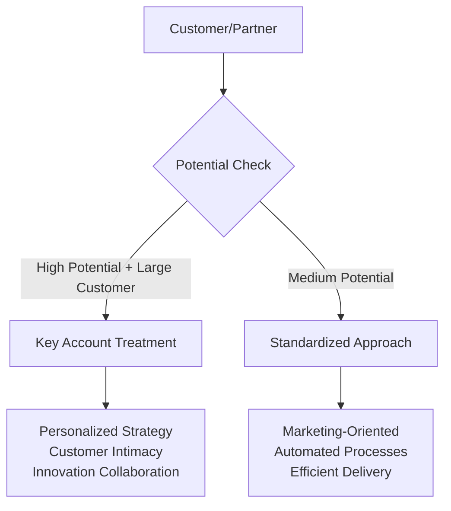
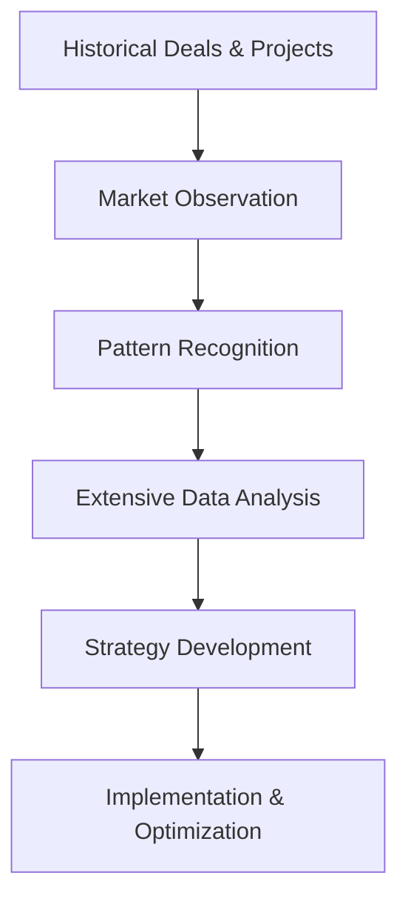

# Account Management as a Service (AMaaS) 
## An Open-Source Business Plan for the Future of B2B Client Management

**Connect with me on LinkedIn**: [https://www.linkedin.com/in/mbrueckner/](https://www.linkedin.com/in/mbrueckner/)

---

> **About This Business Plan**: This comprehensive business strategy emerged from my extensive experience in client advisory roles across multiple organizational levels, including C-suite engagements. Through countless client interactions spanning various industries and company sizes, I identified a critical market gap that traditional account management approaches fail to address effectively. This open-source business plan represents a synthesis of real-world insights, market research, and strategic innovation in the B2B services space.

> **Professional Background**: My advisory work has encompassed strategic consulting, digital transformation initiatives, stakeholder ecosystem mapping, and complex B2B relationship management across technology, professional services, and enterprise sectors. This plan reflects proven methodologies and market observations from actual client engagements.

---

## 🚀 Executive Summary

### The Problem
Traditional account management operates in silos, lacks data-driven insights, and fails to scale effectively across diverse client portfolios. Most B2B companies struggle with inconsistent client treatment, limited pattern recognition, and insufficient stakeholder intelligence.

### The Solution: AMaaS Framework
**Account Management as a Service (AMaaS)** transforms traditional "Key Account Treatment" into a scalable, data-driven service offering that leverages advanced analytics, pattern recognition, and strategic insights. Rather than providing fractional human resources, AMaaS delivers systematic account management methodologies combining technology-enabled processes with strategic human oversight.

### Core Innovation: From Product to Service Thinking
AMaaS shifts from individual key account manager assignments to a structured, repeatable service that combines:
- **Data-Driven Segmentation**: Systematic categorization of clients based on potential and current value
- **Intelligent Treatment Allocation**: Personalized "Key Account Treatment" for high-potential clients, standardized approaches for others
- **Technology-Enhanced Delivery**: MarTech integration while maintaining the critical human element for strategic oversight

### Market Opportunity
- 20% year-over-year growth in fractional executive demand (2024)
- 67% of B2B companies investing in customer analytics and data platforms
- $4.2 billion market for customer analytics software, growing at 15% CAGR
- 25-40% premium pricing for companies offering advanced analytics
- 5-25x cost difference between customer acquisition vs. retention

---

## 🎯 AMaaS Core Framework

### I. Foundational Philosophy: "Key Account Treatment" as a Service

#### Service-Oriented Transformation
AMaaS transforms individual account management into systematic, repeatable services that scale across client portfolios through structured methodologies delivering consistent results.

#### Intelligent Segmentation Strategy

**Tier 1: Large Potential/Large Customer Segment**
- **Treatment**: Personalized "Key Account Treatment"
- **Focus**: Customer intimacy, strategic activities, product/service co-development
- **Engagement**: High-touch strategic partnership
- **Resources**: Premium analytical resources, senior strategic oversight

**Tier 2: Small-Medium Large Potential Segment**
- **Treatment**: Marketing-oriented, systematized approach
- **Focus**: Standardized processes, automated interactions, scalable touchpoints
- **Engagement**: Technology-enabled service delivery
- **Resources**: Optimized cost-effectiveness with maintained quality

### II. Data and Analytics Foundation

#### Core Principle: "Data, Data, Data!"
All AMaaS operations built on extensive data analysis, recognizing actionable insights drive effective account management strategies.

#### Data Sources and Analysis Framework

**Historical Performance Analysis**
- Past deals, projects, opportunities assessment
- Success pattern identification and trend analysis
- Client lifecycle behavior mapping
- Revenue and profitability trajectory evaluation

**Market Intelligence Integration**
- Continuous market observation and trend analysis
- Regulatory change impact assessment
- Competitive landscape monitoring
- Industry evolution tracking

**Pattern Recognition and Hypothesis Development**
- Statistical correlation identification across client data
- Predictive model development for account behavior
- Risk indicator establishment and monitoring
- Opportunity signal detection and verification

### III. Deep Client Analysis Framework

#### Company Intelligence Gathering
- **Financial Analysis**: Key metrics from business reports, performance trends
- **C-Level Engagement**: Executive stakeholder mapping, decision process understanding
- **Strategic Priority Alignment**: Communication preferences, influence assessment

#### Innovation and Transformation Focus
- **3-Horizon Innovation Model**: Core business optimization, emerging opportunities, transformational possibilities
- **Current Initiatives**: Transformation projects (SAP migrations, cloud transitions), digital roadmaps
- **Technology Adoption**: Pattern analysis, modernization opportunities

#### Stakeholder Ecosystem Mapping
- **Beyond C-Level**: Middle management influence, technical stakeholders, cross-functional dynamics
- **IT-Business Alignment**: Direct access strategies, domain expertise demonstration, trust building
- **Influence Networks**: Informal relationship mapping, decision-maker identification

---

## 💼 Service Architecture & Pricing

### Tier 1: Strategic Intelligence Foundation
**Target**: Mid-market (100-400 customers) | **Hours**: 25-35/month | **Price**: $6,500-$8,200/month

**Core Services:**
- Comprehensive historical data analysis and pattern recognition
- Client segmentation based on potential and value assessment
- Stakeholder ecosystem mapping and influence analysis
- Market intelligence integration and competitive landscape assessment
- Basic predictive modeling for account behavior

**ROI Metrics:** 15-20% retention improvement, 10-15% account value increase

### Tier 2: Advanced Account Treatment
**Target**: Larger mid-market (400-1,000 customers) | **Hours**: 40-60/month | **Price**: $9,800-$14,500/month

**Enhanced Services:**
- Advanced pattern recognition with hypothesis testing
- 3-Horizon innovation opportunity identification
- Deep company intelligence with financial analysis
- Technology transformation opportunity analysis
- C-level engagement strategy development

**ROI Metrics:** 20-25% retention improvement, 15-25% account value increase

### Tier 3: Enterprise Account Intelligence
**Target**: Enterprise divisions/large accounts | **Hours**: 60-80/month | **Price**: $18,000-$26,000/month

**Comprehensive Services:**
- Real-time market intelligence integration
- Advanced predictive analytics with ML pattern recognition
- Complex stakeholder ecosystem management
- Strategic partnership development
- Multi-horizon strategic planning

**ROI Metrics:** 25-35% retention improvement, 20-30% account value increase

### Specialized Extensions

#### Partner Intelligence Service ($3,500-$7,500/month)
- High-influence partner treatment
- Standardized partner engagement protocols
- Data-driven partner impact assessment

#### Innovation Collaboration Support ($250-$400/hour)
- 3-Horizon innovation workshops
- Proof of Concept development support
- Technology transformation guidance

---

## 📊 Market Analysis & Financial Projections

### Target Market Segmentation

**Primary**: Mid-Market Technology & Professional Services (50-500 employees)
- Revenue: $5M-$100M annually
- Customer Base: 100-1,000 active B2B clients
- Industries: SaaS, enterprise software, professional services, fintech, healthtech

**Market Validation:**
- 73% of companies report analytics significantly impacts customer strategy
- 23% higher customer lifetime value with advanced account management analytics
- 15-20% retention improvement using predictive analytics
- B2B purchase decisions involve average 6.8 stakeholders

### Revenue Projections (3-Year Forecast)

| Year | Clients | Avg Monthly Revenue | Annual Revenue | Growth Rate |
|------|---------|-------------------|----------------|-------------|
| 1    | 12-15   | $8,500            | $1,275,000     | 15% MoM     |
| 2    | 25-30   | $10,200           | $3,060,000     | 8% MoM      |
| 3    | 45-55   | $12,500           | $6,875,000     | 5% MoM      |

### Unit Economics (Tier 2 Example)
- Monthly Revenue: $12,200
- Delivery Cost (50 hours @ $150/hour): $7,500
- Gross Margin: $4,700 (38.5%)
- Customer Acquisition Cost: $1,200
- Net Monthly Profit: $3,500 after year 1

---

## 🛠 Technology Stack & Operations

### Core Technology Requirements
- **Analytics Platform**: Advanced data processing and pattern recognition
- **CRM Integration**: Seamless client data synchronization
- **Business Intelligence**: Real-time dashboards and reporting
- **Communication Tools**: Stakeholder engagement and collaboration
- **Security Framework**: Enterprise-grade data protection

### Team Structure (Scalable Model)

**Year 1**: Foundation Team (5-7 professionals)
- Strategic Director: Business development and client strategy
- Senior Account Intelligence Analysts (2-3): Advanced analytical capabilities
- Market Intelligence Specialist: Competitive and industry analysis
- Operations Coordinator: Process management and client coordination

**Year 2-3**: Scale Team (15-20 professionals)
- Account Intelligence Directors (3-4): Senior oversight and strategy
- Account Analysts (6-8): Core service delivery
- Data Scientists (2-3): Advanced predictive modeling
- Market Research Team (2-3): Industry intelligence and trends

---

## 🎯 Competitive Positioning

### Competitive Advantages
- **Data-Driven Methodology**: Systematic analytical approach vs. relationship-based traditional models
- **Scalable Framework**: Repeatable processes vs. individual consultant dependencies
- **Technology Integration**: MarTech-enabled delivery with human strategic oversight
- **Industry Specialization**: Deep B2B expertise vs. generalist consulting approaches
- **ROI Focus**: Measurable outcomes with clear performance metrics

### Market Differentiation
- **vs. Large Consulting Firms**: Cost-effective, specialized, technology-enabled
- **vs. Fractional Executives**: Systematic methodology, data-driven insights, scalable delivery
- **vs. Customer Success Platforms**: Human expertise integration, strategic depth, industry knowledge

---

## 📈 Success Metrics & KPIs

### Client Success Metrics
- **Customer Retention Rate**: Target 92%+ (industry benchmark: 85%)
- **Account Value Growth**: 20-30% increase year-over-year
- **Stakeholder Satisfaction**: Net Promoter Score 75+
- **Time to Strategic Value**: Under 45 days for all implementations

### Business Performance Metrics
- **Monthly Recurring Revenue Growth**: 8-15% month-over-month
- **Client Churn Rate**: Under 3% monthly
- **Average Revenue Per Client**: $12,000+ by year 2
- **Gross Margin**: 80%+ at scale

---

## 🚀 Implementation Roadmap

### Phase 1: Foundation (Months 1-6)
- [ ]  Core team assembly and methodology development
- [ ]  Technology platform selection and integration
- [ ]  Pilot client acquisition and service validation
- [ ]  Process documentation and optimization

### Phase 2: Market Entry (Months 4-12)
- [ ]  Service delivery refinement based on pilot feedback
- [ ]  Case study development and thought leadership content
- [ ]  Strategic partnership establishment
- [ ]  Team expansion and capability building

### Phase 3: Scale (Months 10-24)
- [ ]  Geographic expansion and market penetration
- [ ]  Advanced analytics platform development
- [ ]  Industry vertical specialization
- [ ]  Strategic acquisition opportunities evaluation

---

## 🌟 Long-term Vision

### 5-Year Objectives
- **Market Position**: Leading data-driven account management service in North America
- **Revenue Target**: $15-25 million annual recurring revenue
- **Team Size**: 75-100 professionals across multiple regions
- **Service Evolution**: AI-enhanced predictive analytics, industry-specific solutions

### Expansion Opportunities
- **Geographic**: European and Asia-Pacific market entry
- **Vertical**: Industry-specific AMaaS solutions (fintech, healthcare, manufacturing)
- **Technology**: Proprietary analytics platform licensing
- **Partnership**: Strategic alliances with CRM and business intelligence providers

---

## 📝 Contributing & Contact

This open-source business plan welcomes contributions, feedback, and discussions from the business strategy community.

### How to Contribute
1. Fork this repository
2. Create a feature branch for your insights
3. Submit a pull request with detailed analysis
4. Engage in discussions through issues and comments

### Professional Inquiries
- **LinkedIn**: [Connect for strategic discussions](https://www.linkedin.com/in/mbrueckner/)
- **Medium**: [Read the full strategic analysis](https://medium.com/@your-username/account-management-as-a-service-transforming-b2b-client-relationships-through-data-driven-intelligence)
- **Email**: [Direct professional contact](mailto:your-email@domain.com)

---

## 📚 Additional Resources

- [Market Research Data & Sources](./docs/market-research.md)
- [Technical Architecture Details](./docs/technical-architecture.md)
- [Financial Model Templates](./docs/financial-models.md)
- [Implementation Playbooks](./docs/implementation-guides.md)

---

**License**: MIT License - Free for commercial and non-commercial use

**Disclaimer**: This business plan is based on market research and professional experience. Actual results may vary based on execution, market conditions, and competitive factors.

---

⭐ **Post about this repository on [LinkedIn](https://www.linkedin.com/in/mbrueckner/) (and thanks for mentioning me :))** if you find this business plan valuable for your strategic thinking or professional development!
