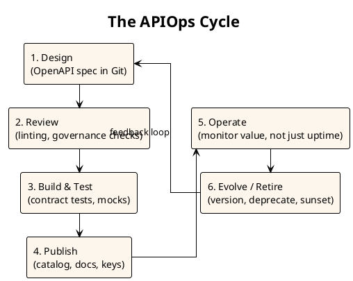
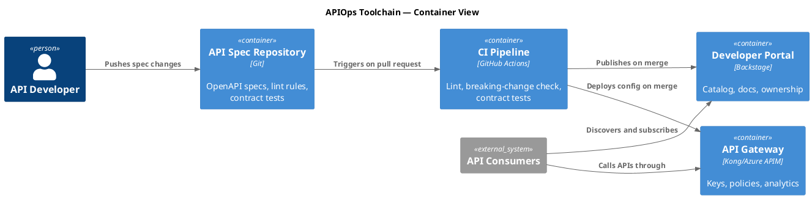

# APIOps as Code: Documenting the API Lifecycle with PlantUML

CI/CD automated how we ship code. APIOps automates how we ship APIs — the design, review, publish, and deprecate cycle that most organizations still run on meetings and wiki pages. This guide covers the lifecycle, the maturity stages, and how to document all of it as code.

BY THE WAY:
**Platform Economies** — launching September 1, 2026.  
[**Pre-order on Amazon**](https://www.amazon.com/dp/B0GXN4PRB5) — Kindle edition available now; paperback follows on September 1. Also available in [🇬🇧 UK](https://www.amazon.co.uk/dp/B0GXN4PRB5), [🇩🇪 DE](https://www.amazon.de/dp/B0GXN4PRB5), [🇯🇵 JP](https://www.amazon.co.jp/dp/B0GXN4PRB5), and [🇨🇦 CA](https://www.amazon.ca/dp/B0GXN4PRB5). The APIOps cycle on this page is the operational engine from Part Four of the book.  
Book page: **[mohammed-brueckner.com/platform-economies](https://mohammed-brueckner.com/platform-economies/)**.

> 📚 Diagrams on this page are PlantUML. New to it? [PlantUML with ArchiMate: Complete Guide](https://mohammed-brueckner.com/plantuml-how-to/) · [C4 diagrams with PlantUML](https://mohammed-brueckner.com/plantuml-how-to/c4-diagrams/)

---

## Table of Contents

- [From CI/CD to APIOps](#from-cicd-to-apiops)
- [The APIOps Cycle](#the-apiops-cycle)
- [Maturity Stages](#maturity-stages)
- [Documenting the Pipeline as Code](#documenting-the-pipeline-as-code)
- [The Measurement Trap](#the-measurement-trap)

---

## From CI/CD to APIOps

CI/CD answered: how do we get code from laptop to production safely? APIOps answers a harder question: how do we get an API from idea to a managed, versioned, monetizable product — repeatedly, at scale, without a committee?

The gap is real. Most organizations have pipelines for code and process theater for APIs. Design happens in documents. Review happens in meetings. Publication happens when someone remembers. Deprecation happens never. The result: seventy percent of organizations track API volume, less than ten percent track API business value. They measure motion, not direction.

APIOps treats the API lifecycle like a pipeline: versioned specifications, automated linting and breaking-change detection, contract tests, catalog publication, and retirement policies — all as code, all in Git, all reviewable.

## The APIOps Cycle

Six stages, one cycle. The diagram is PlantUML — copy it, adapt it, put it in your repo.

The stage everyone skips is the feedback loop from 6 back to 1. APIs that never retire accumulate into the kind of landscape that makes migration programs necessary. Deprecation is a feature of the lifecycle, not a failure of the API.

## Maturity Stages

Four stages, and most organizations sit at stage two believing they are at stage four:

1. **Ad hoc.** APIs happen inside projects. No spec, no catalog, no owner after launch. Discovery means asking around.
2. **Standardized.** OpenAPI specs exist. There is a style guide. Compliance is manual and therefore optional in practice.
3. **Automated.** Specs are linted in CI. Breaking changes fail builds. The catalog publishes itself from the repo. This is where APIOps begins.
4. **Product-managed.** APIs have owners, roadmaps, consumers who pay (with money or with internal commitment), and success metrics tied to business value — revenue per API call, not requests per second.

The jump from 3 to 4 is not technical. It is the moment the organization starts treating APIs as products with customers instead of plumbing with consumers. That jump is a business-model decision, which is why it is a chapter in a book about platform economics and not a chapter in a Jenkins manual.

## Documenting the Pipeline as Code

The APIOps pipeline itself deserves a diagram — this one in C4 notation, because the audience is the engineering team that builds it:

The two diagrams on this page live in the same repo as this article — which is the point. When the pipeline changes, the diagram changes in the same pull request. Documentation that cannot drift is the only documentation worth maintaining.

## The Measurement Trap

The maturity stages fail quietly when organizations measure the wrong things. Endpoints shipped, requests per second, developer signups — activity metrics. A program can ship forty-seven endpoints and generate less value than one that ships three.

The compression-signal questions are different: what percentage of our APIs generate measurable business value? How many of our developers would pay if we charged? What is our revenue per API call? These are harder to put on a dashboard. They are the only ones that tell you whether your API program is a platform play or a cost center with good uptime.

If you want the diagnostic version of this: the [Platform Compression Scorecard](https://mohammed-brueckner.com/scorecard/) scores five signal categories in about five minutes, and API program health shows up in at least three of them.

---

## Further Reading

- **[Platform Economies — the book](https://mohammed-brueckner.com/platform-economies/)** — Part Four covers the APIOps cycle, maturity measurement, and where agentic AI fits the pipeline
- [PlantUML with ArchiMate: Complete Guide](https://mohammed-brueckner.com/plantuml-how-to/) — model the architecture around your APIs
- [PlantUML C4 Diagrams](https://mohammed-brueckner.com/plantuml-how-to/c4-diagrams/) — the notation used for the toolchain diagram
- [Internal Developer Platforms: From Tools to Products](https://mohammed-brueckner.com/developer-platforms/) — the product mindset applied to platforms
- [Architecture as Code](https://mohammed-brueckner.com/archimate/) — why all of this belongs in Git

---

**Last Updated:** August 2026
