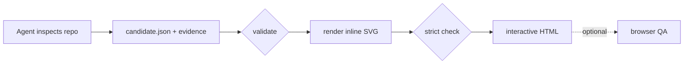
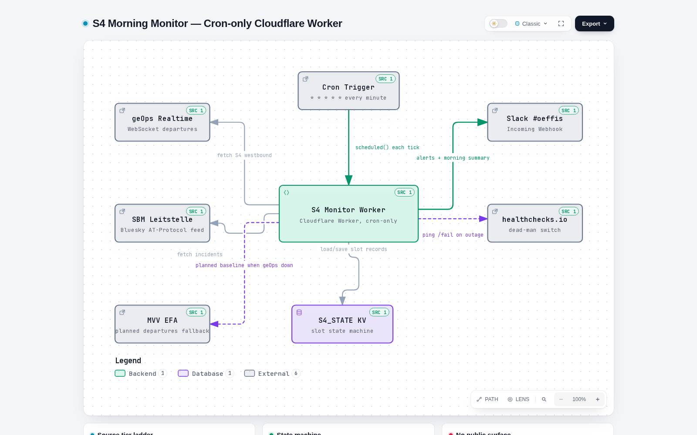

<script type="application/ld+json">
{
  "@context": "https://schema.org",
  "@type": "TechArticle",
  "headline": "Archify: architecture diagrams your AI agent has to prove",
  "description": "Archify turns a codebase into a validated, interactive architecture diagram — typed JSON candidate, schema gates, repository evidence, self-contained HTML output. What worked, what broke, and where it fits next to PlantUML and Mermaid.",
  "url": "https://mohammed-brueckner.com/archify/",
  "inLanguage": "en",
  "proficiencyLevel": "Intermediate",
  "dependencies": "Node.js 18+, archify 3.0 (MIT), optional Chromium for browser QA",
  "author": { "@id": "https://mohammed-brueckner.com/#person" },
  "isPartOf": { "@type": "WebPage", "@id": "https://mohammed-brueckner.com/plantuml-how-to/" },
  "mainEntityOfPage": { "@type": "WebPage", "@id": "https://mohammed-brueckner.com/archify/" }
}
</script>

<script type="application/ld+json">
{
  "@context": "https://schema.org",
  "@type": "BreadcrumbList",
  "itemListElement": [
    { "@type": "ListItem", "position": 1, "name": "Home", "item": "https://mohammed-brueckner.com/" },
    { "@type": "ListItem", "position": 2, "name": "PlantUML with ArchiMate", "item": "https://mohammed-brueckner.com/plantuml-how-to/" },
    { "@type": "ListItem", "position": 3, "name": "Archify", "item": "https://mohammed-brueckner.com/archify/" }
  ]
}
</script>

# Archify: architecture diagrams your AI agent has to prove

Ask an AI agent to draw your system architecture and you will get a convincing diagram of a system that is almost, but not quite, yours. An extra cache that does not exist. A queue nobody installed. The model has seen ten thousand architectures, and it will happily average them into your repository. I write about that gap between plausible fiction and verified structure elsewhere — [Platform Economies](https://platformeconomies.com) is the book — and it shows up in diagramming exactly the way it shows up in market narratives.

**Archify** is an open-source agent skill (MIT, version 3.0, by [tt-a1i](https://github.com/tt-a1i/archify)) built to close that gap. The agent does not draw directly. It writes a **typed JSON description** of the system, Archify **validates it against a schema and your repository**, and only then renders an **interactive, self-contained HTML diagram** with inline SVG, dark and light themes, and export to PNG, SVG, or WebM. Five diagram types: architecture, workflow, sequence, dataflow, and lifecycle.

I ran it against a real project — a cron-only Cloudflare Worker that monitors S-Bahn departures — and this page is what actually happened, including the four things that broke.

---

## How it works

The pipeline has one idea at its core: **separate the claim from the rendering**.

1. The agent inspects the codebase and authors a `candidate.json` — nodes, relationships, boundaries — with **source evidence** (file and line references) attached to every node it claims exists.
2. `finalize` runs the gates: **validate** (schema check), **render**, a strict composition **check** (geometric analysis of the SVG — no browser needed), and an optional real-browser visual QA pass.
3. The output is one standalone `.html` file. No CDN, no fonts fetched, no server. You can mail it to someone.



That evidence step is the part worth paying attention to. Every node in my diagram carries a small `SRC` badge linking back to the file it came from. The validator refused to let me pin evidence to a directory that was not the git top level — which is annoying in a monorepo and also exactly the "prove it" behavior you want. Compare that to a Mermaid block you pasted from a chat window: nothing in that pipeline ever checks whether the boxes are real.

Where does that leave [PlantUML](../plantuml-how-to/) and [Mermaid](../plantuml-how-to/plantuml-vs-mermaid/)? Not replaced. **PlantUML stays the right tool for versioned, diffable diagrams that live in a repo next to the code** — text in, text out, readable in a pull request. **Archify is for the audit and the explainer**: the diagram you hand to a reviewer, a reader, or your future self, where "the agent invented two of these boxes" is a bug and not a vibe. And if you do enterprise architecture rather than runtime architecture, [ArchiMate with jArchi](../archimate/) is still its own discipline.

---

## Hands-on: one real diagram, four real failures

The target: my S4 morning monitor — a cron-only Cloudflare Worker that watches westbound S-Bahn München departures, with a geOps WebSocket source, a Bluesky dispatch feed, an MVV EFA fallback, a KV state machine, and Slack plus healthchecks.io as sinks. Small, real, and nobody rehearsed it.

The install is one line:

```bash
npx skills add tt-a1i/archify -g --agent '*' -y
```

Then the agent reads the sources, writes the candidate (mine came out at **4,241 bytes**), and runs one command:

```bash
node bin/archify.mjs finalize architecture candidate.json s4-monitor.html \
  --repo-root /path/to/repo --quality showcase --json
```

`validate` passed 9 of 9 checks on the first draft. The render produced a **761 KB self-contained HTML** with the diagram below. Click it — [the interactive version](s4-monitor.html) has pan, zoom, lens, theme switch, and export, and it works from `file://`.

[](s4-monitor.html)

Every box is real: the geOps WebSocket source, the Leitstelle Bluesky feed, the EFA fallback (dashed, because it only exists when the primary is down), the `S4_STATE` KV, the Slack webhook, the dead-man switch. The badges in the corners are the file references. This diagram was not drawn; it was **receipted**.

Now the four things that broke, in the order they hit me:

**1. The installer wants a TTY.** `npx skills add` opens an interactive picker for target agents; in a headless codespace stdin is not a TTY and the install silently cancels. Fix: `--agent '*' -y`. If you vendor it into a project instead, note the renderer has **zero npm runtime dependencies** — plain Node, `node:fs` and friends.

**2. The evidence gate rejects subdirectory roots.** Pointing `--repo-root` at a subfolder of a bigger repo fails with `repository-evidence/root-not-top-level`. It wants the git top level. I called this a bug for ten minutes before admitting it is the feature: evidence anchored to a subfolder is exactly how "almost true" diagrams happen.

**3. No Chrome in a container.** The optional browser QA stage died with `chrome-unavailable`. Codespaces has no Chrome. Archify provides both escape hatches: `ARCHIFY_CHROME` pointing at any Chromium executable (Playwright's bundled one works), and `ARCHIFY_CHROME_NO_SANDBOX=1` for containers.

**4. A genuine race bug.** Even with Chromium found, the browser QA pass timed out — every single time, a 15-second `Runtime.evaluate` timeout. A manual CDP repro showed the cause: Archify evaluates its layout-stability probe **the instant `Page.loadEventFired` fires**, and under `--headless=new` that event can fire while the initial `about:blank` context is still mid-teardown. The evaluation lands in a destroyed context, Chrome drops the reply, the timer expires. The deterministic composition check — which needs no browser — passes regardless, so delivery was never actually blocked. This one is worth an upstream issue: a readiness poll (or retry on a destroyed context) would fix it.

Total time from `npx skills add` to the diagram you see above: well under an hour, most of it spent on issue 4 because I refused to believe a tool would ship a race at its final gate. (It did. It happens.)

---
## When to reach for which tool

A concrete decision rule, because "it depends" helps nobody:

- **The diagram lives in the repo and gets reviewed in diffs** → PlantUML (or Mermaid for quick README embeds). Text wins. My [templates](../plantuml-how-to/templates/), [troubleshooting](../plantuml-how-to/troubleshooting/), and [C4](../plantuml-how-to/c4-diagrams/) pages cover that workflow end to end.
- **The diagram is the deliverable** — an architecture audit, a handover document, something you send — → Archify. Interactivity, export, and the evidence trail are the point.
- **The audience is enterprise architects** → ArchiMate, where the semantics of the notation are the message.

One more Archify detail I appreciate: the candidate JSON is small and readable (4 KB for that whole worker), so when the code changes, the agent regenerates the diagram in seconds and you diff the *candidate*, not a PNG. Diagrams rot because updating them is manual; making the update a one-line command is the actual fix.

> 💡 A diagram you cannot audit is a story, not a map. That is the standard I hold AI-generated anything to — and it is, in a nutshell, the argument of my book [Platform Economies](https://platformeconomies.com): when platforms compress the distance between a claim and its verification, the people who insist on receipts win. Archify makes your architecture diagrams produce receipts. The book is about why that instinct scales to an economy.

## The short version

Archify is the first diagramming tool I have used where **"the agent said so" is not the last line of evidence**. It gates the drawing, anchors every box to a source file, and ships output you can open offline and hand around. It has rough edges — the TTY installer, the subdirectory evidence gate, the headless-Chrome race — but every rough edge except the last one is the security feature working as designed. Recommended, with receipts.

---

**About the author:** Mohammed Brückner writes about platform economics, diagrams that tell the truth, and the tools that keep them honest. He is the author of [Platform Economies](https://platformeconomies.com) (2026) and maintains the [PlantUML with ArchiMate](../plantuml-how-to/) cluster on this site.
