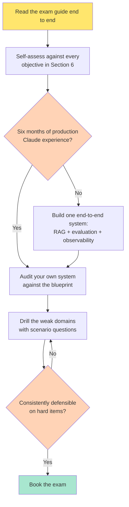

# Claude Certified Architect – Professional: what CCAR-P actually tests

Most certification pages tell you the syllabus. That is the easy half, and Anthropic publishes it themselves. The harder half is what the questions *feel* like once you are sitting there with 120 minutes and 63 items in front of you — and CCAR-P is not a prompt-writing exam. It is an **architecture decision** exam that happens to be about Claude. The stems hand you a system that is already broken, or about to be, and ask which change is defensible.

I went through the blueprint objective by objective and built a full scenario set against it. What follows is what that exercise surfaced: the verified format, the domain weights, and — the part nobody publishes — the recurring decision archetypes that the objectives imply.

BY THE WAY:
**Platform Economies** — out now.  
[**Buy on Amazon**](https://www.amazon.com/dp/B0H3VVNPZ3) — Kindle and paperback. Also available in [🇬🇧 UK](https://www.amazon.co.uk/dp/B0H3VVNPZ3), [🇩🇪 DE](https://www.amazon.de/dp/B0H3VVNPZ3), [🇯🇵 JP](https://www.amazon.co.jp/dp/B0H3VVNPZ3), and [🇨🇦 CA](https://www.amazon.ca/dp/B0H3VVNPZ3). Domain 3 of this exam is nineteen percent integration — MCP, tool contracts, agent-to-agent. That is the same structural argument the book makes about APIs and partnerships, one abstraction level up.  
Book page: **[mohammed-brueckner.com/platform-economies](https://mohammed-brueckner.com/platform-economies/)**.

> 📚 Adjacent reading on this site: [What Is a Platform Economy?](https://mohammed-brueckner.com/platform-economy/) · [From Discovery to Deployment with AI](https://mohammed-brueckner.com/how-to-ai/) · [APIOps as Code](https://mohammed-brueckner.com/apiops/)

---

## Table of Contents

- [The exam at a glance](#the-exam-at-a-glance)
- [Who it is actually for](#who-it-is-actually-for)
- [The blueprint, and what the weights tell you](#the-blueprint-and-what-the-weights-tell-you)
- [How to prepare](#how-to-prepare)
- [The ten decisions the exam keeps asking](#the-ten-decisions-the-exam-keeps-asking)
- [The three official sample questions](#the-three-official-sample-questions)
- [Logistics: fee, retakes, validity](#logistics-fee-retakes-validity)
- [What nobody can tell you](#what-nobody-can-tell-you)

---

## The exam at a glance

Every figure here comes from the **Claude Certified Architect – Professional Exam Guide, version 1.0, effective July 2026**, published by Anthropic. Third-party summaries of this exam are circulating with invented numbers. These are the real ones.

| Item | Value |
|---|---|
| **Exam code** | CCAR-P |
| **Items** | 63 |
| **Time limit** | 120 minutes |
| **Item format** | Multiple-choice and multiple-response; each item states how many to select |
| **Passing score** | 720 on a scaled range of 100–1,000 |
| **Delivery** | Proctored — online or Pearson VUE test center |
| **Fee** | $175 USD |
| **Validity** | 12 months from the award date |
| **Prerequisites** | None |
| **Reporting** | Pass/fail plus scaled score, with percent-correct by domain |

Two details in that table matter more than they look.

**Twelve months of validity** is short for an architecture credential. That is not administrative fussiness — it is an honest admission that half of what the exam covers is product mechanics with a shelf life. Cache multipliers, context-editing behaviour, MCP transports, model tiers. The principles keep. The specifics do not.

**Percent-correct by domain is reported but not used to determine your result.** You pass on the total scaled score. So there is no per-domain minimum to defend, and no reason to over-invest in Developer Productivity at seven percent while Integration sits at nineteen.

---

## Who it is actually for

Anthropic's recommended experience is **three or more years in systems architecture or platform engineering**, plus **six or more months of hands-on production work** with Claude or comparable LLM systems. None of it is mandatory; the credential is awarded on exam performance alone.

Read that second requirement carefully. Six months *in production* is doing a lot of work in that sentence. A large share of the item bank turns on things you only learn by operating a system: how spend behaves when a multi-step agent re-sends its accumulated tool results on every turn, what a cache prefix invalidation actually costs you, why an agent that fails silently still closes its session looking healthy.

The guide is equally explicit about who it excludes: entry-level developers, casual users, and anyone whose role is prompt writing without broader system design responsibility. This is a **solution architect** exam. If your instinct on a hard question is to reach for a better prompt, you will lose points, because the wrong answers are frequently written as plausible prompt fixes to problems that prompts cannot fix.

That gap between principle and practice is the same one I wrote about in [**IT's not magic, it's architecture**](https://www.amazon.com/dp/B0CVZ1BWPN) — architectural judgement is not a body of facts, it is knowing which constraint binds first. CCAR-P is unusually good at testing exactly that.

---

## The blueprint, and what the weights tell you

Seven domains. The weights are the approximate proportion of scored items drawn from each.

| # | Content domain | Weight |
|---|---|---|
| 1 | Solution Design & Architecture | **17%** |
| 2 | Claude Models, Prompting & Context Engineering | **13%** |
| 3 | Integration | **19%** |
| 4 | Evaluation, Testing & Optimization | **16%** |
| 5 | Governance, Safety & Risk Management | **14%** |
| 6 | Stakeholder Communication & Lifecycle Management | **14%** |
| 7 | Developer Productivity & Operational Enablement | **7%** |

Three things fall out of this table immediately.

**Integration is the largest domain, and prompting is nearly the smallest.** Nineteen percent versus thirteen. The single most common preparation mistake is to treat this as a prompt engineering exam because that is the visible skill. It is not. Domain 3 covers tool and agent configuration, authentication and authorization gaps, RAG pipeline design, retrieval strategy matched to data shape, observability at scale, and — explicitly — *evaluating connection protocols and selecting the appropriate integration mechanism (MCP, API/CLI, agent-to-agent)*.

**Design plus integration is thirty-six percent.** More than a third of the exam is the question "what shape should this system be, and how does it reach the systems it needs?" That is classic enterprise architecture work with a new set of primitives. If you have designed [event-driven integration in a serverless world](https://mohammed-brueckner.com/integration/) or run an [APIOps lifecycle](https://mohammed-brueckner.com/apiops/), most of the reasoning transfers directly. The vocabulary changes; the trade-off structure does not.

**Governance and stakeholder work together outrank integration.** Twenty-eight percent combined. Domain 5 names GDPR, HIPAA and FedRAMP outright. Domain 6 is discovery, communicating trade-offs, SLA expectation management, documentation and handoff. A meaningful fraction of this exam is not technical at all — it asks whether you can hold a defensible position in front of a board, a regulator, or a receiving team.

That last one surprises people, and it is the single best argument for reading the blueprint before you book. The full objective list for each domain is in Section 6 of the guide, and it is worth self-assessing against every line.

---

## How to prepare

There is no required course, and Anthropic does not guarantee any resource produces a pass. Their own recommendation is to combine hands-on work with blueprint self-assessment. Here is the sequence I would run:

The step people skip is **auditing a system they already run**. It is far more productive than reading. Take one production Claude workload and walk the blueprint against it: where does authorisation come from, what is the cacheable prefix, what happens when the third dependency degrades, who reviews the output and do they actually read it. You will find two or three genuine holes. Those holes are the exam.

Building the end-to-end system, if you do not have one, is the other route — and the evaluation and observability half of that build is where most people are thinnest. If your background is data and ML platforms rather than application architecture, the discipline transfers well; the [MLOps code companion](https://mohammed-brueckner.com/mlopswithdatabricks/) on this site is the practical version of that muscle, and [**Machine Learning Operations (MLOps) with Databricks on Azure End-to-End**](https://www.amazon.com/dp/B0FTSY78DR) is the long-form treatment of pipelines, reproducibility, deployment and monitoring that Domain 4 assumes you already have.

---

## The ten decisions the exam keeps asking

This is the part that is not in any guide. Working through the objectives at scenario depth, the same ten decisions surface again and again, in different costumes. Learn these and a large share of the item bank stops being surprising.

### 1. Least privilege, and the confused deputy

An agent accumulates tools. It starts with four and ends with twenty-three, including raw SQL access "for flexibility." It authenticates with one service account holding firm-wide read access, and the system prompt politely instructs it to only retrieve data belonging to the requesting user.

That instruction is not a control. It is a wish. The exam's position — and Anthropic's, per the first official sample question — is that **least privilege means removing the capability, not logging it, guarding it, or asking a better model to behave**. Logging and confirmation dialogs are detective and compensating controls. They do not reduce the privilege.

The deeper form is the **confused deputy**: a privileged intermediary acting on untrusted input. Only a deterministic layer that scopes authority per request removes it. Which leads directly to the rule that shows up in every multi-tenant scenario: **authorisation context must be derived, not passed.** Anything the model can put in a tool argument is something an attacker can influence. The tenant boundary belongs to the authenticated session, never to the tool call.

### 2. Cache prefixes are ordered, and the order is not negotiable

Prompt caching is built strictly in the order **tools → system → messages**. A change at any level invalidates that level and everything after it. Volatile content must sit behind the breakpoint.

This produces one of the most reliable wrong-answer patterns on the exam: a prompt with an eleven-thousand-token stable specification whose *header* interpolates the current user's name and unit. The specification looks cacheable. It is not, because one variable field at the front destroys the prefix for everything downstream.

Then the economics, which are separate from the mechanics. Cache reads are **cheaper, not free** — roughly a tenth of base input price. The one-hour TTL costs **2× base input on write** versus **1.25×** for the five-minute default, so the extended TTL only pays when reads actually amortise the more expensive write. And batch processing gives **50% off standard pricing** and stacks with caching, trading latency for cost on work nobody is waiting for.

Agent spend follows from all of this: **cost scales with tokens per session, not requests**, because a multi-step agent re-sends its accumulated tool results on every turn. Finance asks why model spend is growing faster than request volume. That is the answer, and it is an architecture answer, not a billing one.

Pricing that behaves like this — cheap at the margin, punishing when you get the structure wrong — is exactly the dynamic [**Platform Economies**](https://www.amazon.com/dp/B0H3VVNPZ3) works through at the business-model level. Value over volume, as it turns out, is also a caching strategy.

### 3. Workflow or agent — and the honest answer is usually both

A team proposes a single agentic loop that decides for itself what to fetch and when to stop. Then the scenario tells you that eighty-five percent of cases follow an entirely predictable path.

The defensible decomposition is a **prompt-chained workflow for the predictable path with deterministic validation, routing only the atypical cases into an agentic loop**. Agency is expensive and non-deterministic; you spend it where judgement is genuinely required. Anthropic's own published guidance on multi-agent systems is similarly narrow: orchestrator-worker patterns suit tasks that decompose into **independent parallel subtasks** and consume substantially more tokens. A sequential dialogue is not that shape, and dressing it up as multi-agent buys you cost and latency for nothing.

### 4. Retrieval that survives chunking

Fixed 512-token chunks produce two failure modes with tedious reliability: clauses split mid-sentence, and retrieved passages arriving without the defined terms they reference. "Termination per Section 2.1" is useless without Section 2.1.

The published remedy is **contextual retrieval** — chunk-level context added *before* embedding — combined with **hybrid lexical and semantic search with reranking**. Note what is not the remedy: a bigger context window. Stuffing an entire 180,000-token policy manual in dilutes attention, inflates cost, and destroys your cacheable prefix all at once. Retrieving the relevant sections beats all three problems simultaneously.

### 5. Evaluation sets that show you the tail

Extraction quality is 94% F1 on a uniformly random labelled sample, and the system is failing badly on a 2019 template. Both facts are true. **A sample drawn to mirror production tells you about the average case and hides exactly the tail formats where systems fail.** A rare template contributes a handful of cases and cannot move the headline figure however badly it performs.

Stratify and report per stratum. And when one failure mode dominates the risk — a missed obligation, a wrong clinical detail — measure **that failure mode's recall on a stratified sample**, not aggregate accuracy on the natural distribution.

The companion rule is **guardrail metrics**: a goal-metric improvement ships only when the cost and latency guardrails still hold. A breached SLA is disqualifying regardless of how large the quality gain is. That sentence is worth memorising in exactly that form, because several plausible-looking options exist purely to see whether you will trade a contractual p95 for a few points of resolution rate.

### 6. Governance follows the data, not the contract

A hospital group has a signed Business Associate Agreement with the model provider, TLS everywhere, and a system-prompt line instructing the model to handle data per HIPAA. It also streams every full request and response payload to a third-party observability SaaS for debugging.

**A disclosure to your own vendor is still a disclosure.** The observability provider is a business associate in its own right. It needs its own BAA, or the payloads get redacted before they leave. "We only send it for debugging" is not an exception.

The same shape recurs across jurisdictions and gets harder each time:

- **Residency versus transfer.** A contractual in-region commitment is broken by every path the data actually takes — including telemetry destinations and disaster-recovery replicas in an unreviewed second region. Lawfulness of a transfer and compliance with your commitment are separate questions, and a transfer can satisfy the first while breaching the second.
- **Vendor assessment is a two-way flow-down.** Commitments a processor makes to a customer are only true if the same terms exist with its own subprocessors. Undisclosed gaps are contractual misrepresentation, not a passed questionnaire.
- **Deletion is an architecture problem before it is a policy.** You can only erase what you can enumerate — prompts, responses, evaluation fixtures, traces, analytics exports. Every incidental copy you never made is one you never have to find.
- **GDPR Article 22 is a restriction, not a ban.** A solely automated significant decision is restricted; the question is always whether an authorising basis and safeguards exist. Public-benefit eligibility is *separately* a high-risk use under the EU AI Act, which imposes obligations rather than prohibition. Options that say "this is illegal, stop" are usually wrong, and options that say "the privacy notice mentions AI, so we are fine" always are.
- **Bias survives the removal of protected fields.** Fairness work means disaggregated performance against pre-registered thresholds, plus proxy analysis.

### 7. Human review has to be placed, not mandated

Adjusters handle sixty to ninety recommendations a day and approve them faster than they could plausibly read them. The operations director wants the process redesigned rather than merely mandated. Good instinct.

**Rubber-stamping is a design failure, not a discipline failure.** Enforcing a minimum dwell time converts rubber-stamping into rubber-stamping with a pause. Displaying a confidence score makes it worse, because a high number licenses exactly the fast approval you are trying to stop.

What works: cut review to the cases where judgement changes the outcome, make the decision-relevant evidence visible in the time available, and prove oversight through **sampled independent re-review and outcome quality** — not through interface telemetry and not through the approval log. Route review to **irreversibility** and to known risk vectors, never uniformly.

Human factors under load, automation bias, the gap between the process on the slide and the process at the desk — this is change management wearing a lab coat. If that is your weak side, [the Double Trinity Pyramid model](https://mohammed-brueckner.com/changemanagement/) covers why most of these redesigns fail, and [**The Office Adventure Digital Transformation Quest**](https://a.co/d/iSCChrf) runs the same territory as branching scenarios — which, given that CCAR-P is itself a scenario exam, is closer to exam-shaped practice than it has any right to be.

### 8. Reliability: the failure was the propagation, not the dependency

A card-network gateway degrades to forty-second responses. The agent platform holds connections open, the worker pool saturates, and every workload queues behind the slow one — including workloads that never touch that gateway.

**The incident was not that a dependency failed. It was that its failure propagated to workloads that did not depend on it.** Per-dependency timeouts, bulkheading, circuit breakers, retry budgets. And unconditional retry does not mitigate an outage, it amplifies one.

Then the second incident in the same postmortem: a transient failure caused a retry of a settlement-adjustment call, and four hundred merchants were credited twice. **Idempotency belongs to the service that performs the effect**, because the caller can never distinguish a lost response from a lost request. The deduplication token must be derived from the triggering event, so every attempt at the same logical operation carries the same key.

Finally, **degraded mode is a design decision made in advance** — which capabilities are essential and can run without the model — rather than something an outage expresses for you as latency.

### 9. Claude Code, permissions, and the advisory/enforced boundary

Domain 7 is only seven percent, but it is concentrated and very learnable, so it is cheap points.

Permission rules evaluate in the order **deny, then ask, then allow**. Specificity does not change that order. **Managed settings sit above every other source, including command-line flags.** Permissionless mode bypasses prompts — including writes to protected paths — and is documented as appropriate only in isolated environments; the setting that disables it is designed to be pinned in managed settings, which is the correct answer when engineers ask for it across four hundred seats and sixty repositories with export-control-sensitive code.

The principle underneath: repository context files shape *intent* and are reviewable, skills standardise recurring workflows, and **managed settings enforce authority in a way individual configuration cannot override**. The model is never the enforcement layer. That is the same advisory-versus-enforced distinction as the system prompt that politely asks for tenant isolation in decision #1, and the exam rewards you for recognising it as one idea rather than two.

If you are rolling agent tooling out at organisational scale, the product-not-project framing in [Internal Developer Platforms: From Tools to Products](https://mohammed-brueckner.com/developer-platforms/) is the enablement half of this domain.

### 10. Answer the question the stakeholder is actually asking

A board wants to know whether the system is safe enough to deploy. Handing them a context-free accuracy metric does not answer that. **The comparison they are actually making is against today's process**, so the defensible response decomposes into per-failure-mode rates weighted by consequence, presented against the measured error rate of the current human-authored baseline.

Same discipline for incidents: **name the defect, name the control, name the date, and reach affected parties directly.** Vagueness reads as evasion precisely where trust is thinnest.

And for handover, the one that catches people out: the receiving team's first unavoidable task is usually a **model deprecation migration**, which is survivable only if they inherit baselines and a regression procedure. Which is why **migration cost is a coupling problem** — nine workloads sharing one pinned model constant migrate as one terrifying event; nine workloads each owning a pin plus its own baseline migrate as nine small ones.

---

## The three official sample questions

Section 8 of the guide contains three illustrative items with full rationale. They are not from the live bank, but they establish the house style precisely, and it is worth knowing what they cover before you meet forty more like them:

1. **Domain 3 — least privilege.** A support agent can read tickets, draft replies, issue refunds and delete accounts; staff only ever need the first two. The answer is removing the tools, not logging them or gating them behind a confirmation.
2. **Domain 2 — cache prefix ordering.** An 8,000-token system prompt and policy document on every request, followed by a short varying message, with cost and latency both a concern. The answer is placing the static content first and enabling prompt caching — not truncating the policy, not blindly downsizing the model.
3. **Domain 4 — RAG diagnosis.** A system starts returning confident wrong answers after a document refresh, with latency and model version unchanged. The answer is to investigate retrieval and indexing, because nothing else is triggered specifically by a document refresh.

Note the structure of the rationales: the guide explains why each *wrong* option fails, not merely why the right one succeeds. That is the cognitive level being tested. On the harder items, two options are defensible engineering and one of them is subordinate — a real diligence item that does not cure the problem the stem is about. Buffer encryption on a lawful disclosure does not fix an unlawful one elsewhere in the pipeline.

**Stem length is short.** The official samples run roughly 25–35 words with options of 10–25. There is no wall of text to wade through. The difficulty is entirely in the discrimination between near-neighbour options, which means re-reading a stem costs you almost nothing and is nearly always worth it.

---

## Logistics: fee, retakes, validity

- **Registration** runs through the Anthropic Partner Academy; delivery is by **Pearson VUE**, online proctored or at a test center. The fee shown at checkout reflects any partner-tier discount.
- **Cancel or reschedule up to 24 hours before** your appointment. Inside 24 hours, the fee is forfeit.
- **Government-issued photo ID** on exam day, with the name matching your registration exactly. Corrections go to certifications support *before* scheduling.
- **Accommodations** must be requested and approved by Pearson VUE before you schedule. Do not book first.
- **Retakes:** 14 days after a first failure, 30 after a second, 90 after a third. Maximum four attempts per exam in a rolling twelve months. Limits are per exam, so failing one does not block a different one.
- **Validity is twelve months** from the award date.

---

## What nobody can tell you

Two honest limits, because certification content attracts confident nonsense and this page should not add to it.

**The scaled score cannot be reconstructed from outside.** Anthropic does not publish the scaling function that maps raw performance onto 100–1,000, and the cut score of 720 was set by a formal standard-setting study with subject matter experts judging minimally-qualified performance. Any practice tool claiming to predict your scaled score is guessing. Percentage correct on a practice set is a readiness signal, not an exam-equivalent number, and anyone telling you "38 out of 50 means you will pass" has invented a conversion that does not exist.

**A substantial slice of the material has a shelf life.** Cache multipliers and TTLs, batch limits, model tiers, context editing, MCP transports, Claude Code permission behaviour — all of it moves, and none of it is in the published objectives, which name capabilities rather than numbers. Every specific figure on this page was checked against first-party sources in **September 2026**. The architectural principles in the ten decisions above do not expire; the numbers attached to them absolutely do. Re-verify anything version-sensitive against current documentation before you rely on it, and be sceptical of any preparation material that does not date-stamp its claims.

The twelve-month validity period is Anthropic telling you the same thing.

---

## Related reading on this site

- [What Is a Platform Economy?](https://mohammed-brueckner.com/platform-economy/) — the structural argument behind Domain 3, one level up from the protocol.
- [From Discovery to Deployment with AI: A 2026 Reality Check](https://mohammed-brueckner.com/how-to-ai/) — why cost unpredictability and data readiness, not model capability, are the binding constraints.
- [APIOps as Code](https://mohammed-brueckner.com/apiops/) — lifecycle discipline for the integration surface.
- [Integration in a Serverless World](https://mohammed-brueckner.com/integration/) — the pattern vocabulary that transfers directly.
- [MLOps with Databricks on Azure: Complete Code Companion](https://mohammed-brueckner.com/mlopswithdatabricks/) — the evaluation and observability muscle Domain 4 assumes.
- [Change Management Never Really Changes](https://mohammed-brueckner.com/changemanagement/) — human-in-the-loop failure, without the lab coat.
- [Platform Compression Scorecard](https://mohammed-brueckner.com/scorecard/) — twelve questions on where your own platform sits.
- [All publications](https://mohammed-brueckner.com/publications/) — the full list, including [Platform Economies](https://mohammed-brueckner.com/platform-economies/).
- 🎧 [Podcast](https://mohammed-brueckner.com/podcast/) — platform economics and enterprise architecture, in audio.

---

*Official source for every exam figure on this page: the Claude Certified Architect – Professional Exam Guide, version 1.0, effective July 2026, published by Anthropic. This page is independent preparation commentary and is not affiliated with or endorsed by Anthropic.*
