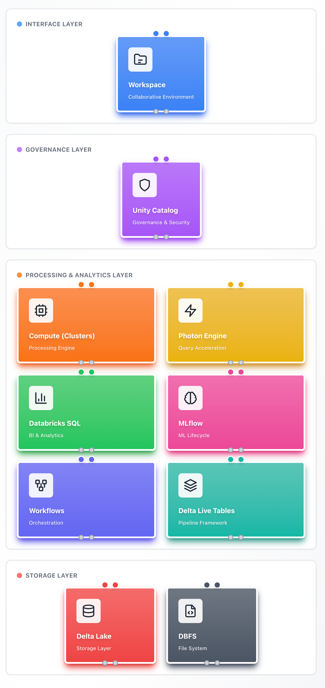

# Databricks Architecture Overview

A visual guide to understanding the core building blocks of the Databricks platform and how they interconnect to form a unified data lakehouse architecture.

## [**View Interactive Version →**](./databricks-architecture.html)

---

## Architecture Visualization

The architecture is organized into four distinct layers, each serving a specific purpose in the data lakehouse ecosystem.

---

## Architectural Layers

### Interface Layer
The **Workspace** provides the collaborative environment where data engineers, scientists, and analysts interact with the platform. It offers notebooks for interactive development, folder structures for organization, and integration with version control systems.

### Governance Layer
**Unity Catalog** serves as the unified governance solution, managing access control, metadata, and data lineage across the entire organization. It provides centralized security and discoverability for all data assets.

### Processing & Analytics Layer
This layer contains the core processing and analytical engines:

- **Compute Clusters**: Groups of virtual machines that process data at scale, supporting both interactive and automated workloads
- **Photon Engine**: A vectorized query engine that accelerates SQL and DataFrame operations through optimized C++ execution
- **Databricks SQL**: A purpose-built query interface optimized for business intelligence and analytics, with native integrations to BI tools
- **MLflow**: An open-source platform managing the complete machine learning lifecycle from experimentation to production deployment
- **Workflows**: An orchestration system that automates data pipelines and manages task dependencies
- **Delta Live Tables (DLT)**: A declarative framework for building reliable data pipelines with built-in quality controls and error handling

### Storage Layer
The foundation where data resides:

- **Delta Lake**: An open-source storage layer providing ACID transactions, time travel, and unified streaming/batch processing on data lakes
- **Databricks File System (DBFS)**: An abstraction layer over cloud object storage that simplifies distributed file access across AWS S3, Azure Blob Storage, and Google Cloud Storage

---

## Key Data Flows

The platform's components interact through well-defined data flows:

- **Workspace → Compute Clusters**: Interactive code execution and notebook-based development
- **Unity Catalog → Delta Lake**: Centralized governance and metadata management for all stored data
- **Databricks SQL → Photon Engine**: Accelerated query processing for analytical workloads
- **Workflows → Delta Live Tables**: Automated orchestration of declarative data pipelines
- **MLflow → Compute Clusters**: Machine learning model training and deployment infrastructure
- **Delta Lake → DBFS**: Reliable storage with versioning capabilities on distributed cloud infrastructure

---

## Use Cases

This architecture supports multiple data and AI workloads:

- **Data Engineering**: Building scalable ETL/ELT pipelines with Delta Live Tables and Workflows
- **Data Analytics**: Running interactive queries and creating dashboards through Databricks SQL
- **Data Science & ML**: Developing, training, and deploying machine learning models with MLflow integration
- **Data Governance**: Managing access control and lineage tracking through Unity Catalog
- **Real-time Processing**: Handling streaming data alongside batch processing with Delta Lake

---

## Platform Benefits

The lakehouse architecture combines the best aspects of data warehouses and data lakes:

- **Unified Platform**: Single platform for all data workloads, eliminating data silos
- **ACID Compliance**: Reliable transactions through Delta Lake's storage format
- **Performance**: Accelerated queries via the Photon engine and optimized data layouts
- **Governance**: Centralized security and compliance through Unity Catalog
- **Scalability**: Cloud-native architecture that scales compute and storage independently
- **Open Standards**: Built on open-source technologies like Apache Spark and Delta Lake

---

**Presented to you by [mohammed-brueckner.com](https://mohammed-brueckner.com)**
