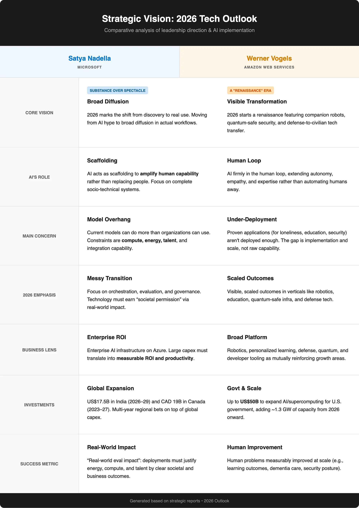
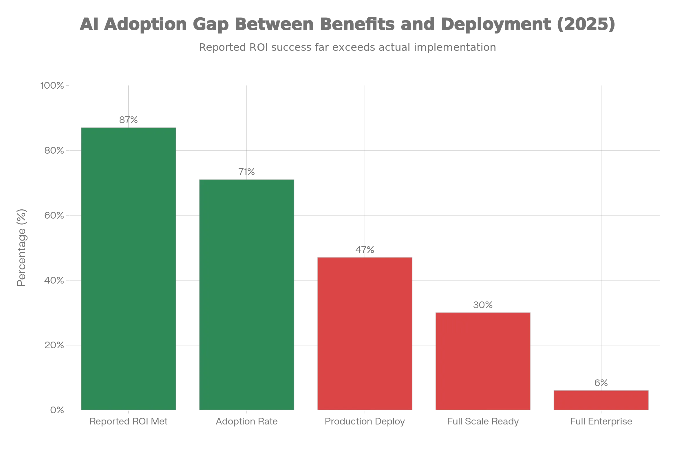

# From Discovery to Deployment with AI, a reality check as of 2026
Some resources discussing the basics of finding and realizing AI Opportunities

The enterprise AI conversation in early 2026 has reached a peculiar inflection. Microsoft's Satya Nadella and Amazon's Werner Vogels both published their respective visions for 2026 at the end of 2025, and the collision between their frameworks exposes a fault line running through the entire industry. With ChatGPT on the scene since late 2022 and the sustained hype through 2023, there can be only little doubt about the importance of AI on all kinds of aspects of value creation. [It can certainly help you code against the Microsoft Graph API and Azure, as I found out.](https://mohammedbrueckner.medium.com/integrating-m365-graph-api-using-chatgpt-b22a15dc6ff)

Nadella frames 2026 as the year AI transitions from discovery to diffusion — from benchmarking models to deploying systems that solve actual problems. Vogels takes a different stance: AI capability is sufficient; the constraint is human-centered scaling. Both leaders are allocating billions to their bets. Microsoft deployed $34.9 billion in a single quarter's capex for AI infrastructure, up 74% year-over-year. Amazon announced $50 billion for U.S. government AI infrastructure plus quantum computing consolidation. The combined big-tech AI capex forecast for 2025 was $405 billion.

So you see, interesting times ahead. The main question will be, can you afford not to be part of this (r)evolution?

## The Two-Speed AI World

A "two-speed AI world" is now undeniable. On one track, labs and tech companies race ahead: new models with ten-million token windows, humanoid robots in factories, AI agents orchestrating complex workflows. On the other track, mainstream enterprises struggle. While 71% of companies are using or piloting AI, only 30% are ready to scale. While 94% of IT leaders report measurable Copilot benefits, only 6% have completed global rollouts. While 87% report their AI initiatives met ROI expectations, only 12% of AI projects reached full enterprise-wide deployment.

The gap reveals three core barriers: talent scarcity, cost unpredictability, and data readiness.

**Talent scarcity is the binding constraint.** Forty-four percent of enterprises cite lack of AI expertise as the primary obstacle to scaling. Microsoft pledged to upskill 20 million people in India by 2030. AWS is making quantum and AI education core strategy. Neither Nadella nor Vogels believes large language models alone will solve the problems ahead. Both believe human expertise — combined with AI — is non-negotiable. The renaissance developer is not a metaphor; it is a job description. A developer who can prompt a model to generate boilerplate code is table stakes. A developer who understands when to trust the model, when to override it, when to escalate to human review, and how to integrate AI-generated components into a production system with proper observability, error handling, and rollback mechanisms — that is the scarce resource.

**Cost unpredictability is the second barrier.** Forty-two percent of enterprises struggle with LLM cost variability as workloads scale. Inference costs for large models can spiral unpredictably as usage grows. A Copilot deployment that costs $10,000 per month in pilot can balloon to $500,000 per month at full scale if prompt engineering, caching, and model selection are not optimized. Enterprises need tooling to monitor token usage, optimize prompts, cache frequent queries, and dynamically route requests to smaller models when appropriate. These are not AI problems; they are cost management problems. The tooling exists. The discipline does not.

**Data readiness is the third barrier.** Forty-three percent of AI initiatives fell short due to poor data quality, compliance risk, and weak systems integration. An AI model trained on high-quality public data performs brilliantly in demos. Deployed in an enterprise with messy, siloed, inconsistent data, it hallucinates, produces incorrect outputs, or fails silently. The problem is not the model; it is the data infrastructure. Enterprises need data governance frameworks, data quality pipelines, and integration layers that prepare data for AI consumption. This is unglamorous work. It involves cleaning decades-old databases, normalizing schemas, enforcing access controls, and building APIs that expose enterprise data safely to AI systems. It is also the prerequisite for any AI deployment beyond demos.

## What Actually Works: Current Evidence

The productivity gains where AI has been deployed with discipline are substantial. Sales teams with high Copilot adoption show 9.4% revenue per seller gains and 20% higher close rates. Security analysts show 68.44% fewer incident reopenings and 54.34% faster policy conflict resolution. Teachers save 5.9 hours per week — six weeks per school year. Students show 65% higher willingness to attempt challenging tasks. Khan Academy's Khanmigo reached 1.4 million users after one year — 1,400% above initial projections. These are not projections; they are current results from 2025.

Coding has become AI's first true killer use case, capturing 55% of departmental AI spend at $4.0 billion in 2025, with 50% of developers now using AI coding tools daily. Healthcare captured nearly half of all vertical AI spend — approximately $1.5 billion — more than tripling from the prior year. Companies spent $37 billion on generative AI in 2025, up from $11.5 billion in 2024 — a 3.2x year-over-year increase.

Organizations that attributed EBIT impact of 5% or more to AI use — representing about 6% of respondents — pushed for transformative innovation via AI, redesigned workflows, scaled faster, and invested more. The scaling problem is tractable. It requires execution, integration, change management, and talent development.

## The Model Overhang Problem

Nadella's "model overhang" concept is central to understanding where the industry stands. The industry has built models with capabilities that vastly exceed current deployment readiness. GPT-4, Claude 3.5, Gemini Ultra — these models can generate astonishing outputs in labs. They fail unpredictably the moment they encounter real-world messiness: incomplete data, contradictory instructions, evolving context, missing permissions. An AI can draft a legal memo brilliantly but cannot determine if the user has authority to access the underlying case files. It can generate a sales forecast but cannot reconcile conflicting data sources or flag when assumptions have changed. The problem is not the model's intelligence; it is the absence of orchestration systems — memory, permissions, tool integration, failsafes — that would make the model's intelligence actionable.

Training compute for frontier models doubled every five months through 2025. Dataset sizes doubled every eight months. Performance improvements per unit of compute are flattening. High-quality public data is becoming exhausted. The industry is approaching a wall where simply scaling models larger yields diminishing returns. Smaller models trained on better, domain-specific data may outperform massive general-purpose models. This is not a minor technical quibble; it represents a potential invalidation of the entire investment thesis driving $405 billion in capex.

Nadella's solution is not to stop investing in compute but to redirect focus toward orchestration systems. Multiple specialized models working together. Memory systems that retain context across sessions. Permission frameworks that respect organizational data boundaries. Tool integration that allows AI to access APIs, databases, and external services safely. Failsafes that detect when an AI's output is unreliable and escalate to human review. These are engineering problems, not research problems. They require execution discipline, not more theoretical breakthroughs.

## Vogels' Human-Centered Counterpoint

Vogels' counter-narrative assumes AI capability is sufficient and reframes the challenge as human-centered scaling. His five predictions for 2026 — companion robots for loneliness, renaissance developers, quantum-safe security, defense tech acceleration, and AI-powered personalized learning — share a common thread: technology serving human flourishing rather than humans adapting to technology. Vogels writes, "We've caught glimpses of a future that values autonomy, empathy, and individual expertise. In the coming year, we will begin the transition into a new era of AI in the human loop, not the other way around."

Consider the companion robot prediction. WHO data shows loneliness affects one in six people worldwide and is designated a public health crisis. Social isolation increases death risk by 32% — comparable to smoking. Amazon's Astro robot has documented genuine emotional attachments forming between users and machines. Paro, a seal-like robot deployed in long-term care facilities, showed that 95% of dementia participants experienced measurable improvements in mood, reduced agitation, decreased medication usage, and improved sleep patterns. This is not speculative. Clinical evidence exists. Companion robots work. The question is not whether the technology is ready but whether society will deploy it at the scale where it matters.

The renaissance developer prediction reflects Vogels' belief that AI will not replace developers but elevate them. Early concerns that compilers would obsolete assembly programmers proved false. Higher abstractions enabled orders of magnitude more software creation. Generative AI will do the same. A renaissance developer combines AI-assisted code generation with systems thinking, domain expertise, business acumen, and understanding of real-world constraints.

## Practical Frameworks for Getting Started

The deepest insight from comparing these two leaders is that their visions are not contradictory — they are complementary. Nadella sees the engineering and resource-allocation problems clearly. Vogels sees the human-centered solution opportunities clearly. An enterprise that adopts both perspectives — building orchestration systems to deploy proven solutions at scale — will emerge stronger than those betting on only one framework.

**Start with strategic alignment, not crowdsourcing.** Instead of crowdsourcing AI efforts ground-up, successful companies followed enterprise-wide strategies centered on top-down programs where senior leadership picked focused AI investments in workflows or business processes where payoffs could be big. Half of AI high performers intended to use AI to transform their businesses, and most redesigned workflows rather than simply automating existing processes.

**Prioritize internal use cases first.** Sixty-three percent of organizations prioritized internal AI use cases before developing customer-facing applications in 2025, providing controlled environments for testing and refinement while building expertise and demonstrating ROI through internal efficiency gains.

**Understand the build-versus-buy shift.** By the end of 2025, 76% of AI use cases were being purchased rather than built in-house, compared to 53% purchased versus 47% built internally in 2024. This shift reflects the maturity of available solutions and the complexity of building production-ready AI systems from scratch.

**Establish governance early.** Sixty percent of organizations report that Responsible AI boosts ROI and efficiency, and 55% report improved customer experience and innovation, though nearly half say turning RAI principles into operational processes has been challenging.

The first half of 2026 may vindicate Nadella's emphasis on execution rigor. The second half may vindicate Vogels' bets on rapid scaling of specific applications. The year ahead will not be binary; it will be messy, iterative, and appropriately human-driven. The enterprises that recognize this complementarity — that capability without orchestration is useless, and orchestration without proven use cases is wasted effort — will capture the value both leaders envision.

## Key Resources for Getting Started

**Understanding AI's Business Impact**

* [**HBR: 6 Ways AI Changed Business in 2024**](https://hbr.org/2025/01/6-ways-ai-changed-business-in-2024-according-to-executives) - Organizations reporting real business value from AI investments, with transformation being gradual but measurable
* [**McKinsey: The State of AI in 2025**](https://www.mckinsey.com/capabilities/quantumblack/our-insights/the-state-of-ai) - Comprehensive analysis of agents, innovation, and enterprise transformation with data from 1,993 participants across 105 nations
* [**Deloitte Tech Trends 2026**](https://www.deloitte.com/us/en/insights/topics/technology-management/tech-trends.html) - Five interconnected forces reshaping business, with emphasis on AI economics and organizational readiness
* [**Microsoft: 1,000+ AI Success Stories**](https://blogs.microsoft.com/blog/2025/04/22/https-blogs-microsoft-com-blog-2024-11-12-how-real-world-businesses-are-transforming-with-ai/) - Real-world examples of organizations transforming with AI across industries and use cases

**Implementation Strategy & Frameworks**

* [**PwC: 2026 AI Business Predictions**](https://www.pwc.com/us/en/tech-effect/ai-analytics/ai-predictions.html) - Strategic guidance on enterprise-wide AI programs, AI agents, and orchestration layers
* [**Gartner: Scaling AI Strategy**](https://www.gartner.com/en/articles/scaling-ai) - Best practices for composable architecture, cost monitoring, and avoiding expensive infrastructure build-outs
* [**Weaviate: State of Enterprise AI 2025**](https://weaviate.io/blog/enterprise-ai-trends-2025) - Survey of 250+ technology leaders showing measured progress over hype, with focus on internal-first strategies
* [**Wharton: Business Model Innovation with AI**](https://executiveeducation.wharton.upenn.edu/thought-leadership/wharton-at-work/2024/03/business-model-innovation-with-ai/) - Companies embracing GenAI for business model innovation are 1.5x more likely to experience considerable revenue growth

**Case Studies & Practical Applications**

* [**Google Cloud: 1,000+ Gen AI Use Cases**](https://cloud.google.com/transform/101-real-world-generative-ai-use-cases-from-industry-leaders) - Real-world implementations from industry leaders across sectors
* [**Menlo Ventures: State of Gen AI in Enterprise**](https://menlovc.com/perspective/2025-the-state-of-generative-ai-in-the-enterprise/) - Data-driven analysis of $37B in enterprise AI spend, showing where money flows and what drives success
* [**Deloitte: State of Gen AI in Enterprise**](https://www.deloitte.com/us/en/what-we-do/capabilities/applied-artificial-intelligence/content/state-of-generative-ai-in-enterprise.html) - Survey of 2,773 leaders with industry-specific insights and case studies on value creation

### Listen Up: Podcasts to Get You Started

Ready to dive deeper and not just read about AI, but hear about it? These podcast episodes will get you thinking about the real-world applications and how to start your own AI journey without getting lost in the technical jargon.

🎧 [**Making the Business Case for AI**](https://spotifycreators-web.app.link/e/1yRFBbintVb)
This episode cuts through the hype to focus on what really matters: how to build a solid business case for AI projects. It's all about moving from a cool idea to a measurable business outcome.

🎧 [**Demystifying AI for the Non-Technical Leader**](https://spotifycreators-web.app.link/e/5zcp3cintVb)
Feeling a bit intimidated by the buzzwords? This podcast breaks down complex AI concepts into understandable terms, giving non-technical leaders the confidence they need to lead AI initiatives and have meaningful conversations with their tech teams.

🎧 [**AI and the Future of the Workplace**](https://open.spotify.com/episode/4EQ2llgOgRtS9ra98PoIJv?si=xSPpDY4xQgyYfrihtMksKg)
This episode explores how AI is reshaping roles, skills, and organizational structures. It's a must-listen for anyone preparing their team for the changes ahead.

🎧 [**Building Ethical AI: Beyond the Hype**](https://open.spotify.com/episode/0m5AGZWoHlU7fqoeO5DLxL?si=R4T5xJVpStCVolA5MHT19g)
It's easy to get caught up in what's possible, but this podcast tackles the crucial question of what's responsible. Learn how to bake ethical considerations into your AI projects from the very start.

🎧 [**AI Opportunities: From Idea to Implementation**](https://open.spotify.com/episode/6r5omWJ43c6Hm5GXs01OW8?si=WDBO0I4qS0WnXHH0OJNamw)
This is a great episode for anyone who has an AI idea but isn't sure how to get it off the ground. It provides a practical, step-by-step guide to turning a concept into a tangible, value-adding reality.

🎧 [**AI and Your Data Strategy**](https://open.spotify.com/episode/0omnwslz1RDNTbwQ9C709F?si=5RtQBjprQoeIW00lwMgCZQ)
The quality of your AI is only as good as the data you feed it. This episode explores the critical link between a solid data strategy and successful AI implementation.

🎧 [**Crafting an AI Business Strategy**](https://open.spotify.com/episode/3a6FpbumwmJhoaw6nWQGKS?si=gvasr7A9TuKfSsfH1d9NRA)
AI isn't just a tool; it's a strategic driver. This podcast dives into how leaders can build a comprehensive AI strategy that aligns with business goals and creates a competitive advantage.

---

## Need Help Navigating This?

Whether you're attempting to move from pilot to production, struggling with the execution gap, or trying to build the orchestration systems that make AI actually useful — I can help. The constraint is not capability. The constraint is deployment discipline, systems integration, and human expertise working alongside AI.

If you're working through talent scarcity, cost unpredictability, data readiness challenges, or simply need someone who understands both the business strategy and technical execution required to make $405 billion in capex defensible — let's talk.

**Connect with me on LinkedIn:** [Mohammed Brueckner](https://www.linkedin.com/in/mbrueckner/)

---

Want to learn more? You probably need to integrate some tools and systems, so why not pick up some integration tricks while you're learning:

[Integration in a serverless world](https://mobruec.github.io/MoBRUEC/integration/)

And even more reads:

**LinkedIn** > [LinkedIn Articles about Business & Tech](https://www.linkedin.com/today/author/mbrueckner)

**Medium** > [Articles about detailed topics around Cloud Computing and more](https://medium.com/@mohammedbrueckner)

Cheers!
[Mo](https://platformeconomies.com)
