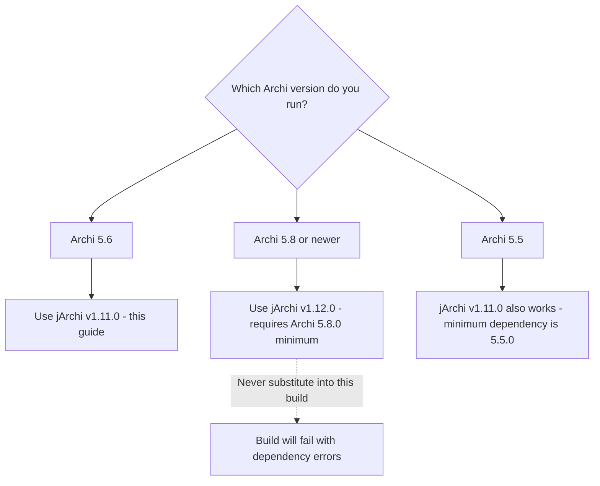
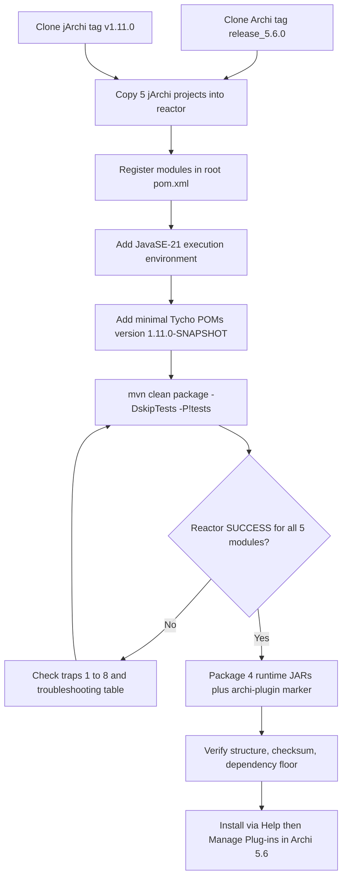
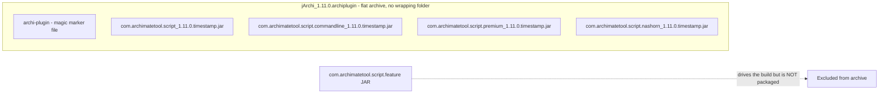

# Building jArchi 1.11.0 for Archi 5.6 from Source: Complete Guide

A verified, repeatable procedure for compiling the jArchi scripting plugin from source and installing it into Archi 5.6 — no Patreon binary required.

BY THE WAY:
**Platform Economies** — launching September 1, 2026.  
[**Pre-order on Amazon**](https://www.amazon.com/dp/B0GXN4PRB5) — Kindle edition available now; paperback follows on September 1. Also available in [🇬🇧 UK](https://www.amazon.co.uk/dp/B0GXN4PRB5), [🇩🇪 DE](https://www.amazon.de/dp/B0GXN4PRB5), [🇯🇵 JP](https://www.amazon.co.jp/dp/B0GXN4PRB5), and [🇨🇦 CA](https://www.amazon.ca/dp/B0GXN4PRB5).
The middle ground didn't fade; it vanished in a single cycle. A strategic‑operational guide for leaders building or surviving in platform economies, built around three irreversible rule shifts: efficiency over headcount, value over volume, and platforms over features.  
Full context and extended materials: **[Platform Economies Site](https://platformeconomies.com)**.

> 📚 **Explore the author's publications:** [mohammed-brueckner.com/publications](https://mohammed-brueckner.com/publications) — featuring [*IT's not magic, it's architecture*](https://www.amazon.com/dp/B0CVZ1BWPN) (IT leadership & enterprise architecture) and [*Machine Learning Operations (MLOps) with Databricks on Azure End-to-End*](https://www.amazon.com/dp/B0FTSY78DR) (production-grade MLOps systems).

---

## Table of Contents

- [What You Will Build](#what-you-will-build)
- [Why Build from Source?](#why-build-from-source)
- [Verified Source Baselines](#verified-source-baselines)
- [Compatibility: Which jArchi for Which Archi?](#compatibility-which-jarchi-for-which-archi)
- [The 8 Traps (Read First)](#the-8-traps-read-first)
- [Prerequisites](#prerequisites)
- [Clean Build Procedure](#clean-build-procedure)
- [Packaging the Installable Plugin](#packaging-the-installable-plugin)
- [Verification](#verification)
- [Installation into Archi](#installation-into-archi)
- [Troubleshooting](#troubleshooting)
- [FAQ](#faq)
- [Resources](#resources)

---

## What You Will Build

This procedure produces an installable `jArchi_1.11.0.archiplugin` from the official jArchi 1.11.0 source, compiled inside the official Archi 5.6.0 build reactor.

The build yields four jArchi runtime bundles:

- `com.archimatetool.script`
- `com.archimatetool.script.commandline`
- `com.archimatetool.script.premium`
- `com.archimatetool.script.nashorn`

The resulting archive installs through `Help > Manage Plug-ins > Install New...` in Archi. It must **not** be unpacked into `C:\Program Files\Archi` manually.

> ⚠️ This is a **source build**, not the separately distributed Patreon binary. It will not have the same byte size, timestamp qualifier, or checksum as the publisher's packaged file — and that is expected (see [Verification](#verification)).

---

## Why Build from Source?

The [jArchi GitHub repository](https://github.com/archimatetool/archi-scripting-plugin) publishes **source tags only — no release assets**. The ready-made binary is distributed separately to Patreon supporters. If you need jArchi on Archi 5.6 and want full control over provenance and versioning, building from the tagged source is the clean path:

- ✅ Fully auditable: exact tags, exact commits, your own checksum
- ✅ No manual patching of an installed Archi instance
- ✅ Repeatable: the same procedure works on any clean machine
- ✅ Safe for managed environments (VDI, locked-down corporate installs)

If you want to master not only your toolchain but IT Architecture overall, check out:
["IT's not magic, it's architecture"](https://www.amazon.com/dp/B0CVZ1BWPN) *today*!

For the full collection of architecture and MLOps resources, visit [mohammed-brueckner.com/publications](https://mohammed-brueckner.com/publications).

---

## Verified Source Baselines

| Component | Source | Exact Version |
|---|---|---|
| jArchi | `https://github.com/archimatetool/archi-scripting-plugin` | tag `v1.11.0` |
| Archi | `https://github.com/archimatetool/archi` | tag `release_5.6.0` |
| Maven | [Apache archive](https://archive.apache.org/dist/maven/maven-3/3.9.9/) | 3.9.9 |
| Tycho | via Archi 5.6's `.mvn/maven.config` | 4.0.12 |
| Java | any JDK 21 distribution | JDK 21 |

---

## Compatibility: Which jArchi for Which Archi?

This matters more than anything else on this page — picking the wrong combination is the #1 cause of failed builds.

| jArchi version | Minimum Archi version | Works with Archi 5.6? |
|---|---|---|
| **1.11.0** | 5.5.0 | ✅ Yes — this guide |
| 1.12.0 | 5.8.0 | ❌ No — do **not** substitute |

jArchi 1.11.0 declares a minimum dependency on Archi bundles at version **5.5.0**, so Archi 5.6 satisfies it. jArchi 1.12.0 instead requires Archi **5.8.0** and must not be substituted into this procedure.



---

## The 8 Traps (Read First)

> 🏛️ Tooling discipline is architecture discipline. [*IT's not magic, it's architecture*](https://www.amazon.com/dp/B0CVZ1BWPN) covers the principles and patterns that make procedures like this one boring — in the best possible way.

### 1. GitHub does not provide the compiled plugin

The repository contains source tags but no release assets. Downloading the tag ZIP only gives you source code; **renaming that ZIP to `.archiplugin` does not create an installable plugin.**

### 2. Use the exact source tags

Do not build from either repository's moving `master` branch. Use `v1.11.0` for jArchi and `release_5.6.0` for Archi. This keeps the intended API boundary stable.

### 3. Use JDK 21 explicitly

The Archi 5.6 build bundles require the Java 21 execution environment. Tycho may initially resolve Java 17 and fail when resolving `com.archimatetool.editor`. Add this to the existing `target-platform-configuration` configuration in the Archi root `pom.xml`:

```xml
<executionEnvironment>JavaSE-21</executionEnvironment>
```

Place it directly inside that plugin's `<configuration>` element, **before** `<environments>`.

### 4. Preserve jArchi's own Maven version

If the jArchi modules simply inherit the Archi parent version, Tycho sees Maven version `5.6.0-SNAPSHOT` but OSGi version `1.11.0.qualifier` and stops with a version mismatch. Every imported jArchi module POM must explicitly contain:

```xml
<version>1.11.0-SNAPSHOT</version>
```

### 5. Do not package the feature JAR as a runtime bundle

The feature project drives the build and lists the runtime plugins, but `com.archimatetool.script.feature-1.11.0-SNAPSHOT.jar` is **not** one of the four runtime bundles placed in the `.archiplugin` file.

### 6. Do not hard-code the build qualifier

Tycho replaces `.qualifier` with a build-specific timestamp. Each clean build can therefore have a different qualifier and checksum. Read the generated `Bundle-Version` from each JAR manifest when naming the packaged bundle.

### 7. The `.archiplugin` file needs the marker at its root

Archi's plugin manager expects a root-level file named `archi-plugin` containing:

```text
Magic file to signify this is an Archi plug-in bundle.
```

The four plugin JARs must also sit at the archive root, not inside a wrapping directory.

### 8. Maven profiles need PowerShell-safe quoting

Use `"-P!tests"` in PowerShell. Leaving it unquoted can cause shell parsing problems. Tests are not needed to create the plugin package, while the main reactor compilation still validates the Archi API dependencies.

---

## Prerequisites

- **Windows with PowerShell** (the commands below are PowerShell; they translate directly to bash on Linux/macOS)
- **JDK 21** — a full JDK, not just a JRE (`javac` is required)
- **Git**
- **Internet access** for Maven, Tycho, and the Eclipse target platform
- Disk space for the Archi reactor and Maven repository cache

---

## Clean Build Procedure

> 💡 Reproducible build pipelines like this one are the same mindset as production-grade ML delivery — see [*Machine Learning Operations (MLOps) with Databricks on Azure End-to-End*](https://www.amazon.com/dp/B0FTSY78DR).

The full pipeline at a glance:



### Step 1: Prepare an isolated build directory

```powershell
$buildRoot = Join-Path $env:TEMP "jarchi-1.11-archi-5.6-build"
New-Item -ItemType Directory -Force -Path $buildRoot | Out-Null
```

Use a temporary directory rather than modifying a working repository or an installed Archi instance.

### Step 2: Confirm Java 21

```powershell
java -version
javac -version
```

Both commands must resolve to JDK 21. A Java runtime without `javac` is insufficient.

### Step 3: Obtain Maven 3.9.9

```powershell
$mavenZip = Join-Path $buildRoot "apache-maven-3.9.9-bin.zip"
$mavenHome = Join-Path $buildRoot "apache-maven-3.9.9"

Invoke-WebRequest `
    -Uri "https://archive.apache.org/dist/maven/maven-3/3.9.9/binaries/apache-maven-3.9.9-bin.zip" `
    -OutFile $mavenZip

Expand-Archive $mavenZip $buildRoot -Force
$mvn = Join-Path $mavenHome "bin\mvn.cmd"
```

### Step 4: Clone the exact sources

```powershell
$archiSource = Join-Path $buildRoot "archi-5.6-source"
$jarchiSource = Join-Path $buildRoot "jarchi-1.11-source"

git clone --branch release_5.6.0 --depth 1 `
    https://github.com/archimatetool/archi.git $archiSource

git clone --branch v1.11.0 --depth 1 `
    https://github.com/archimatetool/archi-scripting-plugin.git $jarchiSource
```

Confirm that both repositories are on the requested tags before continuing:

```powershell
git -C $archiSource rev-parse HEAD
git -C $jarchiSource rev-parse HEAD
git -C $archiSource describe --tags --exact-match
git -C $jarchiSource describe --tags --exact-match
```

The exact tag checks must return `release_5.6.0` and `v1.11.0`. Record the resolved commits in the build log if traceability is required, but do not hard-code them into the reusable procedure.

### Step 5: Copy the required jArchi projects into the Archi reactor

```powershell
$modules = @(
    "com.archimatetool.script",
    "com.archimatetool.script.commandline",
    "com.archimatetool.script.premium",
    "com.archimatetool.script.nashorn",
    "com.archimatetool.script.feature"
)

foreach ($module in $modules) {
    Copy-Item `
        -LiteralPath (Join-Path $jarchiSource $module) `
        -Destination (Join-Path $archiSource $module) `
        -Recurse
}
```

Run this against a clean Archi clone. If any destination module already exists, **stop and inspect it** rather than overwriting an earlier partial build.

### Step 6: Add the modules to the Archi root POM

Inside the existing `<modules>` block in `$archiSource\pom.xml`, add:

```xml
<module>com.archimatetool.script</module>
<module>com.archimatetool.script.commandline</module>
<module>com.archimatetool.script.premium</module>
<module>com.archimatetool.script.nashorn</module>
<module>com.archimatetool.script.feature</module>
```

Also add the Java 21 execution environment to the existing `target-platform-configuration` configuration:

```xml
<configuration>
    <executionEnvironment>JavaSE-21</executionEnvironment>
    <environments>
        ...existing Archi environments...
    </environments>
</configuration>
```

Do **not** replace Archi's repository, Tycho, or environment configuration.

### Step 7: Add minimal Tycho POMs to the jArchi projects

Use this POM for the four runtime plugin projects, changing only the `artifactId`:

```xml
<?xml version="1.0" encoding="UTF-8"?>
<project xmlns="http://maven.apache.org/POM/4.0.0">
  <modelVersion>4.0.0</modelVersion>
  <parent>
    <groupId>com.archimatetool</groupId>
    <artifactId>archi</artifactId>
    <version>${revision}</version>
    <relativePath>../</relativePath>
  </parent>
  <artifactId>REPLACE_WITH_MODULE_NAME</artifactId>
  <version>1.11.0-SNAPSHOT</version>
  <packaging>eclipse-plugin</packaging>
</project>
```

The four runtime `artifactId` values are:

```text
com.archimatetool.script
com.archimatetool.script.commandline
com.archimatetool.script.premium
com.archimatetool.script.nashorn
```

For `com.archimatetool.script.feature\pom.xml`, use:

```xml
<?xml version="1.0" encoding="UTF-8"?>
<project xmlns="http://maven.apache.org/POM/4.0.0">
  <modelVersion>4.0.0</modelVersion>
  <parent>
    <groupId>com.archimatetool</groupId>
    <artifactId>archi</artifactId>
    <version>${revision}</version>
    <relativePath>../</relativePath>
  </parent>
  <artifactId>com.archimatetool.script.feature</artifactId>
  <version>1.11.0-SNAPSHOT</version>
  <packaging>eclipse-feature</packaging>
</project>
```

### Step 8: Build the combined reactor

```powershell
Push-Location $archiSource
try {
    & $mvn clean package -DskipTests "-P!tests"
    if ($LASTEXITCODE -ne 0) {
        throw "Maven build failed with exit code $LASTEXITCODE"
    }
}
finally {
    Pop-Location
}
```

The reactor summary must show `SUCCESS` for all four jArchi runtime modules **and** `com.archimatetool.script.feature`.

---

## Packaging the Installable Plugin

The target archive layout — flat, five root entries, feature JAR excluded:



The following script reads each actual OSGi version from its generated manifest, avoiding a hard-coded qualifier:

```powershell
Add-Type -AssemblyName System.IO.Compression.FileSystem

$packageDir = Join-Path $buildRoot "jarchi-package"
$downloadDir = Join-Path $env:USERPROFILE "Downloads"
$temporaryZip = Join-Path $downloadDir "jArchi_1.11.0.zip"
$outputPlugin = Join-Path $downloadDir "jArchi_1.11.0.archiplugin"

if (Test-Path $packageDir) {
    throw "Package directory already exists: $packageDir"
}

New-Item -ItemType Directory -Path $packageDir | Out-Null

[System.IO.File]::WriteAllText(
    (Join-Path $packageDir "archi-plugin"),
    "Magic file to signify this is an Archi plug-in bundle.",
    [System.Text.Encoding]::ASCII
)

$runtimeBundles = @(
    "com.archimatetool.script",
    "com.archimatetool.script.commandline",
    "com.archimatetool.script.premium",
    "com.archimatetool.script.nashorn"
)

foreach ($bundle in $runtimeBundles) {
    $jar = Get-Item (Join-Path $archiSource "$bundle\target\$bundle-1.11.0-SNAPSHOT.jar")
    $archive = [System.IO.Compression.ZipFile]::OpenRead($jar.FullName)

    try {
        $entry = $archive.GetEntry("META-INF/MANIFEST.MF")
        if ($null -eq $entry) {
            throw "Manifest missing from $($jar.FullName)"
        }

        $reader = New-Object System.IO.StreamReader($entry.Open())
        try {
            $manifest = $reader.ReadToEnd()
        }
        finally {
            $reader.Dispose()
        }
    }
    finally {
        $archive.Dispose()
    }

    $versionMatch = [regex]::Match(
        $manifest,
        '(?m)^Bundle-Version:\s*([^\r\n]+)'
    )

    if (-not $versionMatch.Success) {
        throw "Bundle-Version missing from $($jar.FullName)"
    }

    $bundleVersion = $versionMatch.Groups[1].Value.Trim()
    if ($bundleVersion -notmatch '^1\.11\.0\.') {
        throw "Unexpected version $bundleVersion in $($jar.FullName)"
    }

    Copy-Item $jar.FullName `
        (Join-Path $packageDir "${bundle}_${bundleVersion}.jar")
}

Compress-Archive `
    -Path (Join-Path $packageDir '*') `
    -DestinationPath $temporaryZip `
    -CompressionLevel Optimal `
    -Force

Move-Item $temporaryZip $outputPlugin -Force
```

---

## Verification

> 🔗 Verification, traceability, and disciplined release management are core themes across the [author's publications](https://mohammed-brueckner.com/publications).

### 1. Check the archive structure

```powershell
tar -tf "$env:USERPROFILE\Downloads\jArchi_1.11.0.archiplugin"
```

There must be **exactly five root entries**: the `archi-plugin` marker and the four runtime bundles. There must not be a wrapping directory.

### 2. Record the checksum

```powershell
Get-FileHash `
    "$env:USERPROFILE\Downloads\jArchi_1.11.0.archiplugin" `
    -Algorithm SHA256
```

Record the checksum alongside the build log or delivery record. Because Tycho generates a timestamp-qualified bundle version, **each clean build can produce a different checksum**. Validate each build through its source tags, successful reactor output, manifest versions, archive structure, and newly recorded checksum — do **not** compare it with a checksum from an unrelated build run.

### 3. Check the Archi dependency floor

Extract `META-INF/MANIFEST.MF` from the main generated bundle and confirm it still contains the Archi editor and command-line requirements at version **5.5.0**. This proves the packaged jArchi source has not silently moved to the Archi 5.8 dependency introduced by jArchi 1.12.

---

## Installation into Archi

1. Start Archi 5.6.
2. Open `Help > Manage Plug-ins`.
3. Select `Install New...`.
4. Select `jArchi_1.11.0.archiplugin`.
5. Confirm and restart Archi.

> ⚠️ Do **not** extract the archive or copy it into the Archi installation directory. This is particularly important in managed VDI environments, where the program installation is shared and should not be modified manually.

---

## Troubleshooting

| Symptom | Root Cause | Fix |
|---|---|---|
| Tycho fails resolving `com.archimatetool.editor` | Java 17 resolved instead of Java 21 | Add `<executionEnvironment>JavaSE-21</executionEnvironment>` to `target-platform-configuration` (Trap 3) |
| Maven/OSGi version mismatch (`5.6.0-SNAPSHOT` vs `1.11.0.qualifier`) | jArchi modules inherited the Archi parent version | Set explicit `<version>1.11.0-SNAPSHOT</version>` in every jArchi module POM (Trap 4) |
| Archi rejects the file as "not a valid plug-in" | Missing `archi-plugin` marker or JARs nested in a folder | Repack with the marker and the four JARs at the archive root (Trap 7) |
| Dependency error during installation | Built jArchi 1.12.x against Archi 5.6 | Rebuild from jArchi tag `v1.11.0` — 1.12 requires Archi 5.8 (see [Compatibility](#compatibility-which-jarchi-for-which-archi)) |
| Profile-related Maven error in PowerShell | Unquoted `-P!tests` parsed by the shell | Quote it: `"-P!tests"` (Trap 8) |
| Checksum differs from a previous build | Tycho replaced `.qualifier` with a new timestamp | Expected behavior — verify via manifest `Bundle-Version`, not checksum comparison (Trap 6) |
| "Installable plugin" made from the GitHub ZIP does nothing | The tag ZIP is source code, not a plugin | Follow this guide; renaming the ZIP never works (Trap 1) |

---

## FAQ

**Can I just download jArchi instead of building it?**
The official binary is distributed via the publisher's Patreon. GitHub offers source tags only. This guide is the way to get an installable plugin directly from the official source.

**Can I rename the GitHub source ZIP to `.archiplugin`?**
No. The ZIP contains uncompiled source code. An `.archiplugin` file is a specifically structured archive containing compiled OSGi bundles plus the `archi-plugin` marker file.

**Which jArchi version works with Archi 5.6?**
jArchi **1.11.0** (minimum dependency: Archi 5.5.0). jArchi 1.12.0 requires Archi 5.8.0 and will not install on Archi 5.6.

**Do I need a full JDK, or is a JRE enough?**
A full **JDK 21** is required — `javac` must be available. A runtime-only Java installation will fail the build.

**Why is my checksum different from the official download?**
Tycho stamps every build with a timestamp qualifier, so qualifiers and checksums differ between builds by design. Validate your build through source tags, reactor success, manifest versions, and archive structure instead.

**Can I unpack the plugin into the Archi program folder?**
No — always install via `Help > Manage Plug-ins > Install New...`. Manual copying bypasses Archi's plugin management and is especially risky on shared/managed installations.

---

## Resources

- [Author Publications — Mohammed Brückner](https://mohammed-brueckner.com/publications) — IT architecture, MLOps, and enterprise integration resources
- [Archi Tool](https://www.archimatetool.com/)
- [Archi Source (GitHub)](https://github.com/archimatetool/archi)
- [jArchi Scripting Plugin (GitHub)](https://github.com/archimatetool/archi-scripting-plugin)
- [Apache Maven 3.9.9 Archive](https://archive.apache.org/dist/maven/maven-3/3.9.9/)
- [Eclipse Tycho](https://tycho.eclipseprojects.io/)
- [Adoptium JDK 21](https://adoptium.net/)

---

> ### 📖 Before you go
>
> You just built an enterprise architecture plugin from source — you clearly care about doing architecture *properly*. Take the next step:
>
> - 🏛️ [**IT's not magic, it's architecture**](https://www.amazon.com/dp/B0CVZ1BWPN) — IT leadership & enterprise architecture, from principles to practice.
> - 🤖 [**Machine Learning Operations (MLOps) with Databricks on Azure End-to-End**](https://www.amazon.com/dp/B0FTSY78DR) — production-grade MLOps systems that survive contact with reality.
> - 🚀 [**Platform Economies**](https://www.amazon.com/dp/B0GXN4PRB5) — launching September 1, 2026. Pre-order the Kindle edition now ([US](https://www.amazon.com/dp/B0GXN4PRB5) · [UK](https://www.amazon.co.uk/dp/B0GXN4PRB5) · [DE](https://www.amazon.de/dp/B0GXN4PRB5) · [JP](https://www.amazon.co.jp/dp/B0GXN4PRB5) · [CA](https://www.amazon.ca/dp/B0GXN4PRB5)) and visit the [Platform Economies Site](https://platformeconomies.com) for extended materials.
>
> **Full catalog:** [mohammed-brueckner.com/publications](https://mohammed-brueckner.com/publications)

---

**Last Updated:** August 2026
