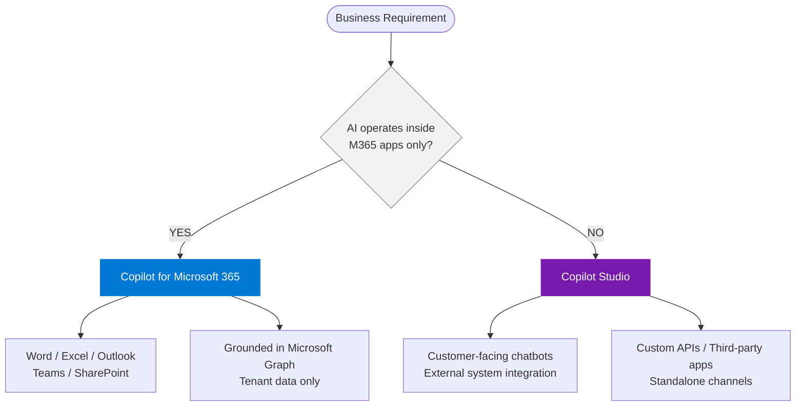
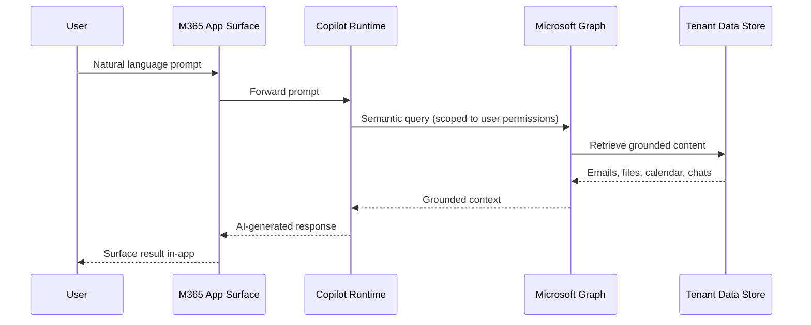
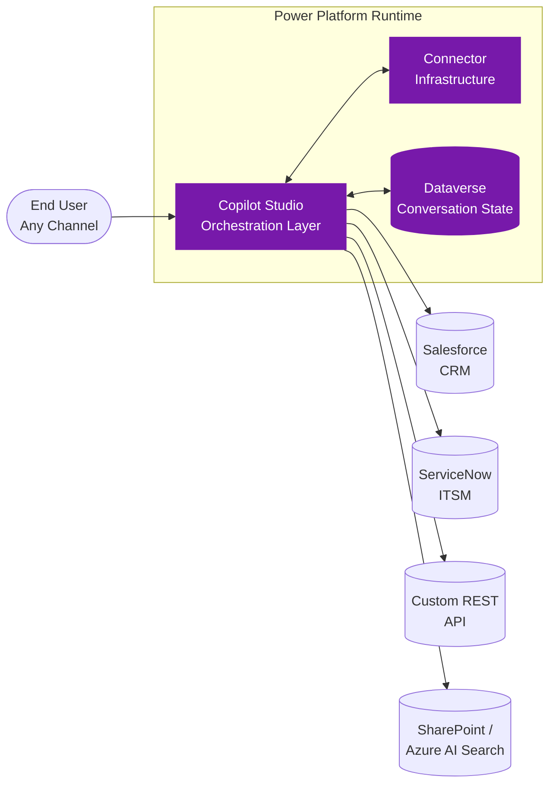
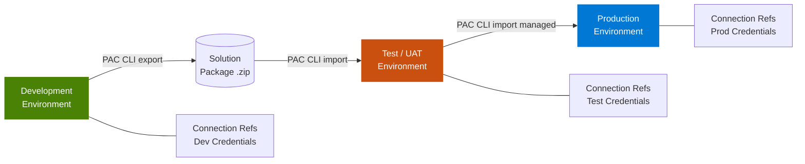

First published at mohammed-brueckner.com

---

# Copilot Studio vs. Copilot for Microsoft 365: The Architect's Definitive Decision Guide

*A principal-engineer-level breakdown of architecture, governance, cost models, and execution traps — for the teams who have to live with the consequences of the choice.*

---

## The Fork That Actually Matters

Microsoft's Copilot branding has created a genuine taxonomy problem. When a business leader says "we want Copilot," they might mean an AI layer inside their existing Microsoft 365 apps — or they might mean an autonomous agent that handles customer queries, writes back to a CRM, and orchestrates multi-step workflows across third-party systems. These are structurally different products, with different licensing models, different governance postures, different cost curves, and — critically — different ceilings on what they can do.

Getting the choice wrong is not a minor inconvenience. Deploying **Copilot for Microsoft 365** when you need external-facing automation means your team will spend months discovering the edges of a walled garden. Deploying **Copilot Studio** when your users only need help drafting emails means absorbing consumption-based variable costs and a Power Platform governance burden you did not budget for. Both errors are common. Both are expensive.

This advisory covers the underlying mechanics of each product, the exact friction points you will encounter during implementation, the governance obligations that follow each path, and the specific technical decisions that determine long-term stability.

> **The question is not "which product is better." The question is which architectural paradigm — productivity augmentation or orchestration-and-automation — matches your actual business requirement.**

---

## One Qualifying Question, Two Completely Different Products

The cleanest way to frame the decision is a single qualifying question: **Does the AI need to operate exclusively inside Microsoft 365 applications, or does it need to cross the boundary into external systems, custom APIs, or standalone interfaces?**



If the answer is "inside M365 apps only" — Word, Excel, Outlook, Teams, SharePoint — the correct path is **Copilot for Microsoft 365**. The AI reasons over the user's organizational data via Microsoft Graph and surfaces results inside familiar application surfaces. No custom development required. No external connectors to govern.

If the answer is anything else — a customer-facing chatbot, an agent that reads from Salesforce and writes back to ServiceNow, a standalone knowledge base assistant, a workflow that spans multiple backend systems — the correct path is **Copilot Studio**. This is a low-code orchestration platform, not a productivity add-on. Its architectural purpose is fundamentally different.

This distinction maps directly to the data flow architecture of each product, which in turn determines every governance, cost, and security decision you make downstream.

---

## Copilot for M365: The Walled Garden, Precisely Described

Copilot for Microsoft 365 operates within a closed-loop architecture. The canonical data flow is:



Every hop in this chain is controlled by Microsoft. You do not own the transport layer. You do not configure the routing. Your administrative control is limited to what Microsoft exposes through the M365 Admin Center and the tenant's existing compliance policies.

The AI grounding mechanism is **Microsoft Graph** — specifically, the semantic index that Graph builds over your tenant's data. When a user asks Copilot to summarize the last three emails from a specific contact, Graph queries the Exchange Online data store, applies the user's existing access permissions (meaning Copilot cannot surface data the user does not already have rights to see), and returns a grounded response. This is not retrieval-augmented generation in the open-source sense; it is a proprietary implementation where the retrieval index is managed entirely by Microsoft's infrastructure.

The practical consequence of this architecture is that **you cannot inject custom data sources without using Microsoft-provided connectors**. Microsoft Graph Connectors exist to extend the semantic index to external data — ServiceNow knowledge articles, Confluence pages — but these connectors are Microsoft-certified and the list is finite. If your data source is not on that list, it does not enter the Copilot for M365 retrieval pipeline. This is the ceiling that most architects eventually hit.

> **Architecture Constraint:** Microsoft Graph Connectors for Copilot for M365 require data to be indexed in Microsoft's semantic index. Third-party data sources without an official Graph Connector cannot be grounded into Copilot for M365 responses without a custom connector build — a non-trivial development effort subject to Microsoft's certification process.

Sensitivity labels and compliance tags applied via Microsoft Purview *are respected by Copilot*. If a document is labeled "Confidential — Do Not Forward," Copilot will not surface its content to a user lacking the appropriate clearance. This inheritance of existing DLP policies is a significant operational advantage for organizations that have already invested in Purview compliance posture. The walled garden enforces the walls you already built.

---

## Copilot Studio: The Extensible Platform, Layer by Layer

Copilot Studio's architecture is structurally different. The canonical data flow is a three-tier model:



The orchestration layer in Copilot Studio is built on the **Microsoft Power Platform** runtime. An agent created in Copilot Studio is, at the engine level, a Power Virtual Agents bot extended with generative AI capabilities. The conversation state, topic branching logic, and action triggers are all managed within the Power Platform's Dataverse-adjacent runtime. This matters for governance because **the Power Platform Admin Center — not the M365 Admin Center — is the control plane for everything Copilot Studio does**.

When a Copilot Studio agent calls an external API, it does so via **Power Platform Connectors**. There are over 1,000 certified connectors (Salesforce, ServiceNow, SAP, Zendesk, GitHub, and hundreds more), plus the ability to create **Custom Connectors** using an OpenAPI specification. This is where Copilot Studio's extensibility lives — and where its governance complexity begins.

Each connector call traverses the Power Platform's connector infrastructure, which acts as a relay between the bot runtime and the external system. Credentials are stored as **Connection References** in the Power Platform environment's Dataverse. These references hold OAuth tokens, API keys, or service account credentials required to authenticate with the external system. Connection References are environment-scoped — they do not automatically propagate between development, test, and production environments. This is a source of significant deployment friction that teams consistently underestimate.

For generative answers, Copilot Studio supports configuring **knowledge sources**: SharePoint sites, public websites, uploaded files, or custom data stores via Azure AI Search integration. The generative answer capability is powered by an Azure OpenAI Service call, with the knowledge source content used as retrieval context. The specific model version is not configurable in the standard interface — Microsoft manages model updates, which introduces a non-zero risk of behavioral drift.

> Copilot Studio gives you the extensibility. It also gives you the responsibility. The governance work that Copilot for M365 handles automatically — DLP, data residency, sensitivity label enforcement — you must implement explicitly via Power Platform policies.

---

## Deploying Copilot for M365: What the Admin Center Does Not Tell You

The nominal deployment path for Copilot for Microsoft 365 is license assignment via the M365 Admin Center. The reality of a production deployment involves several steps that, if skipped, produce a Copilot experience that is slower, less accurate, and more likely to generate user complaints.

**Step 1: Verify and optimize the Microsoft Graph semantic index.**

Copilot grounds its responses in the semantic index. If your tenant has large volumes of unstructured, untagged, or poorly organized SharePoint content, the semantic index will surface low-quality results. Before enabling Copilot broadly, audit your SharePoint content architecture: remove orphaned sites, enforce naming conventions, and ensure high-value content is in locations with appropriate permissions.

**Step 2: Configure Search Schema in SharePoint Online.**

The Graph semantic index leverages SharePoint Online's search schema to understand content properties. Custom managed properties that map to your organization's metadata taxonomy will improve Copilot's grounding precision. Use the SharePoint Admin Center's search schema configuration to promote high-value managed properties as refiners and enable them for full-text search.

**Step 3: Audit existing sensitivity label configurations.**

Run a Purview Content Explorer scan to identify the percentage of your tenant's content carrying a sensitivity label. For organizations with low label adoption, enabling Copilot at scale creates a risk: content that should be restricted but has never been labeled will be surfaced to any user whose permissions technically allow access. Implement auto-labeling policies in Purview before Copilot goes live.

**Step 4: Manage the oversharing risk explicitly.**

Copilot does not create new access — it surfaces existing accessible content at unprecedented speed. The latent oversharing problem that existed in your tenant before Copilot becomes immediately visible once Copilot can query across all accessible content in seconds. Run a permission audit using Microsoft's SharePoint Advanced Management (SAM) tool, specifically the Data Access Governance reports, before enabling Copilot for any population larger than a pilot group.

Validation command to check user Copilot license assignment status at scale via PowerShell:

```powershell
Connect-MgGraph -Scopes "User.Read.All", "Directory.Read.All"

$copilotSkuId = (Get-MgSubscribedSku | Where-Object {
    $_.SkuPartNumber -like "*COPILOT*"
}).SkuId

Get-MgUser -All -Property DisplayName,UserPrincipalName,AssignedLicenses |
  Select-Object DisplayName, UserPrincipalName,
    @{Name="CopilotLicensed";
      Expression={$_.AssignedLicenses.SkuId -contains $copilotSkuId}} |
  Export-Csv -Path ".\copilot_license_report.csv" -NoTypeInformation
```

This produces a CSV with each user's license state. The script uses the Microsoft Graph PowerShell SDK (`Microsoft.Graph` module), not the deprecated legacy MSOL or AzureAD modules.

---

## Deploying Copilot Studio: Environment, DLP, and Connection Reference Architecture

A Copilot Studio deployment that will survive enterprise governance review needs to be designed around three axes from day one: **environment strategy, DLP policy architecture, and connection reference management**.

### Environment Strategy



A minimum viable enterprise environment strategy uses three environments: Development, Test/UAT, and Production. Each environment should have its own Dataverse instance. Connection References are environment-scoped and must be explicitly configured in each environment during deployment. Do not share Connection References across environments.

The deployment pipeline between environments should use **Power Platform Solutions**. The PAC CLI is the correct tool:

```bash
# Install PAC CLI (requires Node.js 16+)
npm install -g @microsoft/powerplatform-cli

# Authenticate to your development environment
pac auth create --environment https://your-dev-env.crm.dynamics.com

# Export the solution from development (unmanaged for source control)
pac solution export \
  --name "CopilotAgentSolution" \
  --path "./solutions/CopilotAgentSolution.zip" \
  --managed false

# Authenticate to production environment
pac auth create --environment https://your-prod-env.crm.dynamics.com

# Import to production as a managed solution
pac solution import \
  --path "./solutions/CopilotAgentSolution_managed.zip" \
  --activate-plugins true
```

After import, update Connection References in the target environment to bind production credentials:

```bash
# List connection references in the target environment
pac connection list --environment https://your-prod-env.crm.dynamics.com

# Bind a connection reference to a pre-provisioned production connection
pac connection update \
  --connection-reference "cr123_SalesforceConnectionRef" \
  --connection-id "your-prod-connection-id"
```

### DLP Policy Architecture

This is where most Copilot Studio governance failures originate. The Power Platform Admin Center's DLP policies control which connectors can be used together in a single agent or flow. Connectors are classified into three tiers: *Business*, *Non-Business*, and *Blocked*. Business-tier connectors can interact with each other. Business and Non-Business connectors cannot interact in the same agent without violating the DLP boundary.

The correct approach for an enterprise deployment is a default-deny posture: start with all connectors in the Blocked category, then explicitly promote only the connectors your approved agents need.

```powershell
# Install the Power Platform Administration module
Install-Module -Name Microsoft.PowerApps.Administration.PowerShell

# Create a new DLP policy with default-deny posture
New-AdminDlpPolicy `
  -DisplayName "CopilotStudio-Production-DLP" `
  -DefaultConnectorClassification "Blocked" `
  -PolicyType "SingleEnvironment" `
  -EnvironmentName "your-prod-environment-id"

# Promote the Salesforce connector to Business tier
Set-AdminDlpPolicy `
  -PolicyName "your-policy-id" `
  -ConnectorName "shared_salesforce" `
  -Classification "Business"

# Promote the ServiceNow connector to Business tier
Set-AdminDlpPolicy `
  -PolicyName "your-policy-id" `
  -ConnectorName "shared_service-now" `
  -Classification "Business"
```

Validate that your DLP policy is correctly applied and not being overridden by a tenant-level policy:

```powershell
Get-AdminDlpPolicy | Where-Object {
    $_.PolicyType -eq "SingleEnvironment" -and
    $_.Environments -contains "your-prod-environment-id"
} | Select-Object DisplayName, CreatedTime, LastModifiedTime
```

---

## Licensing Architecture: Where Fixed Cost Meets Variable Cost

The cost models for these two products are structurally different, and that difference has budget implications that finance teams frequently do not anticipate.

| Dimension | Copilot for M365 | Copilot Studio |
|---|---|---|
| **License Model** | Per-user, per-month add-on to E3/E5 | Tenant capacity pack + message consumption |
| **Cost Predictability** | Fixed — scales linearly with user count | Variable — scales with agent usage volume |
| **External User Access** | Not supported (requires M365 identity) | Supported — no M365 license required |
| **Admin Control Plane** | M365 Admin Center | Power Platform Admin Center |
| **Connector Cost Tracking** | Not applicable | Per-connector consumption tracked in PPAC |
| **Required Prerequisite** | M365 E3 or E5 base license | Power Platform license (can be standalone) |

The consumption model for Copilot Studio is built around **messages**. Each conversational exchange between an end user and an agent consumes messages. Generative AI-powered exchanges invoke the underlying Azure OpenAI model and consume significantly more messages than rule-based topic responses. At the time of writing, Microsoft's published rate is that generative AI responses consume approximately 2,000 messages per session, compared to 1 message for a simple transactional response. Verify this against the current Microsoft licensing guide before building your financial model.

Setting a spending cap in the Power Platform Admin Center is not optional for production deployments with external users: **Power Platform Admin Center → Billing → Add-ons → set a monthly consumption limit per environment**. There is no PowerShell equivalent for this operation — it requires the Admin Center UI.

---

## The Specific Technical Headaches You Will Encounter

Advisory documents that only describe how things work when they work correctly are incomplete. These are the concrete failure modes engineering teams encounter in production deployments.

### Copilot for M365: The Semantic Index Lag Problem

When new content is added to SharePoint or OneDrive, it is not immediately available for Copilot grounding. Microsoft Graph's semantic index has an ingestion latency ranging from minutes to hours depending on tenant size and index load. Users who upload a document and immediately ask Copilot to summarize it will sometimes receive a "no relevant content found" response. This is not a bug — it is an indexing lag. Fresh content may take up to 24 hours to be fully indexed. There is no administrative lever to force immediate reindexing.

### Copilot for M365: Graph API Throttling Under Load

In tenants where many users activate Copilot simultaneously, Microsoft Graph API endpoints can return `429 Too Many Requests` responses. Copilot for M365's internal retry logic handles most of these transparently, but under sustained load, users may experience slower response times. Monitor tenant Graph API health via the Microsoft 365 Admin Center's Service Health dashboard. There is no tenant-level configuration to increase Graph API rate limits — they are set by Microsoft at the tenant tier level.

### Copilot Studio: The Connection Reference Deployment Race Condition

When deploying a Solution from development to production using PAC CLI, there is a race condition if Connection References are not pre-provisioned in the target environment before the import. The solution import will succeed, but the agent will fail at runtime when it tries to use a connection that does not yet have a valid credential bound to it. The failure mode is a generic "connection not found" error in the agent runtime logs — not a clear deployment error. The correct procedure: **provision all required connections in the target environment first**, then run the solution import, then bind the connection references.

### Copilot Studio: Custom Connector Authentication Token Expiry

Custom connectors that use OAuth 2.0 for authentication rely on refresh tokens stored in the Connection Reference. If the OAuth application in the external system has a refresh token expiry policy shorter than the connection's last-used date — common in security-hardened environments where refresh tokens expire after 24 hours of inactivity — the connection will silently fail until manually refreshed by the connection owner. This failure only surfaces when the agent attempts to use the connector during a live user conversation. Implement monitoring on connector authentication state via the Power Platform Admin Center's analytics or via custom Azure Monitor alerts on the agent's Dataverse telemetry.

### Copilot Studio: Generative Answer Hallucination on Sparse Knowledge Sources

When Copilot Studio's generative answer capability cannot find sufficiently relevant content in the configured knowledge sources, it may generate a response that sounds plausible but is not grounded in any source document. Configure the agent's fallback behavior explicitly: in the Generative Answers node, set the **Content moderation** threshold to "High" and configure an explicit fallback message for low-confidence responses. The setting lives in the agent's **Generative AI → Content moderation** configuration panel.

> **Counter-Point Worth Acknowledging:** Some architects argue that Copilot Studio's low-code interface creates an illusion of simplicity that leads non-technical business users to build agents without adequate governance review. The platform's accessibility accelerates prototyping but also means agents carrying sensitive data integrations can be built and published without security review. Governance policies in Power Platform must explicitly restrict who can publish agents to production channels.

---

## Authentication Posture: Entra ID Integration and the External User Problem

Both products tie into Azure Entra ID, but in fundamentally different ways that affect who can use each tool.

Copilot for Microsoft 365 is **exclusively an internal-user product**. It requires the user to have an active M365 license and a valid Entra ID identity in the tenant. There is no supported path for external users — customers, partners, contractors without full M365 licenses — to access Copilot for M365 capabilities. This is an architectural constraint tied to how Graph grounds responses in per-user permission scopes.

Copilot Studio agents support multiple authentication modes:

- **No Authentication** — The agent is publicly accessible without identity verification. Appropriate for public-facing informational bots with no access to sensitive data.

- **Microsoft (Entra ID)** — Users authenticate with their organizational identity. The agent accesses connector resources on behalf of the authenticated user (delegated permission model). Correct for internal agents that need to perform actions as the signed-in user.

- **Generic OAuth 2.0** — Supports third-party identity providers (Google, LinkedIn, custom OAuth). Connector actions in this mode run under a service account (application permission model), not as the individual user.

- **Manual (Custom)** — The agent prompts the user for credentials passed directly to the backend system. Treat this mode with caution: it transfers credential management responsibility to the bot conversation itself, creating a phishing-adjacent attack surface if the deployment channel is not controlled.

For agents in delegated permission mode, validate the app registration's permission set during security review:

```powershell
Connect-MgGraph -Scopes "Application.Read.All"

# Retrieve the service principal for your Copilot Studio app registration
$sp = Get-MgServicePrincipal -Filter "DisplayName eq 'YourCopilotStudioApp'"

# List all delegated permission grants
Get-MgServicePrincipalOauth2PermissionGrant -ServicePrincipalId $sp.Id |
  Select-Object Scope, ConsentType, PrincipalId |
  Format-Table -AutoSize

# List all application permissions (roles)
Get-MgServicePrincipalAppRoleAssignment -ServicePrincipalId $sp.Id |
  Select-Object AppRoleId, CreatedDateTime |
  Format-Table -AutoSize
```

---

## Monitoring, Telemetry, and What Good Looks Like in Production

Both products have distinct telemetry paths requiring different monitoring configurations.

For **Copilot for M365**, the primary telemetry surface is the Microsoft 365 Usage Analytics dashboard and the Copilot Usage Report in the M365 Admin Center. These reports show adoption metrics but do not provide query-level logging. Individual Copilot interactions are not logged in a customer-accessible audit log by default. Microsoft's Purview Audit (Premium) captures some Copilot interaction events under the `CopilotInteraction` event type, but coverage is not exhaustive across all M365 apps.

For **Copilot Studio**, telemetry is substantially richer:

- **Conversation transcripts** — Full conversation logs for each agent session, accessible via the agent's Analytics tab or via Dataverse queries against the `botcontent` and `conversationtranscript` entities. These transcripts are stored in Dataverse and can be exported for compliance review.

- **Session analytics** — Engagement rate, escalation rate, abandon rate, and topic trigger frequency. Exportable to Power BI via the built-in connector.

- **Connector usage logs** — Each connector call generates a log entry in the Power Platform's connector diagnostics. For compliance-sensitive environments, forward these logs to Azure Monitor using the Power Platform Diagnostic Settings feature.

Export conversation transcripts for compliance review via PAC CLI:

```bash
pac data export \
  --table conversationtranscript \
  --filter "createdon ge 2025-01-01T00:00:00Z" \
  --fields content,createdon,botid,sessionid \
  --output-path "./transcripts/"
```

The `content` field in the `conversationtranscript` entity contains the full JSON-serialized conversation, including user messages, agent responses, and action results from connector calls. For regulated industries — financial services, healthcare, government — this transcript export capability is a prerequisite for compliance certification.

---

## Sovereignty, Residency, and What Microsoft Actually Guarantees

For **Copilot for M365**, Microsoft's documented commitment is that customer data remains in the tenant's **primary data region** as defined by the organization's M365 tenant geography. The AI model inference may process prompts in a different region from where the data is stored. Microsoft's published guidance states that Copilot for M365 does not use customer data to train the underlying foundation models, and that prompt and response data is not retained beyond the user session for model training purposes. These commitments are captured in the Microsoft Product Terms and the Data Protection Addendum (DPA), which are legally binding but subject to change with notice.

For **Copilot Studio**, data residency is more complex. The agent's conversation state and Dataverse storage follow the Power Platform environment's geography — selected at environment creation time. The generative AI capabilities invoke Azure OpenAI Service endpoints, and the region of those endpoints is determined by Microsoft's infrastructure routing, not directly by the customer. Organizations with strict data-at-rest and data-in-transit residency requirements should validate the current Azure OpenAI regional availability against their compliance requirements and consider whether the Power Platform's **EU Data Boundary** commitments apply to their scenario.

The counter-point worth raising: Microsoft's residency and data handling commitments for AI products have been a moving target as the product matures. Organizations making sovereignty-sensitive architecture decisions based on Copilot products should build a contractual review cadence into their governance program — not treat the current DPA terms as permanent.

---

## The Architect's Checklist: Arriving at the Right Answer

Work through each item with actual business and technical stakeholders before committing to a product path.

- **Who are the users?** If exclusively internal employees with M365 licenses, both products are viable. If any users are external — customers, partners, contractors without M365 licenses — Copilot Studio is the only option.

- **What data sources does the AI need to reason over?** If exclusively M365 data (emails, files, SharePoint, Teams), Copilot for M365 is sufficient. If any external system — Salesforce, SAP, a custom REST API, a SQL database — Copilot Studio is required.

- **Does the AI need to perform actions, or only generate content?** Generating a document draft or summarizing an email are content generation tasks — Copilot for M365 handles these well. Creating a ticket in Jira or updating a CRM record are actions — these require Copilot Studio's connector and action framework.

- **What is the expected user interaction model?** If users invoke AI assistance within an existing M365 app (the Copilot button in Word, the summarize feature in Outlook), Copilot for M365 maps to this. If users interact with a standalone chat interface — a website widget, a Teams bot with a custom persona, a phone channel — Copilot Studio is the correct platform.

- **What is your organization's Power Platform governance maturity?** Copilot Studio requires a functioning Power Platform governance model: environment strategy, DLP policies, solution lifecycle management. If your organization has not invested in this infrastructure, the governance buildout is a prerequisite, not a parallel workstream.

- **How predictable must the AI's cost be?** Copilot for M365 is a fixed per-user cost — straightforward to budget. Copilot Studio has a variable consumption component tied to message volume. If the finance team requires fully predictable AI costs, Copilot for M365 is easier to justify. If the business case requires external user access, the variable cost model is unavoidable.

- **What are your audit and compliance logging requirements?** If individual AI interaction audit trails are required by regulation, Copilot Studio's Dataverse conversation transcript capability is substantially more comprehensive than what Copilot for M365 exposes today.

---

## A Sober Summary of What Stability Looks Like After Deployment

A well-deployed **Copilot for M365** stabilizes into a consistent, low-maintenance productivity layer. The primary operational work is license lifecycle management (assign, revoke, report) and periodic content governance — ensuring SharePoint content quality remains high enough to produce useful Copilot responses. The ceiling is real — you will not extend it beyond M365 data without custom Graph Connectors — but within that boundary, it operates reliably. The biggest ongoing risk is the oversharing problem: as organizational data grows and permissions drift, the quality and sensitivity of Copilot-surfaced content requires periodic governance review.

A well-deployed **Copilot Studio** agent is a more active operational artifact. You are managing a software system with connector dependencies, authentication token lifecycles, DLP policy coverage, and a model behavior layer that can drift when Microsoft updates the underlying Azure OpenAI model. The stability achieved after a disciplined deployment — correct environment strategy, explicit DLP policies, pre-provisioned Connection References, configured fallback behaviors, active telemetry — is genuine and production-grade. It requires ongoing operational investment that Copilot for M365 does not.

The organizations that achieve the best outcomes with these products are not the ones that chose the "right" product by gut feel. They are the ones that mapped their actual business requirement to the correct architectural paradigm first, then invested in the governance infrastructure the chosen product demands. The two products are not competitors within the same feature space. They are architecturally distinct tools designed for structurally different problems.

The decision framework in this advisory is not a flowchart to follow once and file away. It is a set of questions to revisit each time the business requirement changes — because the requirement that justified Copilot for M365 today may be the one that justifies Copilot Studio six months from now, and the architecture you build in the meantime either prepares for that evolution or complicates it.

---

*This advisory reflects product capabilities and Microsoft documentation available as of mid-2025. Licensing terms, API rate limits, regional availability, and data residency commitments for Microsoft AI products are subject to change. Verify current terms against the Microsoft Product Terms, Data Protection Addendum, and Power Platform licensing guide before making production architecture commitments. PAC CLI commands and PowerShell module syntax should be validated against current module versions in your deployment environment.*
