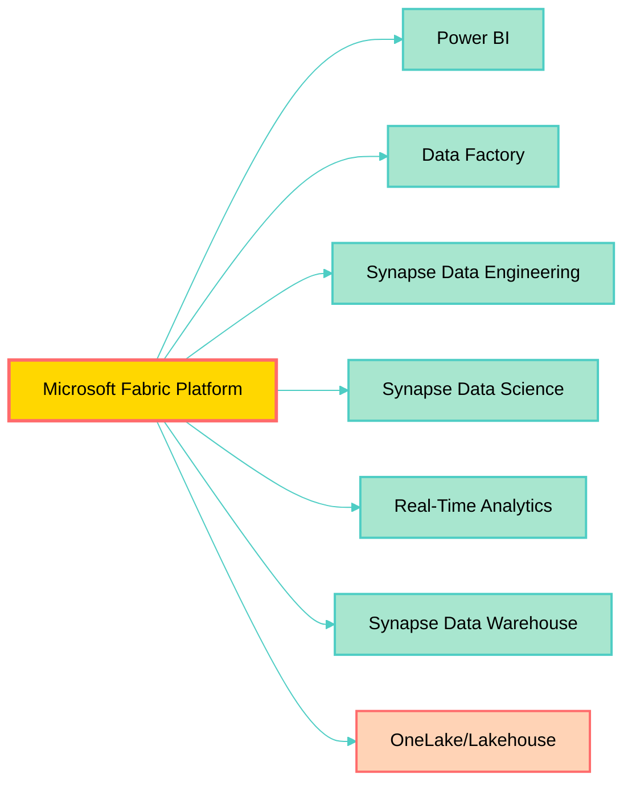
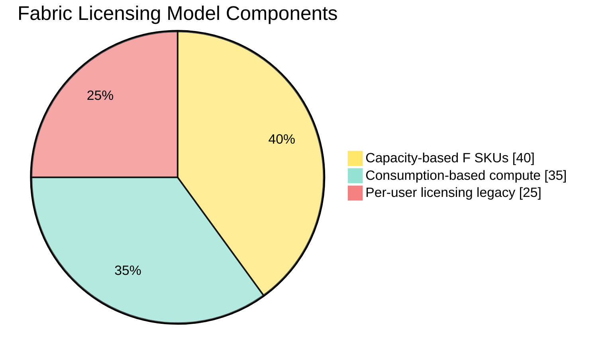
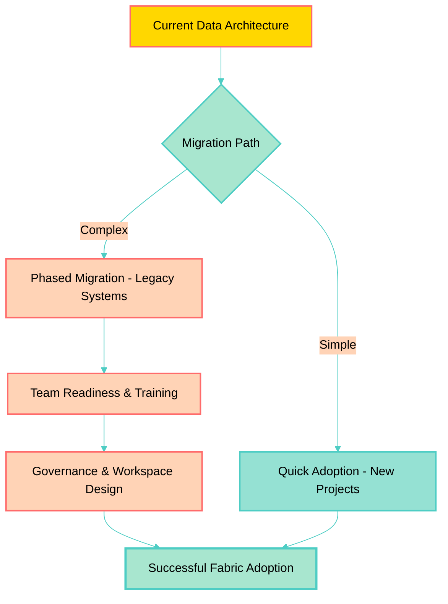
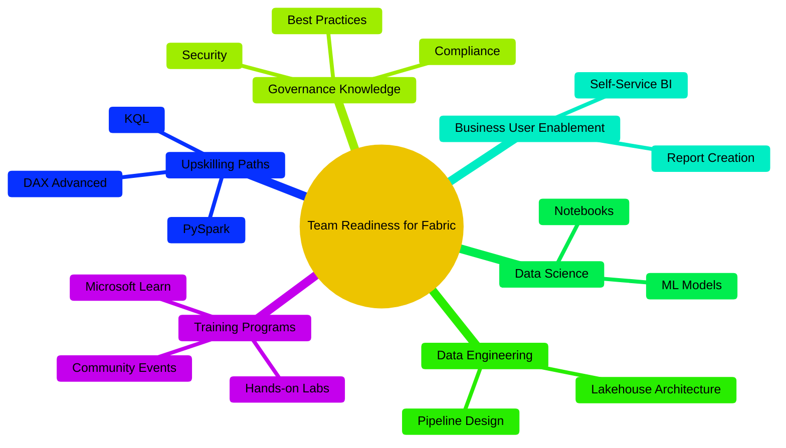
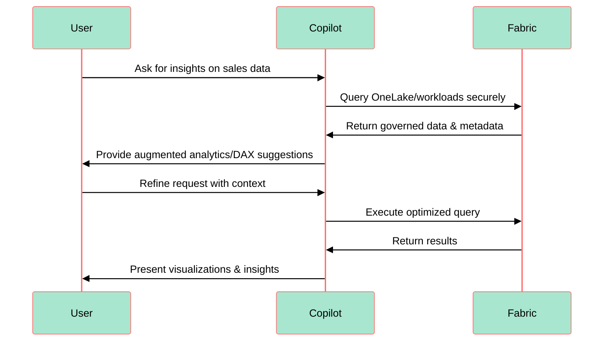
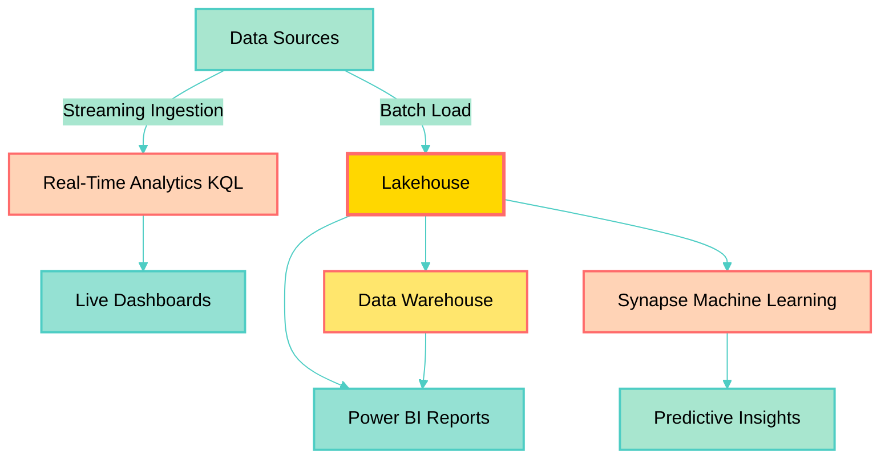
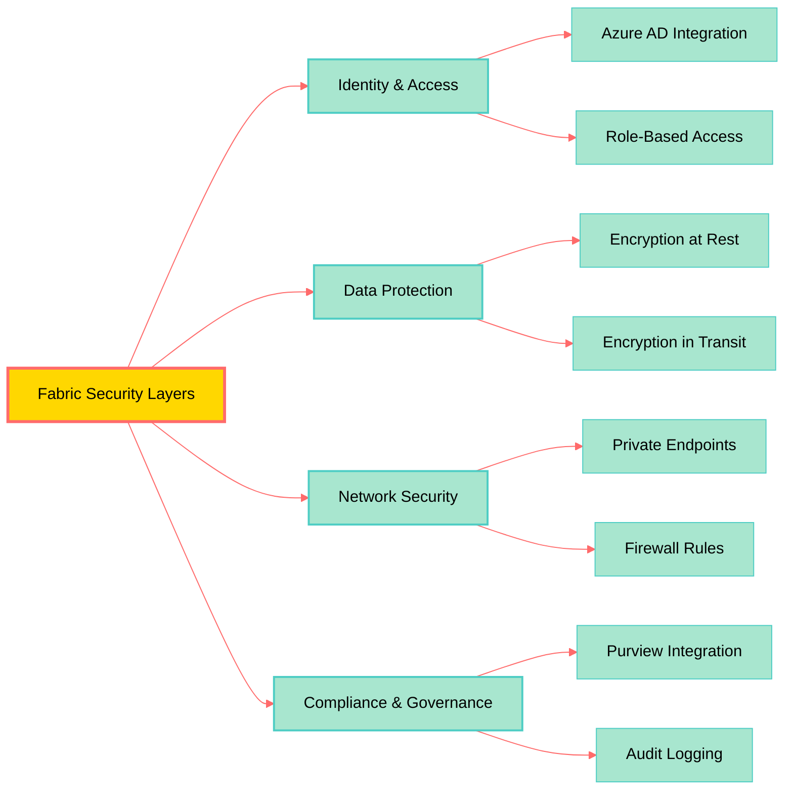
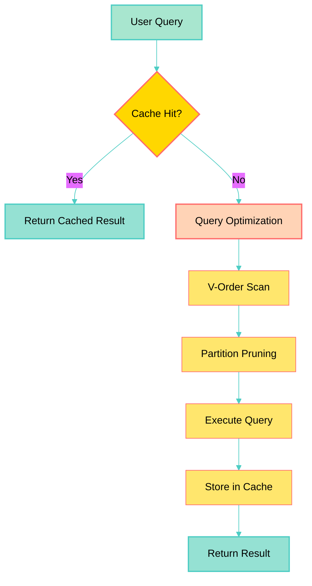
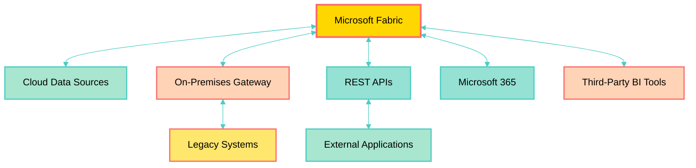
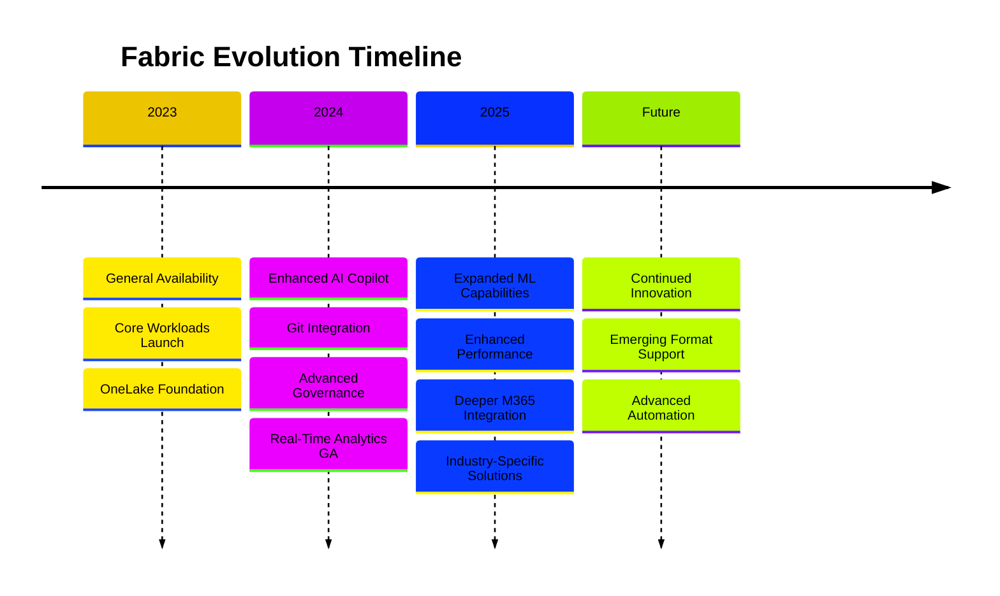

# Busting Microsoft Fabric Misconceptions

This comprehensive guide addresses 100 common misconceptions about Microsoft Fabric, complete with visual diagrams for clarity.

## 1. Core Platform Myths

**Misconception 1:** Fabric is just another Power BI update.  
**Reality:** Fabric is a comprehensive platform that includes Power BI as one of seven integrated workloads.

**Misconception 2:** Fabric is merely a repackaging of existing Microsoft products.  
**Reality:** It fundamentally changes how data flows through an organization (one copy of data stored in OneLake).

**Misconception 3:** Fabric only benefits large enterprises.  
**Reality:** Fabric scales for organizations of all sizes, from small teams to global corporations.

**Misconception 4:** Fabric is only for cloud-based data.  
**Reality:** It integrates with on-premises data via connectors and gateways.

**Misconception 5:** You need to migrate all data at once to use Fabric.  
**Reality:** Fabric supports incremental adoption, allowing you to start with specific workloads or projects.

**Misconception 6:** Fabric replaces Azure Synapse Analytics entirely.  
**Reality:** Fabric includes Synapse capabilities but is a broader platform; existing Synapse investments remain valid.

**Misconception 7:** OneLake is just another data lake.  
**Reality:** OneLake is a unified, hierarchical namespace that automatically organizes data across all Fabric workloads.

**Misconception 8:** Fabric doesn't integrate with non-Microsoft tools.  
**Reality:** Fabric supports open standards like Delta Lake format and integrates with third-party tools via APIs.

**Misconception 9:** You can't use Fabric without Power BI.  
**Reality:** Each Fabric workload can be used independently based on your needs.

**Misconception 10:** Fabric is still in beta and not production-ready.  
**Reality:** Fabric reached general availability in November 2023 and is fully production-ready.

## 2. Licensing & Pricing Myths

**Misconception 11:** Fabric's pricing is the same as Power BI.  
**Reality:** Fabric uses a capacity (F-SKU) consumption-based pricing model, fundamentally different from Power BI Pro/PPU licensing.

**Misconception 12:** Every member of the company needs their own Fabric Trial.  
**Reality:** Trials and licenses vary by role and workload; capacity-based licensing is shared across the organization.

**Misconception 13:** You need a PPU license in addition to Fabric capacity.  
**Reality:** Deployment pipelines and other premium features are supported within Fabric capacity licensing tiers without needing additional PPU licenses.

**Misconception 14:** Fabric is more expensive than Azure Synapse.  
**Reality:** Pricing depends on usage patterns; Fabric can be more cost-effective due to shared capacity and unified storage.

**Misconception 15:** You're charged separately for each Fabric workload.  
**Reality:** All workloads share the same capacity pool, providing flexibility in resource allocation.

**Misconception 16:** Pausing capacity doesn't save money.  
**Reality:** You can pause F-SKU capacity when not in use to reduce costs significantly.

**Misconception 17:** Fabric licensing is per-workspace.  
**Reality:** Licensing is capacity-based, and multiple workspaces can share the same capacity.

**Misconception 18:** Free trial has limited functionality.  
**Reality:** The 60-day trial provides access to all Fabric features with generous capacity limits.

**Misconception 19:** You can't predict Fabric costs.  
**Reality:** Azure Cost Management and Fabric Capacity Metrics app provide detailed usage tracking and forecasting.

**Misconception 20:** Small projects aren't worth using Fabric capacity.  
**Reality:** F2 SKU starts at affordable rates, making Fabric accessible for small-scale projects.

## 3. Implementation & Migration Myths

**Misconception 21:** Migration to Fabric is straightforward regardless of setup.  
**Reality:** Complexity depends on existing architecture, data volume, and organizational readiness.

**Misconception 22:** Implementation is always complex.  
**Reality:** With proper planning and leveraging existing Synapse/Azure experience, Fabric adoption can be streamlined.

**Misconception 23:** Governance and workspace management are simple.  
**Reality:** They require deliberate design, oversight, and a clear operating model to manage sharing and security.

**Misconception 24:** You must migrate all reports at once.  
**Reality:** Reports can be migrated incrementally, testing and validating as you go.

**Misconception 25:** Existing Power BI Premium workspaces can't be upgraded to Fabric.  
**Reality:** Premium workspaces can be seamlessly upgraded to Fabric capacity.

**Misconception 26:** Data migration requires downtime.  
**Reality:** Parallel migration strategies allow continued operation during transition.

**Misconception 27:** You need to rebuild everything from scratch.  
**Reality:** Most existing Power BI content, pipelines, and notebooks are compatible with Fabric.

**Misconception 28:** Migration doesn't require a rollback plan.  
**Reality:** Always maintain rollback capabilities during migration phases.

**Misconception 29:** Third-party tools break during migration.  
**Reality:** Most tools using standard APIs continue working; some may need minor configuration updates.

**Misconception 30:** Migration is a one-time event.  
**Reality:** Fabric adoption is an ongoing journey with continuous optimization opportunities.

## 4. Team & Skills Myths

**Misconception 31:** Team readiness isn't a major factor.  
**Reality:** Success depends heavily on dedicated training and skill development across Data Engineering, Data Science, and BI roles.

**Misconception 32:** You need a degree in data analytics to use Fabric.  
**Reality:** Fabric is designed for both seasoned professionals and citizen/business users.

**Misconception 33:** Existing employee skills are sufficient.  
**Reality:** New workloads introduce fresh skill requirements, necessitating upskilling.

**Misconception 34:** Only data engineers need training.  
**Reality:** Business analysts, data scientists, and report consumers all benefit from Fabric training.

**Misconception 35:** SQL skills alone are enough for Fabric.  
**Reality:** PySpark, KQL, DAX, and Power Query knowledge significantly enhance Fabric capabilities.

**Misconception 36:** Fabric documentation is insufficient for learning.  
**Reality:** Microsoft provides extensive documentation, learning paths, and community resources.

**Misconception 37:** You need dedicated Fabric administrators.  
**Reality:** While helpful, existing Azure/Power BI admins can manage Fabric with appropriate training.

**Misconception 38:** Citizen developers can't contribute meaningfully.  
**Reality:** Low-code tools like Data Factory and Power BI empower business users to create valuable solutions.

**Misconception 39:** Training should happen after implementation.  
**Reality:** Proactive training during planning phases accelerates adoption and reduces friction.

**Misconception 40:** One-time training is sufficient.  
**Reality:** Continuous learning is essential as Fabric evolves with new features monthly.

## 5. Copilot & AI Myths

**Misconception 41:** Copilot can replace human analysts entirely.  
**Reality:** Copilot augments analysts by automating repetitive tasks; human insight remains essential.

**Misconception 42:** Copilot in Fabric is not secure and sends data externally.  
**Reality:** Copilot operates within Microsoft's compliance boundary, leveraging configured governance policies.

**Misconception 43:** Copilot is ready for all use cases without preparation.  
**Reality:** It requires proper setup, clean data, and context like well-defined Lakehouse tables.

**Misconception 44:** Copilot only works with English.  
**Reality:** Copilot supports multiple languages for natural language queries and code generation.

**Misconception 45:** Copilot can't generate complex DAX measures.  
**Reality:** It can create sophisticated calculations when provided with clear requirements and context.

**Misconception 46:** Using Copilot doesn't require understanding the underlying technology.  
**Reality:** Domain knowledge helps you validate and refine Copilot suggestions effectively.

**Misconception 47:** Copilot stores your queries and data for training.  
**Reality:** Fabric Copilot respects data residency and doesn't use tenant data for model training without consent.

**Misconception 48:** Copilot always generates production-ready code.  
**Reality:** Generated code should be reviewed, tested, and optimized before production deployment.

**Misconception 49:** Copilot can't help with data modeling.  
**Reality:** It assists with relationship suggestions, schema design recommendations, and optimization tips.

**Misconception 50:** Copilot requires separate licensing.  
**Reality:** Copilot features are included in Fabric capacity licensing (availability may vary by SKU).

## 6. Data & Analytics Myths

**Misconception 51:** Fabric doesn't support real-time data.  
**Reality:** Real-Time Analytics workload enables streaming, event processing, and live insights via KQL Databases.

**Misconception 52:** Fabric is only for structured data.  
**Reality:** It supports structured, semi-structured (JSON/XML), and unstructured data in OneLake.

**Misconception 53:** Fabric is only for historical analysis.  
**Reality:** Built-in Synapse Data Science capabilities enable predictive analytics and ML model deployment.

**Misconception 54:** You can't do complex transformations in Fabric.  
**Reality:** Dataflows Gen2, Spark notebooks, and pipelines provide extensive transformation capabilities.

**Misconception 55:** Fabric can't handle petabyte-scale data.  
**Reality:** OneLake and Spark clusters scale to handle petabytes of data efficiently.

**Misconception 56:** Real-time analytics requires separate infrastructure.  
**Reality:** Real-Time Analytics is natively integrated, sharing the same governance and security model.

**Misconception 57:** You can't use Python for data engineering in Fabric.  
**Reality:** PySpark notebooks are fully supported for data engineering workflows.

**Misconception 58:** Fabric doesn't support incremental refresh.  
**Reality:** Both Power BI datasets and Lakehouse tables support incremental data loading.

**Misconception 59:** Data lineage tracking isn't available.  
**Reality:** Fabric provides comprehensive lineage views across workloads and data assets.

**Misconception 60:** You can't schedule complex orchestrations.  
**Reality:** Data Factory pipelines support sophisticated scheduling, dependencies, and error handling.

## 7. Security & Governance Myths

**Misconception 61:** Fabric security is less robust than Azure Synapse.  
**Reality:** Fabric inherits Azure's enterprise-grade security with additional unified governance capabilities.

**Misconception 62:** Row-level security (RLS) isn't supported.  
**Reality:** RLS is fully supported across Power BI datasets, Lakehouses, and Data Warehouses.

**Misconception 63:** You can't control who accesses what data.  
**Reality:** Fabric provides granular permissions at workspace, item, and data level.

**Misconception 64:** Compliance certifications don't cover Fabric.  
**Reality:** Fabric maintains SOC, ISO, HIPAA, and other major compliance certifications.

**Misconception 65:** Data encryption is optional.  
**Reality:** All data is encrypted at rest and in transit by default.

**Misconception 66:** Audit logs aren't comprehensive.  
**Reality:** Fabric provides detailed audit logs integrated with Microsoft Purview.

**Misconception 67:** You can't implement data classification.  
**Reality:** Microsoft Purview integration enables sensitivity labels and data classification.

**Misconception 68:** External sharing isn't secure.  
**Reality:** External sharing follows configurable policies with comprehensive controls.

**Misconception 69:** OneLake doesn't support GDPR compliance.  
**Reality:** OneLake supports data residency, retention policies, and right-to-be-forgotten requirements.

**Misconception 70:** You can't track who modified what.  
**Reality:** Version history and audit trails track all changes to items and data.

## 8. Performance & Optimization Myths

**Misconception 71:** Fabric performance is slower than dedicated solutions.  
**Reality:** Optimized Fabric implementations often outperform traditional architectures due to unified storage and compute.

**Misconception 72:** You can't optimize query performance.  
**Reality:** V-Order optimization, partitioning, and indexing strategies significantly improve performance.

**Misconception 73:** All data must be processed in Spark.  
**Reality:** T-SQL warehouse and KQL databases provide alternative high-performance engines.

**Misconception 74:** Capacity units can't be monitored in real-time.  
**Reality:** Capacity Metrics app provides near real-time consumption monitoring.

**Misconception 75:** Throttling happens without warning.  
**Reality:** Capacity metrics and alerts help you stay within limits proactively.

**Misconception 76:** You can't optimize storage costs.  
**Reality:** Delta Lake compaction, data retention policies, and archiving reduce storage costs.

**Misconception 77:** Fabric doesn't cache query results.  
**Reality:** Multiple caching layers optimize repeated query performance.

**Misconception 78:** Large datasets always require expensive SKUs.  
**Reality:** Proper data modeling and optimization can run large datasets on smaller capacities.

**Misconception 79:** You can't benchmark Fabric performance.  
**Reality:** Standard benchmarking tools and methodologies work with Fabric workloads.

**Misconception 80:** Auto-scaling isn't available.  
**Reality:** Capacity can be scaled up/down manually or programmatically based on demand.

## 9. Integration & Connectivity Myths

**Misconception 81:** Fabric can't connect to legacy on-premises systems.  
**Reality:** On-premises data gateways enable secure connectivity to legacy systems.

**Misconception 82:** REST API access is limited.  
**Reality:** Comprehensive REST APIs support automation and integration scenarios.

**Misconception 83:** You can't use Git for version control.  
**Reality:** Git integration is available for source control of Fabric items.

**Misconception 84:** Third-party BI tools can't connect to Fabric.  
**Reality:** Standard protocols like TDS and XMLA enable third-party tool connectivity.

**Misconception 85:** Fabric doesn't work with Azure DevOps.  
**Reality:** Deployment pipelines integrate with Azure DevOps for CI/CD workflows.

**Misconception 86:** You can't export data from Fabric.  
**Reality:** Multiple export options exist including shortcuts, APIs, and direct file access.

**Misconception 87:** Fabric shortcuts are just symbolic links.  
**Reality:** Shortcuts provide virtualized access to external data with full query capabilities.

**Misconception 88:** Integration with Microsoft 365 is limited.  
**Reality:** Deep integration with Teams, SharePoint, and Excel enhances collaboration.

**Misconception 89:** Custom connectors can't be created.  
**Reality:** Power Query custom connectors extend connectivity to any data source.

**Misconception 90:** Fabric can't be automated with PowerShell.  
**Reality:** PowerShell modules enable comprehensive Fabric automation.

## 10. Future & Roadmap Myths

**Misconception 91:** Fabric's roadmap is unclear.  
**Reality:** Microsoft publishes quarterly roadmaps and regularly updates feature availability.

**Misconception 92:** New features will break existing implementations.  
**Reality:** Microsoft maintains backward compatibility with clear migration paths for changes.

**Misconception 93:** Fabric won't replace Azure Synapse long-term.  
**Reality:** While both coexist, Microsoft's investment is heavily focused on Fabric's evolution.

**Misconception 94:** AI capabilities won't improve significantly.  
**Reality:** AI and Copilot enhancements are core to Fabric's roadmap with frequent updates.

**Misconception 95:** Fabric is Microsoft's final data platform.  
**Reality:** Fabric will continue evolving, but represents Microsoft's unified data platform vision.

**Misconception 96:** Community feedback isn't considered.  
**Reality:** Microsoft actively incorporates user feedback through forums, UserVoice, and preview programs.

**Misconception 97:** Preview features are unstable.  
**Reality:** Most preview features are production-quality; "preview" indicates evolving functionality.

**Misconception 98:** Fabric won't support emerging data formats.  
**Reality:** Open architecture ensures support for new formats like Apache Iceberg and Hudi.

**Misconception 99:** Smaller SKUs won't get new features.  
**Reality:** Most features roll out across all capacity sizes, though some may have minimum requirements.

**Misconception 100:** Investing in Fabric now is risky.  
**Reality:** Fabric is Microsoft's strategic platform with long-term commitment and continuous investment.

## Summary

Microsoft Fabric represents a fundamental shift in how organizations approach data and analytics. Understanding these 100 misconceptions helps teams make informed decisions about adoption, implementation, and optimization. The platform continues to evolve rapidly, making continuous learning essential for maximizing value.

## Additional Resources

- [Microsoft Fabric Documentation](https://learn.microsoft.com/fabric/)
- [Fabric Community](https://community.fabric.microsoft.com/)
- [Fabric Roadmap](https://aka.ms/FabricRoadmap)
- [Fabric Capacity Metrics App](https://aka.ms/CapacityMetricsApp)
