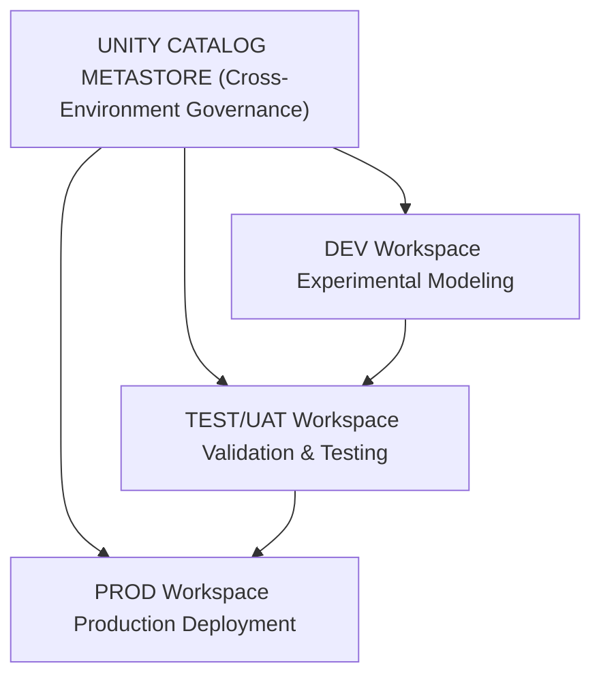

# Machine Learning Operations (MLOps) with Databricks on Azure End-to-End

This document contains a complete compilation of all the code snippets from the "Machine Learning Operations (MLOps) with Databricks on Azure End-to-End" guide by Mohammed Brückner. The code is organized by chapter for easy reference.

**📚 [Get the complete book on Amazon](https://www.amazon.com/dp/B0FTSY78DR)** for detailed explanations, architectural insights, and production MLOps best practices.

# Table of Contents

- [Chapter 2: The Three Workspaces](#chapter-2-the-three-workspaces)
  - [Architecture Diagram](#architecture-diagram)
  - [Unity Catalog Metastore Configuration](#unity-catalog-metastore-configuration)
  - [Catalog Structure per Environment](#catalog-structure-per-environment)
  - [Model Registry Configuration](#model-registry-configuration)
- [Chapter 3: The Central Hub of MLflow](#chapter-3-the-central-hub-of-mlflow)
  - [MLflow Configuration Class](#mlflow-configuration-class)
  - [MLflow REST API Configuration](#mlflow-rest-api-configuration)
- [Chapter 4: Crafting Reproducible Environments](#chapter-4-crafting-reproducible-environments)
  - [Python Dependencies Dictionary](#python-dependencies-dictionary)
  - [setup.py for Python Wheel](#setuppy-for-python-wheel)
  - [Model Serialization Class](#model-serialization-class)
- [Chapter 5: Configuring the Compute Foundation](#chapter-5-configuring-the-compute-foundation)
  - [Databricks Runtime Configuration](#databricks-runtime-configuration)
  - [Serverless Compute Configuration](#serverless-compute-configuration)
- [Chapter 6: Managing the Economics of Compute](#chapter-6-managing-the-economics-of-compute)
  - [DBU Cost Optimization Strategy](#dbu-cost-optimization-strategy)
  - [DBU Cost Monitoring Class](#dbu-cost-monitoring-class)
- [Chapter 7: Securing the Workspace](#chapter-7-securing-the-workspace)
  - [Secure Networking Configuration](#secure-networking-configuration)
  - [Secure Network Management Class](#secure-network-management-class)
- [Chapter 8: Deployment and Serving](#chapter-8-deployment-and-serving)
  - [Model Serving Endpoint Class](#model-serving-endpoint-class)
  - [Advanced Serving Patterns Configuration](#advanced-serving-patterns-configuration)
  - [Custom pyfunc Scoring Class](#custom-pyfunc-scoring-class)
- [Chapter 9: The Propagation of Work](#chapter-9-the-propagation-of-work)
  - [Model Promotion Function](#model-promotion-function)
  - [Databricks Asset Bundle (databricks.yml)](#databricks-asset-bundle-databricksyml)
- [Chapter 10: The Practice of Monitoring](#chapter-10-the-practice-of-monitoring)
  - [Model Drift Monitoring Function](#model-drift-monitoring-function)
  - [Lakehouse Monitoring Configuration](#lakehouse-monitoring-configuration)
- [Chapter 11: The Feature Store](#chapter-11-the-feature-store)
  - [Feature Store Client Usage](#feature-store-client-usage)
- [Chapter 12: Governance and Lineage](#chapter-12-governance-and-lineage)
  - [Lineage Query](#lineage-query)
  - [Model Tagging](#model-tagging)
- [Chapter 13: Recovery and Resilience](#chapter-13-recovery-and-resilience)
  - [Model Restoration Function](#model-restoration-function)
- [Chapter 14: Compliance and Auditing](#chapter-14-compliance-and-auditing)
  - [Audit Log Query](#audit-log-query)
## Chapter 2: The Three Workspaces

### Architecture Diagram



### Unity Catalog Metastore Configuration

```python
# Unity Catalog Metastore Configuration
metastore_config = {
"name": "company_mlops_metastore",
"storage_root": "abfss://metastore@companydatalake.dfs.core.windows.net/",
"region": "eastus2",
"delta_sharing_scope": "INTERNAL_AND_EXTERNAL",
"delta_sharing_recipient_token_lifetime": 90 # days
}
```

### Catalog Structure per Environment

```python
# Catalog Structure per Environment
catalog_structure = {
"dev": {
"catalog_name": "ml_dev_catalog",
"schemas": ["raw", "feature_store", "experiments", "sandbox"]
},
"test": {
"catalog_name": "ml_test_catalog",
"schemas": ["raw", "feature_store", "validation", "staging"]
},
"prod": {
"catalog_name": "ml_prod_catalog",
"schemas": ["raw", "feature_store", "models", "serving"]
}
}
```

### Model Registry Configuration

```python
# Model Registry Configuration
model_registry_config = {
"registry_type": "unity_catalog",
"model_catalog": "ml_models_catalog",
"schemas": {
"dev_models": "Development stage models",
"candidate_models": "Models ready for validation",
"production_models": "Production-deployed models",
"archived_models": "Deprecated model versions"
},
"retention_policy": {
"dev": "30 days",
"staging": "90 days",
"production": "365 days",
"archived": "730 days"
}
}
```

## Chapter 3: The Central Hub of MLflow

### MLflow Configuration Class

```python
#MLflow Configuration Class
class MLflowEnvironmentConfig:
def __init__(self, environment: str):
self.environment = environment
self.configs = {
"dev": {
"tracking_uri": "databricks://dev-workspace",
"registry_uri": "databricks-uc://ml_models_catalog.dev_models",
"experiment_path": "/Workspace/ml_experiments/dev",
"artifact_location":
"abfss://mlflow-artifacts-dev@companydatalake.dfs.core.windows.net/",
"backend_store_uri": "databricks://dev-workspace",
"default_artifact_root": "dbfs:/ml-artifacts/dev"
},
"test": {
"tracking_uri": "databricks://test-workspace",
"registry_uri": "databricks-uc://ml_models_catalog.candidate_models",
"experiment_path": "/Workspace/ml_experiments/test",
"artifact_location":
"abfss://mlflow-artifacts-test@companydatalake.dfs.core.windows.net/",
"backend_store_uri": "databricks://test-workspace",
"default_artifact_root": "dbfs:/ml-artifacts/test"
},
"prod": {
"tracking_uri": "databricks://prod-workspace",
"registry_uri": "databricks-uc://ml_models_catalog.production_models",
"experiment_path": "/Workspace/ml_experiments/prod",
"artifact_location":
"abfss://mlflow-artifacts-prod@companydatalake.dfs.core.windows.net/",
"backend_store_uri": "databricks://prod-workspace",
"default_artifact_root": "dbfs:/ml-artifacts/prod"
}
}

def get_config(self):
return self.configs[self.environment]
```

### MLflow REST API Configuration

```python
# MLflow REST API Configuration
mlflow_api_config = {
"base_urls": {
"dev":
"https://adb-dev-workspace.azuredatabricks.net/api/2.0/mlflow",
"test":
"https://adb-test-workspace.azuredatabricks.net/api/2.0/mlflow",
"prod":
"https://adb-prod-workspace.azuredatabricks.net/api/2.0/mlflow"
},
"endpoints": {
"create_experiment": "/experiments/create",
"log_model": "/runs/log-model",
"register_model": "/registered-models/create",
"transition_stage": "/model-versions/transition-stage",
"get_model_version": "/model-versions/get",
"search_models": "/registered-models/search",
"create_deployment": "/endpoints/create",
"update_deployment": "/endpoints/update"
},
"authentication": {
"method": "bearer_token",
"token_location": "Azure Key Vault",
"service_principal": True
}
}
```

## Chapter 4: Crafting Reproducible Environments

### Python Dependencies Dictionary

```python
# requirements.txt for ML environments
ml_dependencies = {
"core_ml": [
"scikit-learn==1.7.0", # Primary ML library for classical algorithms, including preprocessing, model selection, and evaluation
"xgboost==2.2.0", # Gradient boosting framework for scalable tree-based models
"lightgbm==4.6.0", # Fast gradient boosting with histogram-based learning for large datasets
"pandas==2.3.0", # Data manipulation and analysis, essential for data wrangling
"numpy==2.1.0", # Numerical computing foundation for array operations
"scipy==1.15.0", # Scientific computing library
"statsmodels==0.14.2", # Statistical modeling and hypothesis testing
],
"deep_learning": [
"tensorflow==2.18.0", # End-to-end platform for machine learning
"torch==2.5.0", # Open source machine learning framework
"transformers==4.43.0" # State-of-the-art machine learning for NLP, computer vision, and audio
],
"validation_monitoring": [
"great-expectations==0.18.15", # Data validation and documentation
"evidently==0.6.0" # ML model monitoring and data/prediction drift detection
],
"databricks": [
"mlflow==3.4.0", # ML lifecycle platform
"databricks-sdk==0.36.0", # Databricks SDK for Python
"databricks-feature-engineering==1.0.0" # Databricks Feature Store client
],
"serialization": [
"cloudpickle==3.1.0", # Advanced pickling for complex ML objects like lambda functions
"joblib==1.5.0", # Efficient persistence for scikit-learn models with compression
"dill==0.4.0" # Extended pickling for arbitrary Python objects
],
"utils": [
"pydantic==2.9.0", # Data validation and settings management
"python-dotenv==1.0.2", # Environment variable loading for configs
"requests==2.33.0", # HTTP client for API interactions
"pytest==8.4.0", # Testing framework for unit/integration tests
"black==24.5.0", # Code formatting for consistency
"pylint==3.3.0" # Code linting for quality assurance
]
}
```

### setup.py for Python Wheel

```python
from setuptools import setup, find_packages

# Assuming ml_dependencies dict is loaded
all_deps = [dep for category in ml_dependencies.values() for dep in category]

setup(
name="company_ml_framework",
version="1.0.0",
packages=find_packages(),
install_requires=all_deps,
extras_require={
"dev": ["pytest", "black", "pylint"],
"prod": ["gunicorn", "uvicorn", "fastapi"]
},
entry_points={
"console_scripts": [
"train_model=company_ml.training:main",
"deploy_model=company_ml.deployment:main",
"monitor_model=company_ml.monitoring:main"
]
},
package_data={
"company_ml": ["configs/*.yaml", "schemas/*.json"]
}
)

# Build wheel command
# python setup.py bdist_wheel
# Upload to Databricks: dbfs cp dist/company_ml_framework-1.0.0-py3-none-any.whl dbfs:/libs/
```

### Model Serialization Class

```python
import cloudpickle
import joblib
import pickle
import hashlib
from pathlib import Path
from typing import Any, Dict

class ModelSerializer:
"""Best practice model serialization handler"""
@staticmethod
def serialize_model(model: Any,
path: str,
method: str = "cloudpickle",
compression: int = 3) -> Dict[str, str]:
"""
Serialize ML model with metadata
"""
path = Path(path)
if method == "cloudpickle":
with open(path, 'wb') as f:
cloudpickle.dump(model, f)
elif method == "joblib":
joblib.dump(model, path, compress=compression)
elif method == "pickle":
with open(path, 'wb') as f:
pickle.dump(model, f)
else:
raise ValueError(f"Unknown serialization method: {method}")

# Calculate checksum for integrity
with open(path, 'rb') as f:
checksum = hashlib.sha256(f.read()).hexdigest()

metadata = {
"serialization_method": method,
"file_path": str(path),
"file_size_mb": path.stat().st_size / (1024 * 1024),
"checksum": checksum,
"compression": compression if method == "joblib" else None
}
return metadata

@staticmethod
def deserialize__model(path: str,
method: str = "cloudpickle",
checksum: str = None) -> Any:
"""Deserialize model with integrity check"""
path = Path(path)
# Verify checksum if provided
if checksum:
with open(path, 'rb') as f:
actual_checksum = hashlib.sha256(f.read()).hexdigest()
if actual_checksum != checksum:
raise IOError("Model checksum mismatch. File may be corrupt.")

# Load the model
if method == "cloudpickle":
with open(path, 'rb') as f:
model = cloudpickle.load(f)
elif method == "joblib":
model = joblib.load(path)
elif method == "pickle":
with open(path, 'rb') as f:
model = pickle.load(f)
else:
raise ValueError(f"Unknown deserialization method: {method}")

return model
```

## Chapter 5: Configuring the Compute Foundation

### Databricks Runtime Configuration

```python
# Runtime configuration per environment
runtime_config = {
"dev": {
"runtime_version": "17.2.x-ml-scala2.12", # Latest LTS ML Runtime (Sep 2025)
"spark_version": "3.6.0",
"python_version": "3.12",
"enable_photon": False, # Photon not needed for ML workloads
"node_type_id": "Standard_DS3_v2",
"driver_node_type_id": "Standard_DS3_v2",
"min_workers": 1,
"max_workers": 4,
"autoscale": True,
"autotermination_minutes": 30,
"spark_conf": {
"spark.databricks.delta.preview.enabled": "true",
"spark.databricks.delta.retentionDurationCheck.enabled": "false"
}
},
"test": {
"runtime_version": "17.2.x-ml-scala2.12",
"spark_version": "3.6.0",
"python_version": "3.12",
"enable_photon": False,
"node_type_id": "Standard_DS4_v2",
"driver_node_type_id": "Standard_DS4_v2",
"min_workers": 2,
"max_workers": 8,
"autoscale": True,
"autotermination_minutes": 60,
"spark_conf": {
"spark.databricks.delta.optimizeWrite.enabled": "true",
"spark.databricks.delta.autoCompact.enabled": "true"
}
},
"prod": {
"runtime_version": "17.2.x-ml-scala2.12",
"spark_version": "3.6.0",
"python_version": "3.12",
"enable_photon": True, # Enable for production data processing
"node_type_id": "Standard_DS5_v2",
"driver_node_type_id": "Standard_DS5_v2",
"min_workers": 4,
"max_workers": 16,
"autoscale": True,
"autotermination_minutes": 120,
"spot_instances": {
"enabled": True,
"max_spot_price_percent": 100,
"fall_back_to_on_demand": True
},
"spark_conf": {
"spark.databricks.delta.optimizeWrite.enabled": "true",
"spark.databricks.delta.autoCompact.enabled": "true",
"spark.sql.adaptive.enabled": "true"
}
}
}
```

### Serverless Compute Configuration

```python
# Serverless compute for model serving
serverless_config = {
"model_serving": {
"compute_type": "SERVERLESS",
"auto_capture_config": {
"enabled": True,
"catalog_name": "ml_prod_catalog",
"schema_name": "model_inference_logs",
"table_name_prefix": "inference_logs_"
},
"scaling_config": {
"min_provisioned_throughput": 0, # Scale to zero
"max_provisioned_throughput": 100,
"scale_down_delay": 300 # seconds
}
},
"workflow_jobs": {
"compute_type": "SERVERLESS",
"job_queue_enabled": True
}
}
```

## Chapter 6: Managing the Economics of Compute

### DBU Cost Optimization Strategy

```python
# DBU pricing optimization strategy
dbu_optimization = {
"compute_types": {
"all_purpose_compute": {
"dev": {
"dbu_rate": 0.55, # $/DBU for interactive development
"instance_pool": True,
"idle_instance_auto_termination": 10 # minutes
},
"test": {
"dbu_rate": 0.55,
"instance_pool": True,
"idle_instance_auto_termination": 20
},
"prod": {
"dbu_rate": 0.55,
"instance_pool": False, # Direct provisioning for production
"idle_instance_auto_termination": 30
}
},
"jobs_compute": {
"all_environments": {
"dbu_rate": 0.15, # $/DBU for automated jobs
"spot_instances": True,
"spot_bid_max_price": 0.20
}
},
"serverless_compute": {
"model_serving": {
"dbu_rate": 0.07, # $/DBU for serverless
"auto_scale_to_zero": True
}
}
},
"commitment_discounts": {
"dbcu_purchase": "3_year", # 37% discount
"reserved_capacity": 10000 # DBCUs
}
}
```

### DBU Cost Monitoring Class

```python
from databricks.sdk import WorkspaceClient
from datetime import datetime, timedelta
import pandas as pd

class DBUCostMonitor:
"""Monitor and optimize DBU consumption"""
def __init__(self, workspace_url: str, token: str):
self.client = WorkspaceClient(
host=workspace_url,
token=token
)

def get_usage_metrics(self, days_back: int = 7) -> pd.DataFrame:
"""Retrieve DBU usage metrics"""
end_time = datetime.now()
start_time = end_time - timedelta(days=days_back)

query = f"""
SELECT
workspace_id,
sku_name,
usage_date,
usage_unit,
SUM(usage_quantity) as total_dbu,
SUM(usage_quantity *
CASE
WHEN sku_name LIKE '%ALL_PURPOSE%' THEN 0.55
WHEN sku_name LIKE '%JOBS%' THEN 0.15
WHEN sku_name LIKE '%SERVERLESS%' THEN 0.07
ELSE 0.40
END
) as estimated_cost_usd
FROM system.billing.usage
WHERE usage_date >= '{start_time.date()}'
AND usage_date <= '{end_time.date()}'
GROUP BY workspace_id, sku_name, usage_date, usage_unit
ORDER BY usage_date DESC
"""

# In a real environment, you would execute the query
# result = self.client.sql.exec(query)
# return pd.DataFrame(result)
return pd.DataFrame() # Returning empty dataframe for placeholder

def generate_cost_alerts(self, threshold_usd: float = 1000):
"""Generate alerts for cost overruns"""
usage_df = self.get_usage_metrics(days_back=1)
if usage_df.empty:
return None
daily_cost = usage_df['estimated_cost_usd'].sum()

if daily_cost > threshold_usd:
alert = {
"severity": "HIGH",
"message": f"Daily DBU cost ${daily_cost:.2f} exceeds threshold of ${threshold_usd:.2f}"
}
return alert
return None
```

## Chapter 7: Securing the Workspace

### Secure Networking Configuration

```python
# Azure Private Endpoint Configuration
network_config = {
"vnet_configuration": {
"vnet_name": "databricks-mlops-vnet",
"address_space": "10.0.0.0/16",
"subnets": {
"public_subnet": {
"name": "public-subnet",
"address_prefix": "10.0.1.0/24",
"delegation": "Microsoft.Databricks/workspaces"
},
"private_subnet": {
"name": "private-subnet",
"address_prefix": "10.0.2.0/24",
"delegation": "Microsoft.Databricks/workspaces"
},
"private_endpoint_subnet": {
"name": "pe-subnet",
"address_prefix": "10.0.3.0/24",
"private_endpoint_network_policies": "Disabled"
}
}
},
"private_endpoints": {
"databricks_workspace": {
"resource_type": "Microsoft.Databricks/workspaces",
"group_id": "databricks_ui_api",
"dns_zone": "privatelink.azuredatabricks.net"
},
"storage_account": {
"resource_type": "Microsoft.Storage/storageAccounts",
"group_ids": ["blob", "dfs"],
"dns_zones": [
"privatelink.blob.core.windows.net",
"privatelink.dfs.core.windows.net"
]
},
"key_vault": {
"resource_type": "Microsoft.KeyVault/vaults",
"group_id": "vault",
"dns_zone": "privatelink.vaultcore.azure.net"
}
},
"network_security_group": {
"name": "databricks-mlops-nsg",
"rules": [
{
"name": "AllowVnetInBound",
"priority": 100,
"direction": "Inbound",
"access": "Allow",
"protocol": "*",
"source": "VirtualNetwork",
"destination": "VirtualNetwork"
},
{
"name": "Microsoft.Databricks-workspaces_UseOnly_databricks-worker-to-databricks",
"priority": 101,
"direction": "Outbound",
"access": "Allow",
"protocol": "tcp",
"destination": "AzureDatabricks",
"destination_port": "443"
}
]
}
}
```

### Secure Network Management Class

```python
from azure.identity import DefaultAzureCredential
from azure.mgmt.network import NetworkManagementClient
from azure.mgmt.privatedns import PrivateDnsManagementClient

class SecureNetworkManager:
"""Manage Azure private networking for MLOps"""
def __init__(self, subscription_id: str, resource_group: str):
self.subscription_id = subscription_id
self.resource_group = resource_group
self.credential = DefaultAzureCredential()
self.network_client = NetworkManagementClient(
self.credential,
self.subscription_id
)
self.dns_client = PrivateDnsManagementClient(
self.credential,
self.subscription_id
)

def create_private_endpoint(self,
endpoint_name: str,
resource_id: str,
group_id: str,
subnet_id: str) -> dict:
"""Create a private endpoint for secure access"""
private_endpoint_params = {
"location": "eastus2",
"subnet": {"id": subnet_id},
"private_link_service_connections": [{
"name": f"{endpoint_name}-connection",
"private_link_service_id": resource_id,
"group_ids": [group_id]
}]
}

result = self.network_client.private_endpoints.begin_create_or_update(
self.resource_group,
endpoint_name,
private_endpoint_params
).result()

return {
"endpoint_id": result.id,
"private_ip": result.custom_dns_configs[0].ip_addresses[0],
"fqdn": result.custom_dns_configs[0].fqdn
}

def configure_private_dns_zone(self,
zone_name: str,
vnet_id: str) -> None:
"""Configure private DNS zone for private endpoints"""
# Create private DNS zone
self.dns_client.private_zones.begin_create_or_update(
self.resource_group,
zone_name,
{"location": "global"}
).result()

# Link to VNet
self.dns_client.virtual_network_links.begin_create_or_update(
self.resource_group,
zone_name,
f"{zone_name}-link",
{
"location": "global",
"virtual_network": {"id": vnet_id},
"registration_enabled": True
}
).result()
```

## Chapter 8: Deployment and Serving

### Model Serving Endpoint Class

```python
import requests
from typing import Dict, Any
import json

class ModelServingEndpoint:
"""Manage model serving endpoints via REST API"""
def __init__(self, workspace_url: str, token: str):
self.base_url = f"{workspace_url}/api/2.0/serving-endpoints"
self.headers = {
"Authorization": f"Bearer {token}",
"Content-Type": "application/json"
}

def create_endpoint(self,
endpoint_name: str,
model_name: str,
model_version: str,
workload_size: str = "Small") -> Dict[str, Any]:
"""Create a new model serving endpoint"""
endpoint_config = {
"name": endpoint_name,
"config": {
"served_models": [{
"model_name": model_name,
"model_version": model_version,
"workload_size": workload_size,
"scale_to_zero_enabled": True,
"environment_vars": {
"MLFLOW_TRACKING_URI": "databricks",
"ENABLE_MLFLOW_TRACING": "true"
}
}],
"auto_capture_config": {
"catalog_name": "ml_prod_catalog",
"schema_name": "model_inference",
"table_name_prefix": endpoint_name
},
"traffic_config": {
"routes": [{
"served_model_name": f"{model_name}-{model_version}",
"traffic_percentage": 100
}]
}
}
}

response = requests.post(
f"{self.base_url}",
headers=self.headers,
json=endpoint_config
)
response.raise_for_status()
return response.json()

def update_endpoint_traffic(self,
endpoint_name: str,
traffic_config: list) -> Dict[str, Any]:
"""Update traffic distribution for A/B testing"""
update_payload = { "traffic_config": traffic_config }

response = requests.put(
f"{self.base_url}/{endpoint_name}/config",
headers=self.headers,
json=update_payload
)
response.raise_for_status()
return response.json()

def get_endpoint_metrics(self,
endpoint_name: str,
metric_type: str = "REQUEST_COUNT") -> Dict[str, Any]:
"""Retrieve endpoint performance metrics"""
params = {
"name": endpoint_name,
"metrics": metric_type,
"granularity": "5_MINUTES"
}

response = requests.get(
f"{self.base_url}/{endpoint_name}/metrics",
headers=self.headers,
params=params
)
response.raise_for_status()
return response.json()
```

### Advanced Serving Patterns Configuration

```python
# Advanced serving patterns configuration
serving_patterns = {
"blue_green": {
"strategy": "full_traffic_shift",
"versions": [
{
"name": "blue",
"model_version": "v1",
"traffic": 100,
"status": "active"
},
{
"name": "green",
"model_version": "v2",
"traffic": 0,
"status": "staging"
}
],
"promotion_steps": [
"Deploy green version to 0% traffic",
"Run smoke tests on green",
"Shift 100% traffic to green",
"Decommission blue"
]
},
"ab_testing": {
"strategy": "canary_release",
"configurations": [
{
"model_version": "v1.0",
"traffic_percentage": 90,
"user_segment": "control_group"
},
{
"model_version": "v2.0",
"traffic_percentage": 10,
"user_segment": "treatment_group"
}
],
"monitoring_metrics": ["latency_p95", "error_rate", "business_kpi"]
},
"shadow_traffic": {
"strategy": "passive_testing",
"primary_model": "production_v1",
"shadow_model": "candidate_v2",
"traffic_split": "100% mirrored to shadow",
"comparison": "log predictions for offline eval"
}
}
```

### Custom pyfunc Scoring Class

```python
# Example: Custom scoring script for scikit-learn model in MLflow
import mlflow
import pandas as pd
from sklearn.ensemble import RandomForestClassifier
import json

class ScoringService:
def __init__(self):
self.model = None

def load_model(self, model_uri):
"""Load the model from the specified URI"""
self.model = mlflow.sklearn.load_model(model_uri)

def predict(self, data: pd.DataFrame) -> Dict[str, Any]:
"""Generate predictions"""
if self.model is None:
raise RuntimeError("Model is not loaded.")

predictions = self.model.predict_proba(data)

return {
"predictions": predictions.tolist(),
"model_info": "custom_scoring_service_v1"
}
```

## Chapter 9: The Propagation of Work

### Model Promotion Function

```python
from databricks.sdk import WorkspaceClient
import mlflow

def promote_model(source_env: str, target_env: str, model_name: str, version: str,
source_env_run_id: str):
"""Promote model across environments"""
client = WorkspaceClient(host=f"https://adb-{target_env}-workspace.azuredatabricks.net")

mlflow.set_registry_uri(f"databricks-uc://{target_env}_catalog")

mlflow.register_model(
f"runs:/{source_env_run_id}/model",
model_name
)

client.models.transition_stage(
name=model_name,
version=version,
stage="Production"
)

endpoint_client = client.serving_endpoints
endpoint_client.create(
name=f"{model_name}_prod",
config={
"served_models": [{"model_name": model_name, "model_version": version}]
}
)
```

### Databricks Asset Bundle (databricks.yml)

```yaml
# databricks.yml
bundle:
name: mlops_pipeline

targets:
dev:
workspace:
host: https://adb-dev.azuredatabricks.net
resources:
jobs:
train_model:
name: train-dev
tasks:
- task_key: train
notebook_task:
notebook_path: ./notebooks/train.py

prod:
workspace:
host: https://adb-prod.azuredatabricks.net
resources:
jobs:
deploy_model:
name: deploy-prod
tasks:
- task_key: deploy
mlflow_model_serve_task:
model_name: "prod_catalog.production_models.sklearn_model"
```

## Chapter 10: The Practice of Monitoring

### Model Drift Monitoring Function

```python
import mlflow
from evidently.report import Report
from evidently.metric_preset import DataDriftPreset

def monitor_model(reference_data, current_data, model_name):
"""Generate monitoring report"""
report = Report(metrics=[DataDriftPreset()])
report.run(reference_data=reference_data, current_data=current_data)

with mlflow.start_run(run_name=f"monitoring_{model_name}"):
report_path = "drift_report.html"
report.save_html(report_path)
mlflow.log_artifact(report_path, "drift_reports")

drift_info = report.as_dict()
dataset_drift_score = drift_info["metrics"][0]["result"]["dataset_drift_score"]
mlflow.log_metric("drift_score", dataset_drift_score)

if drift_info["metrics"][0]["result"]["dataset_drift"]:
print(f"High drift detected for model {model_name}. Retraining may be required.")
```

### Lakehouse Monitoring Configuration

```python
# Lakehouse Monitoring Configuration
monitoring_config = {
"table_name": "ml_prod_catalog.feature_store.customer_features",
"schedule": "daily",
"data_quality_checks": {
"completeness": {"user_id": "> 0.99"},
"uniqueness": ["user_id"]
},
"model_checks": {
"prediction_drift": "weekly",
"accuracy_degradation": True,
"bias_detection": True
},
"alerts": {
"channel": "teams_webhook",
"thresholds": {"drift": 0.3, "accuracy_drop": 0.05}
}
}
```

## Chapter 11: The Feature Store

### Feature Store Client Usage

```python
from databricks.feature_store import FeatureStoreClient

fs = FeatureStoreClient()

# Example: A dataframe `feature_df` contains new feature values.
# feature_df = ...

# Create the feature table if it doesn't exist
# fs.create_feature_table(
# name="prod_catalog.feature_store.user_features",
# primary_keys="user_id",
# df=feature_df,
# schema=feature_df.schema,
# description="User-level features for our models."
# )

# Write data to the offline store
# fs.write_table(
# name="prod_catalog.feature_store.user_features",
# df=feature_df,
# mode="merge"
# )

# Publish a subset to the online store
# online_features_df = ...
# fs.publish_table(
# name="prod_catalog.feature_store.user_features",
# online_store=some_online_store_spec,
# mode="merge"
# )
```

## Chapter 12: Governance and Lineage

### Lineage Query

```sql
-- Lineage query example
SELECT
source_name,
destination_name,
operation_type,
timestamp
FROM system.access.audit
WHERE operation_type = 'MODEL_TRAIN'
ORDER BY timestamp DESC
```

### Model Tagging

```sql
ALTER MODEL prod_catalog.models.sklearn_model SET TAGS ('pii' = 'false', 'gdpr' = 'compliant');
```

## Chapter 13: Recovery and Resilience

### Model Restoration Function

```python
import mlflow

def restore_model(model_name: str, version: str):
"""Restore an archived model version from the MLflow registry."""
client = mlflow.tracking.MlflowClient()
client.restore_registered_model_version(
name=model_name,
version=version,
)
print(f"Version {version} of model {model_name} has been restored.")
```

## Chapter 14: Compliance and Auditing

### Audit Log Query

```sql
SELECT * FROM system.access.audit
WHERE action_name LIKE '%MLFLOW%'
ORDER BY timestamp DESC
LIMIT 10;
```
