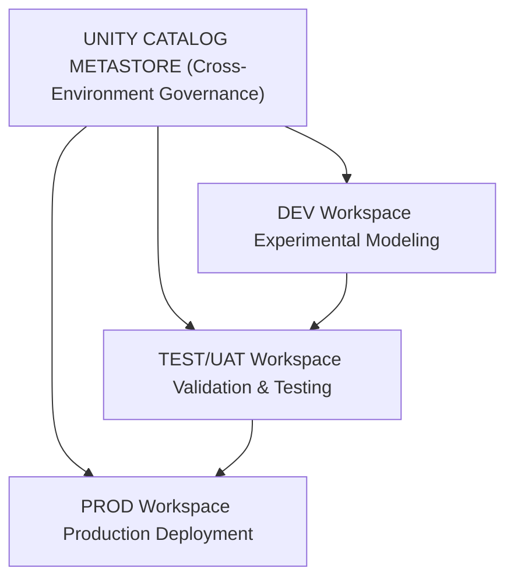

# Machine Learning Operations (MLOps) with Databricks on Azure End-to-End

This document contains a complete compilation of all the code snippets from the "Machine Learning Operations (MLOps) with Databricks on Azure End-to-End" guide by Mohammed Brückner. 

**📚 [Get the full book on Amazon](https://www.amazon.com/dp/B0FTSY78DR)** - Complete with detailed explanations, architectural insights, and production MLOps best practices.

---

# Table of Contents

- [Getting Started: Hands-On Setup](#getting-started-hands-on-setup)
- [Chapter 2: The Three Workspaces](#chapter-2-the-three-workspaces)
- [Chapter 3: The Central Hub of MLflow](#chapter-3-the-central-hub-of-mlflow)
- [Chapter 4: Crafting Reproducible Environments](#chapter-4-crafting-reproducible-environments)
- [Chapter 5: Configuring the Compute Foundation](#chapter-5-configuring-the-compute-foundation)
- [Chapter 6: Managing the Economics of Compute](#chapter-6-managing-the-economics-of-compute)
- [Chapter 7: Securing the Workspace](#chapter-7-securing-the-workspace)
- [Chapter 8: Deployment and Serving](#chapter-8-deployment-and-serving)
- [Chapter 9: The Propagation of Work](#chapter-9-the-propagation-of-work)
- [Chapter 10: The Practice of Monitoring](#chapter-10-the-practice-of-monitoring)
- [Chapter 11: The Feature Store](#chapter-11-the-feature-store)
- [Chapter 12: Governance and Lineage](#chapter-12-governance-and-lineage)
- [Chapter 13: Recovery and Resilience](#chapter-13-recovery-and-resilience)
- [Chapter 14: Compliance and Auditing](#chapter-14-compliance-and-auditing)

---

## Getting Started: Hands-On Setup

This section provides the CLI commands to rapidly deploy a functional MLOps infrastructure skeleton on Azure and Databricks. For detailed explanations of the architecture and design decisions, **[see the complete book](https://www.amazon.com/dp/B0FTSY78DR)**.

### Prerequisites

Before you begin, ensure you have the following tools installed and configured:

**Pro Tip:** A great way to get started with minimal setup is to use the Azure Cloud Shell. It's a browser-based shell environment that has the Azure CLI pre-installed and authenticated. You can launch it directly from the Azure Portal.

- **Azure CLI**: If working locally, ensure it is installed and you are authenticated to your Azure subscription (`az login`). This is already handled if you use Azure Cloud Shell.
- **Databricks CLI**: Install it with:
  ```bash
  pip install databricks-cli
  ```
- **An Azure Account**: You need an account with permissions to create resource groups, storage, networks, and Databricks workspaces.

### Step 1: Laying the Azure Foundation

Create three resource groups, one for each environment (DEV, TEST, PROD):

```bash
# Create resource groups for DEV, TEST, and PROD
az group create --name "mlops-dev-rg" --location "eastus2"
az group create --name "mlops-test-rg" --location "eastus2"
az group create --name "mlops-prod-rg" --location "eastus2"
```

### Step 2: The Network Perimeter

Create a Virtual Network (VNet) and dedicated subnets for Databricks workspaces:

```bash
# Create the Virtual Network
az network vnet create \
  --resource-group "mlops-prod-rg" \
  --name "mlops-vnet" \
  --address-prefix "10.0.0.0/16"

# Create the public and private subnets for Databricks
az network vnet subnet create \
  --resource-group "mlops-prod-rg" \
  --vnet-name "mlops-vnet" \
  --name "public-subnet" \
  --address-prefixes "10.0.1.0/24" \
  --delegations "Microsoft.Databricks/workspaces"

az network vnet subnet create \
  --resource-group "mlops-prod-rg" \
  --vnet-name "mlops-vnet" \
  --name "private-subnet" \
  --address-prefixes "10.0.2.0/24" \
  --delegations "Microsoft.Databricks/workspaces"
```

### Step 3: Deploying the Databricks Workspaces

Deploy three Databricks workspaces (DEV, TEST, PROD):

```bash
# Deploy the DEV workspace
az databricks workspace create \
  --resource-group "mlops-dev-rg" \
  --name "mlops-dev-workspace" \
  --location "eastus2" \
  --sku "premium"

# Deploy the TEST workspace
az databricks workspace create \
  --resource-group "mlops-test-rg" \
  --name "mlops-test-workspace" \
  --location "eastus2" \
  --sku "premium"

# Deploy the PROD workspace
az databricks workspace create \
  --resource-group "mlops-prod-rg" \
  --name "mlops-prod-workspace" \
  --location "eastus2" \
  --sku "premium"
```

### Step 4: The Governance Hub - Unity Catalog

Create a storage account for the Unity Catalog metastore:

```bash
# Create a globally unique storage account for the metastore root
STORAGE_ACCOUNT_NAME="ucmetastore$(openssl rand -hex 5)"

az storage account create \
  --resource-group "mlops-prod-rg" \
  --name $STORAGE_ACCOUNT_NAME \
  --sku "Standard_LRS" \
  --kind "StorageV2"
```

**Manual Step Required**: Create the metastore in the Databricks Account Console:
1. Navigate to your Databricks Account Console
2. Create a new metastore, assigning it to the storage account created above
3. Assign your DEV, TEST, and PROD workspaces to this new metastore

After the manual step, configure the Databricks CLI and create catalogs:

```bash
# Configure Databricks CLI (requires a PAT token from your Databricks Account user)
export DATABRICKS_HOST="https://accounts.azuredatabricks.net"
export DATABRICKS_ACCOUNT_ID="your-account-id"
export DATABRICKS_USERNAME="your-account-user"
export DATABRICKS_PASSWORD="your-account-password"

# Create catalogs for each environment
databricks unity-catalog catalogs create --name "ml_dev_catalog"
databricks unity-catalog catalogs create --name "ml_test_catalog"
databricks unity-catalog catalogs create --name "ml_prod_catalog"
```

### Step 5: A Glimpse of Automation

Use Databricks Asset Bundles to define and deploy resources. Create a `databricks.yml` file:

```yaml
bundle:
  name: mlops_pipeline

targets:
  dev:
    workspace:
      # Get this from the Azure Portal for your DEV workspace
      host: https://adb-<workspace-id>.azuredatabricks.net

    resources:
      jobs:
        hello_world_job:
          name: "Hello World DEV"
          tasks:
            - task_key: hello
              notebook_task:
                notebook_path: ./notebooks/hello.py
```

Create a simple notebook at `./notebooks/hello.py`:

```python
print("Hello from DEV!")
```

Deploy the bundle:

```bash
# Configure a profile for the DEV workspace
databricks configure --host <dev_workspace_url> --token

# Deploy the bundle to the dev target
databricks bundle deploy -t dev
```

**💡 Want to understand the "why" behind these commands?** The full book explains the architectural principles and design patterns. **[Available on Amazon](https://www.amazon.com/dp/B0FTSY78DR)**.

---

## Chapter 2: The Three Workspaces

The three-workspace architecture (DEV, TEST, PROD) is fundamental to production MLOps. **[Learn the complete strategy in the book](https://www.amazon.com/dp/B0FTSY78DR)**.

### Architecture Diagram



### Unity Catalog Metastore Configuration

```python
metastore_config = {
    "name": "company_mlops_metastore",
    "storage_root": "abfss://metastore@companydatalake.dfs.core.windows.net/",
    "region": "eastus2",
    "delta_sharing_scope": "INTERNAL_AND_EXTERNAL",
    "delta_sharing_recipient_token_lifetime": 90
}
```

### Catalog Structure per Environment

```python
catalog_structure = {
    "dev": {
        "catalog_name": "ml_dev_catalog",
        "schemas": ["raw", "feature_store", "experiments", "sandbox"]
    },
    "test": {
        "catalog_name": "ml_test_catalog",
        "schemas": ["raw", "feature_store", "validation", "staging"]
    },
    "prod": {
        "catalog_name": "ml_prod_catalog",
        "schemas": ["raw", "feature_store", "models", "serving"]
    }
}
```

### Model Registry Configuration

```python
model_registry_config = {
    "registry_type": "unity_catalog",
    "model_catalog": "ml_models_catalog",
    "schemas": {
        "dev_models": "Development stage models",
        "candidate_models": "Models ready for validation",
        "production_models": "Production-deployed models",
        "archived_models": "Deprecated model versions"
    },
    "retention_policy": {
        "dev": "30 days",
        "staging": "90 days",
        "production": "365 days",
        "archived": "730 days"
    }
}
```

---

## Chapter 3: The Central Hub of MLflow

MLflow orchestrates the entire ML lifecycle. The book covers advanced patterns for experiment tracking, model versioning, and automated promotion. **[Get the full guide](https://www.amazon.com/dp/B0FTSY78DR)**.

### MLflow Configuration Class

```python
class MLflowEnvironmentConfig:
    def __init__(self, environment: str):
        self.environment = environment
        self.configs = {
            "dev": {
                "tracking_uri": "databricks://dev-workspace",
                "registry_uri": "databricks-uc://ml_models_catalog.dev_models",
                "experiment_path": "/Workspace/ml_experiments/dev",
                "artifact_location": "abfss://mlflow-artifacts-dev@companydatalake.dfs.core.windows.net/",
                "backend_store_uri": "databricks://dev-workspace",
                "default_artifact_root": "dbfs:/ml-artifacts/dev"
            },
            "test": {
                "tracking_uri": "databricks://test-workspace",
                "registry_uri": "databricks-uc://ml_models_catalog.candidate_models",
                "experiment_path": "/Workspace/ml_experiments/test",
                "artifact_location": "abfss://mlflow-artifacts-test@companydatalake.dfs.core.windows.net/",
                "backend_store_uri": "databricks://test-workspace",
                "default_artifact_root": "dbfs:/ml-artifacts/test"
            },
            "prod": {
                "tracking_uri": "databricks://prod-workspace",
                "registry_uri": "databricks-uc://ml_models_catalog.production_models",
                "experiment_path": "/Workspace/ml_experiments/prod",
                "artifact_location": "abfss://mlflow-artifacts-prod@companydatalake.dfs.core.windows.net/",
                "backend_store_uri": "databricks://prod-workspace",
                "default_artifact_root": "dbfs:/ml-artifacts/prod"
            }
        }
    
    def get_config(self):
        return self.configs[self.environment]
```

### MLflow REST API Configuration

```python
mlflow_api_config = {
    "base_urls": {
        "dev": "https://adb-dev-workspace.azuredatabricks.net/api/2.0/mlflow",
        "test": "https://adb-test-workspace.azuredatabricks.net/api/2.0/mlflow",
        "prod": "https://adb-prod-workspace.azuredatabricks.net/api/2.0/mlflow"
    },
    "endpoints": {
        "create_experiment": "/experiments/create",
        "log_model": "/runs/log-model",
        "register_model": "/registered-models/create",
        "transition_stage": "/model-versions/transition-stage",
        "get_model_version": "/model-versions/get",
        "search_models": "/registered-models/search",
        "create_deployment": "/endpoints/create",
        "update_deployment": "/endpoints/update"
    },
    "authentication": {
        "method": "bearer_token",
        "token_location": "Azure Key Vault",
        "service_principal": True
    }
}
```

---

## Chapter 4: Crafting Reproducible Environments

Reproducibility is non-negotiable in production ML. Learn how Python wheels, dependency pinning, and checksums create bulletproof environments. **[Read more](https://www.amazon.com/dp/B0FTSY78DR)**.

### Python Dependencies Dictionary

```python
ml_dependencies = {
    "core_ml": [
        "scikit-learn==1.7.0",
        "xgboost==2.2.0",
        "lightgbm==4.6.0",
        "pandas==2.3.0",
        "numpy==2.1.0",
        "scipy==1.15.0",
        "statsmodels==0.14.2",
    ],
    "deep_learning": [
        "tensorflow==2.18.0",
        "torch==2.5.0",
        "transformers==4.43.0"
    ],
    "validation_monitoring": [
        "great-expectations==0.18.15",
        "evidently==0.6.0"
    ],
    "databricks": [
        "mlflow==3.4.0",
        "databricks-sdk==0.36.0",
        "databricks-feature-engineering==1.0.0"
    ],
    "serialization": [
        "cloudpickle==3.1.0",
        "joblib==1.5.0",
        "dill==0.4.0"
    ],
    "utils": [
        "pydantic==2.9.0",
        "python-dotenv==1.0.2",
        "requests==2.33.0",
        "pytest==8.4.0",
        "black==24.5.0",
        "pylint==3.3.0"
    ]
}
```

### setup.py for Python Wheel

```python
from setuptools import setup, find_packages

all_deps = [dep for category in ml_dependencies.values() for dep in category]

setup(
    name="company_ml_framework",
    version="1.0.0",
    packages=find_packages(),
    install_requires=all_deps,
    extras_require={
        "dev": ["pytest", "black", "pylint"],
        "prod": ["gunicorn", "uvicorn", "fastapi"]
    },
    entry_points={
        "console_scripts": [
            "train_model=company_ml.training:main",
            "deploy_model=company_ml.deployment:main",
            "monitor_model=company_ml.monitoring:main"
        ]
    },
    package_data={
        "company_ml": ["configs/*.yaml", "schemas/*.json"]
    }
)

# Build wheel: python setup.py bdist_wheel
# Upload: dbfs cp dist/company_ml_framework-1.0.0-py3-none-any.whl dbfs:/libs/
```

### Model Serialization Class

```python
import cloudpickle
import joblib
import pickle
import hashlib
from pathlib import Path
from typing import Any, Dict

class ModelSerializer:
    """Best practice model serialization handler"""
    
    @staticmethod
    def serialize_model(model: Any, path: str, method: str = "cloudpickle", 
                       compression: int = 3) -> Dict[str, str]:
        """Serialize ML model with metadata"""
        path = Path(path)
        
        if method == "cloudpickle":
            with open(path, 'wb') as f:
                cloudpickle.dump(model, f)
        elif method == "joblib":
            joblib.dump(model, path, compress=compression)
        elif method == "pickle":
            with open(path, 'wb') as f:
                pickle.dump(model, f)
        else:
            raise ValueError(f"Unknown serialization method: {method}")
        
        with open(path, 'rb') as f:
            checksum = hashlib.sha256(f.read()).hexdigest()
        
        metadata = {
            "serialization_method": method,
            "file_path": str(path),
            "file_size_mb": path.stat().st_size / (1024 * 1024),
            "checksum": checksum,
            "compression": compression if method == "joblib" else None
        }
        return metadata
    
    @staticmethod
    def deserialize_model(path: str, method: str = "cloudpickle", 
                         checksum: str = None) -> Any:
        """Deserialize model with integrity check"""
        path = Path(path)
        
        if checksum:
            with open(path, 'rb') as f:
                actual_checksum = hashlib.sha256(f.read()).hexdigest()
            if actual_checksum != checksum:
                raise IOError("Model checksum mismatch. File may be corrupt.")
        
        if method == "cloudpickle":
            with open(path, 'rb') as f:
                model = cloudpickle.load(f)
        elif method == "joblib":
            model = joblib.load(path)
        elif method == "pickle":
            with open(path, 'rb') as f:
                model = pickle.load(f)
        else:
            raise ValueError(f"Unknown deserialization method: {method}")
        
        return model
```

---

## Chapter 5: Configuring the Compute Foundation

### Databricks Runtime Configuration

```python
runtime_config = {
    "dev": {
        "runtime_version": "17.2.x-ml-scala2.12",
        "spark_version": "3.6.0",
        "python_version": "3.12",
        "enable_photon": False,
        "node_type_id": "Standard_DS3_v2",
        "driver_node_type_id": "Standard_DS3_v2",
        "min_workers": 1,
        "max_workers": 4,
        "autoscale": True,
        "autotermination_minutes": 30,
        "spark_conf": {
            "spark.databricks.delta.preview.enabled": "true",
            "spark.databricks.delta.retentionDurationCheck.enabled": "false"
        }
    },
    "test": {
        "runtime_version": "17.2.x-ml-scala2.12",
        "spark_version": "3.6.0",
        "python_version": "3.12",
        "enable_photon": False,
        "node_type_id": "Standard_DS4_v2",
        "driver_node_type_id": "Standard_DS4_v2",
        "min_workers": 2,
        "max_workers": 8,
        "autoscale": True,
        "autotermination_minutes": 60,
        "spark_conf": {
            "spark.databricks.delta.optimizeWrite.enabled": "true",
            "spark.databricks.delta.autoCompact.enabled": "true"
        }
    },
    "prod": {
        "runtime_version": "17.2.x-ml-scala2.12",
        "spark_version": "3.6.0",
        "python_version": "3.12",
        "enable_photon": True,
        "node_type_id": "Standard_DS5_v2",
        "driver_node_type_id": "Standard_DS5_v2",
        "min_workers": 4,
        "max_workers": 16,
        "autoscale": True,
        "autotermination_minutes": 120,
        "spot_instances": {
            "enabled": True,
            "max_spot_price_percent": 100,
            "fall_back_to_on_demand": True
        },
        "spark_conf": {
            "spark.databricks.delta.optimizeWrite.enabled": "true",
            "spark.databricks.delta.autoCompact.enabled": "true",
            "spark.sql.adaptive.enabled": "true"
        }
    }
}
```

### Serverless Compute Configuration

```python
serverless_config = {
    "model_serving": {
        "compute_type": "SERVERLESS",
        "auto_capture_config": {
            "enabled": True,
            "catalog_name": "ml_prod_catalog",
            "schema_name": "model_inference_logs",
            "table_name_prefix": "inference_logs_"
        },
        "scaling_config": {
            "min_provisioned_throughput": 0,
            "max_provisioned_throughput": 100,
            "scale_down_delay": 300
        }
    },
    "workflow_jobs": {
        "compute_type": "SERVERLESS",
        "job_queue_enabled": True
    }
}
```

---

## Chapter 6: Managing the Economics of Compute

Cost optimization is critical for sustainable MLOps. The book provides detailed strategies for DBU management, spot instances, and commitment discounts. **[Learn the economics](https://www.amazon.com/dp/B0FTSY78DR)**.

### DBU Cost Optimization Strategy

```python
dbu_optimization = {
    "compute_types": {
        "all_purpose_compute": {
            "dev": {
                "dbu_rate": 0.55,
                "instance_pool": True,
                "idle_instance_auto_termination": 10
            },
            "test": {
                "dbu_rate": 0.55,
                "instance_pool": True,
                "idle_instance_auto_termination": 20
            },
            "prod": {
                "dbu_rate": 0.55,
                "instance_pool": False,
                "idle_instance_auto_termination": 30
            }
        },
        "jobs_compute": {
            "all_environments": {
                "dbu_rate": 0.15,
                "spot_instances": True,
                "spot_bid_max_price": 0.20
            }
        },
        "serverless_compute": {
            "model_serving": {
                "dbu_rate": 0.07,
                "auto_scale_to_zero": True
            }
        }
    },
    "commitment_discounts": {
        "dbcu_purchase": "3_year",
        "reserved_capacity": 10000
    }
}
```

### DBU Cost Monitoring Class

```python
from databricks.sdk import WorkspaceClient
from datetime import datetime, timedelta
import pandas as pd

class DBUCostMonitor:
    """Monitor and optimize DBU consumption"""
    
    def __init__(self, workspace_url: str, token: str):
        self.client = WorkspaceClient(host=workspace_url, token=token)
    
    def get_usage_metrics(self, days_back: int = 7) -> pd.DataFrame:
        """Retrieve DBU usage metrics"""
        end_time = datetime.now()
        start_time = end_time - timedelta(days=days_back)
        
        query = f"""
        SELECT
            workspace_id,
            sku_name,
            usage_date,
            usage_unit,
            SUM(usage_quantity) as total_dbu,
            SUM(usage_quantity *
                CASE
                    WHEN sku_name LIKE '%ALL_PURPOSE%' THEN 0.55
                    WHEN sku_name LIKE '%JOBS%' THEN 0.15
                    WHEN sku_name LIKE '%SERVERLESS%' THEN 0.07
                    ELSE 0.40
                END
            ) as estimated_cost_usd
        FROM system.billing.usage
        WHERE usage_date >= '{start_time.date()}'
            AND usage_date <= '{end_time.date()}'
        GROUP BY workspace_id, sku_name, usage_date, usage_unit
        ORDER BY usage_date DESC
        """
        
        return pd.DataFrame()
    
    def generate_cost_alerts(self, threshold_usd: float = 1000):
        """Generate alerts for cost overruns"""
        usage_df = self.get_usage_metrics(days_back=1)
        if usage_df.empty:
            return None
        
        daily_cost = usage_df['estimated_cost_usd'].sum()
        
        if daily_cost > threshold_usd:
            return {
                "severity": "HIGH",
                "message": f"Daily DBU cost ${daily_cost:.2f} exceeds threshold"
            }
        return None
```

---

## Chapter 7: Securing the Workspace

Security is foundational, not optional. Learn how to build a network perimeter with private endpoints, NSGs, and secure authentication. **[Security chapter in the book](https://www.amazon.com/dp/B0FTSY78DR)**.

### Secure Networking Configuration

```python
network_config = {
    "vnet_configuration": {
        "vnet_name": "databricks-mlops-vnet",
        "address_space": "10.0.0.0/16",
        "subnets": {
            "public_subnet": {
                "name": "public-subnet",
                "address_prefix": "10.0.1.0/24",
                "delegation": "Microsoft.Databricks/workspaces"
            },
            "private_subnet": {
                "name": "private-subnet",
                "address_prefix": "10.0.2.0/24",
                "delegation": "Microsoft.Databricks/workspaces"
            },
            "private_endpoint_subnet": {
                "name": "pe-subnet",
                "address_prefix": "10.0.3.0/24",
                "private_endpoint_network_policies": "Disabled"
            }
        }
    },
    "private_endpoints": {
        "databricks_workspace": {
            "resource_type": "Microsoft.Databricks/workspaces",
            "group_id": "databricks_ui_api",
            "dns_zone": "privatelink.azuredatabricks.net"
        },
        "storage_account": {
            "resource_type": "Microsoft.Storage/storageAccounts",
            "group_ids": ["blob", "dfs"],
            "dns_zones": [
                "privatelink.blob.core.windows.net",
                "privatelink.dfs.core.windows.net"
            ]
        },
        "key_vault": {
            "resource_type": "Microsoft.KeyVault/vaults",
            "group_id": "vault",
            "dns_zone": "privatelink.vaultcore.azure.net"
        }
    }
}
```

### Secure Network Management Class

```python
from azure.identity import DefaultAzureCredential
from azure.mgmt.network import NetworkManagementClient
from azure.mgmt.privatedns import PrivateDnsManagementClient

class SecureNetworkManager:
    """Manage Azure private networking for MLOps"""
    
    def __init__(self, subscription_id: str, resource_group: str):
        self.subscription_id = subscription_id
        self.resource_group = resource_group
        self.credential = DefaultAzureCredential()
        self.network_client = NetworkManagementClient(
            self.credential, self.subscription_id
        )
        self.dns_client = PrivateDnsManagementClient(
            self.credential, self.subscription_id
        )
    
    def create_private_endpoint(self, endpoint_name: str, resource_id: str,
                               group_id: str, subnet_id: str) -> dict:
        """Create a private endpoint for secure access"""
        params = {
            "location": "eastus2",
            "subnet": {"id": subnet_id},
            "private_link_service_connections": [{
                "name": f"{endpoint_name}-connection",
                "private_link_service_id": resource_id,
                "group_ids": [group_id]
            }]
        }
        
        result = self.network_client.private_endpoints.begin_create_or_update(
            self.resource_group, endpoint_name, params
        ).result()
        
        return {
            "endpoint_id": result.id,
            "private_ip": result.custom_dns_configs[0].ip_addresses[0],
            "fqdn": result.custom_dns_configs[0].fqdn
        }
```

---

## Chapter 8: Deployment and Serving (continued)

### Advanced Serving Patterns Configuration

```python
serving_patterns = {
    "blue_green": {
        "strategy": "full_traffic_shift",
        "versions": [
            {"name": "blue", "model_version": "v1", "traffic": 100, "status": "active"},
            {"name": "green", "model_version": "v2", "traffic": 0, "status": "staging"}
        ],
        "promotion_steps": [
            "Deploy green version to 0% traffic",
            "Run smoke tests on green",
            "Shift 100% traffic to green",
            "Decommission blue"
        ]
    },
    "ab_testing": {
        "strategy": "canary_release",
        "configurations": [
            {"model_version": "v1.0", "traffic_percentage": 90, "user_segment": "control_group"},
            {"model_version": "v2.0", "traffic_percentage": 10, "user_segment": "treatment_group"}
        ],
        "monitoring_metrics": ["latency_p95", "error_rate", "business_kpi"]
    },
    "shadow_traffic": {
        "strategy": "passive_testing",
        "primary_model": "production_v1",
        "shadow_model": "candidate_v2",
        "traffic_split": "100% mirrored to shadow",
        "comparison": "log predictions for offline eval"
    }
}
```

### Custom pyfunc Scoring Class

```python
import mlflow
import pandas as pd
from sklearn.ensemble import RandomForestClassifier
import json

class ScoringService:
    def __init__(self):
        self.model = None
    
    def load_model(self, model_uri):
        """Load the model from the specified URI"""
        self.model = mlflow.sklearn.load_model(model_uri)
    
    def predict(self, data: pd.DataFrame) -> dict:
        """Generate predictions"""
        if self.model is None:
            raise RuntimeError("Model is not loaded.")
        
        predictions = self.model.predict_proba(data)
        
        return {
            "predictions": predictions.tolist(),
            "model_info": "custom_scoring_service_v1"
        }
```

---

## Chapter 9: The Propagation of Work

Automated model promotion across environments is the backbone of MLOps. **[Learn the complete CI/CD strategy](https://www.amazon.com/dp/B0FTSY78DR)**.

### Model Promotion Function

```python
from databricks.sdk import WorkspaceClient
import mlflow

def promote_model(source_env: str, target_env: str, model_name: str, 
                 version: str, source_env_run_id: str):
    """Promote model across environments"""
    client = WorkspaceClient(
        host=f"https://adb-{target_env}-workspace.azuredatabricks.net"
    )
    
    # Set the registry URI for the target environment
    mlflow.set_registry_uri(f"databricks-uc://{target_env}_catalog")
    
    # Register the model from the source run to the target registry
    mlflow.register_model(
        f"runs:/{source_env_run_id}/model",
        model_name
    )
    
    # Transition the new version to the Production stage
    client.models.transition_stage(
        name=model_name,
        version=version,
        stage="Production"
    )
    
    # Deploy the model to a serving endpoint
    endpoint_client = client.serving_endpoints
    endpoint_client.create(
        name=f"{model_name}_prod",
        config={
            "served_models": [
                {"model_name": model_name, "model_version": version}
            ]
        }
    )
```

### Databricks Asset Bundle (databricks.yml)

```yaml
bundle:
  name: mlops_pipeline

targets:
  dev:
    workspace:
      host: https://adb-dev.azuredatabricks.net
    resources:
      jobs:
        train_model:
          name: train-dev
          tasks:
            - task_key: train
              notebook_task:
                notebook_path: ./notebooks/train.py

  prod:
    workspace:
      host: https://adb-prod.azuredatabricks.net
    resources:
      jobs:
        deploy_model:
          name: deploy-prod
          tasks:
            - task_key: deploy
              mlflow_model_serve_task:
                model_name: "prod_catalog.production_models.sklearn_model"
```

---

## Chapter 10: The Practice of Monitoring

Production models require continuous observation. Learn drift detection, performance monitoring, and automated alerting. **[Monitoring strategies in the book](https://www.amazon.com/dp/B0FTSY78DR)**.

### Model Drift Monitoring Function

```python
import mlflow
from evidently.report import Report
from evidently.metric_preset import DataDriftPreset

def monitor_model(reference_data, current_data, model_name):
    """Generate monitoring report"""
    report = Report(metrics=[DataDriftPreset()])
    report.run(reference_data=reference_data, current_data=current_data)
    
    with mlflow.start_run(run_name=f"monitoring_{model_name}"):
        report_path = "drift_report.html"
        report.save_html(report_path)
        mlflow.log_artifact(report_path, "drift_reports")
        
        drift_info = report.as_dict()
        dataset_drift_score = drift_info["metrics"][0]["result"]["dataset_drift_score"]
        mlflow.log_metric("drift_score", dataset_drift_score)
        
        if drift_info["metrics"][0]["result"]["dataset_drift"]:
            print(f"High drift detected for model {model_name}. Retraining may be required.")
```

### Lakehouse Monitoring Configuration

```python
monitoring_config = {
    "table_name": "ml_prod_catalog.feature_store.customer_features",
    "schedule": "daily",
    "data_quality_checks": {
        "completeness": {"user_id": "> 0.99"},
        "uniqueness": ["user_id"]
    },
    "model_checks": {
        "prediction_drift": "weekly",
        "accuracy_degradation": True,
        "bias_detection": True
    },
    "alerts": {
        "channel": "teams_webhook",
        "thresholds": {"drift": 0.3, "accuracy_drop": 0.05}
    }
}
```

---

## Chapter 11: The Feature Store

Centralized feature management eliminates duplication and prevents train-serve skew. **[Feature Store best practices](https://www.amazon.com/dp/B0FTSY78DR)**.

### Feature Store Client Usage

```python
from databricks.feature_store import FeatureStoreClient

fs = FeatureStoreClient()

# Example: Create a feature table
# fs.create_feature_table(
#     name="prod_catalog.feature_store.user_features",
#     primary_keys="user_id",
#     df=feature_df,
#     schema=feature_df.schema,
#     description="User-level features for our models."
# )

# Write data to the offline store
# fs.write_table(
#     name="prod_catalog.feature_store.user_features",
#     df=feature_df,
#     mode="merge"
# )

# Publish a subset to the online store for real-time serving
# fs.publish_table(
#     name="prod_catalog.feature_store.user_features",
#     online_store=online_store_spec,
#     mode="merge"
# )
```

---

## Chapter 12: Governance and Lineage

Complete traceability from raw data to production predictions. Unity Catalog captures every transformation. **[Governance chapter](https://www.amazon.com/dp/B0FTSY78DR)**.

### Lineage Query

```sql
-- Lineage query example
SELECT
    source_name,
    destination_name,
    operation_type,
    timestamp
FROM system.access.audit
WHERE operation_type = 'MODEL_TRAIN'
ORDER BY timestamp DESC
```

### Model Tagging

```sql
ALTER MODEL prod_catalog.models.sklearn_model 
SET TAGS ('pii' = 'false', 'gdpr' = 'compliant');
```

---

## Chapter 13: Recovery and Resilience

Systems fail. Professional MLOps plans for recovery. Delta Lake time travel and automated backups ensure rapid restoration. **[Resilience patterns](https://www.amazon.com/dp/B0FTSY78DR)**.

### Model Restoration Function

```python
import mlflow

def restore_model(model_name: str, version: str):
    """Restore an archived model version from the MLflow registry."""
    client = mlflow.tracking.MlflowClient()
    client.restore_registered_model_version(
        name=model_name,
        version=version,
    )
    print(f"Version {version} of model {model_name} has been restored.")
    # Next step: redeploy the model to its serving endpoint
```

### Delta Lake Time Travel

```sql
-- Restore a table to a previous version
RESTORE TABLE ml_prod_catalog.feature_store.customer_features
TO VERSION AS OF 42;

-- Query historical data
SELECT * FROM ml_prod_catalog.feature_store.customer_features
VERSION AS OF 100;

-- Query data as it existed at a specific timestamp
SELECT * FROM ml_prod_catalog.feature_store.customer_features
TIMESTAMP AS OF '2025-01-01 00:00:00';
```

---

## Chapter 14: Compliance and Auditing

Regulatory compliance requires complete audit trails. System tables provide immutable logs of all operations. **[Complete compliance guide](https://www.amazon.com/dp/B0FTSY78DR)**.

### Audit Log Query

```sql
-- Query MLflow operations
SELECT * FROM system.access.audit
WHERE action_name LIKE '%MLFLOW%'
ORDER BY timestamp DESC
LIMIT 10;

-- Query model access patterns
SELECT 
    user_identity.email,
    request_params.model_name,
    request_params.version,
    event_time
FROM system.access.audit
WHERE service_name = 'mlflow'
    AND action_name = 'getModelVersion'
ORDER BY event_time DESC;

-- Track data lineage
SELECT 
    source_table_full_name,
    target_table_full_name,
    event_time,
    user_identity.email
FROM system.access.table_lineage
WHERE target_table_full_name = 'ml_prod_catalog.models.sklearn_model'
ORDER BY event_time DESC;
```

### Compliance Report Generation

```python
from databricks.sdk import WorkspaceClient
import pandas as pd

def generate_compliance_report(start_date: str, end_date: str) -> pd.DataFrame:
    """Generate a compliance report for model access"""
    
    query = f"""
    SELECT 
        user_identity.email as user,
        request_params.model_name as model,
        request_params.version as version,
        action_name as action,
        event_time as timestamp
    FROM system.access.audit
    WHERE service_name = 'mlflow'
        AND event_date >= '{start_date}'
        AND event_date <= '{end_date}'
    ORDER BY event_time DESC
    """
    
    # Execute query and return results
    # In practice, use workspace client to execute
    return pd.DataFrame()
```

---

## Additional Resources

### Access Control Matrix

| Role | DEV Catalog | TEST Catalog | PROD Catalog | Model Registry |
|------|-------------|--------------|--------------|----------------|
| Data Scientists | READ/WRITE | READ | READ | CREATE/UPDATE (dev_models) |
| ML Engineers | READ/WRITE | READ/WRITE | READ | FULL ACCESS |
| DevOps Engineers | READ | READ/WRITE | READ/WRITE | PROMOTE MODELS |
| Model Consumers | NO ACCESS | READ | READ | READ (production_models) |

### Environment Configuration Summary

```python
environment_summary = {
    "dev": {
        "purpose": "Experimentation and rapid iteration",
        "compute": "Small clusters with aggressive auto-termination",
        "access": "Broad read/write for data scientists",
        "cost_profile": "Optimized for flexibility"
    },
    "test": {
        "purpose": "Validation and UAT",
        "compute": "Medium clusters mirroring prod configuration",
        "access": "Restricted write, validation-focused",
        "cost_profile": "Balanced for testing workloads"
    },
    "prod": {
        "purpose": "Production deployment and serving",
        "compute": "Large clusters with spot instances",
        "access": "Highly restricted, read-only for most",
        "cost_profile": "Optimized for performance and efficiency"
    }
}
```

---

## Key Takeaways

This code reference provides the complete technical implementation of a production MLOps system on Databricks and Azure. Key principles include:

1. **Three-tier isolation** - DEV, TEST, PROD environments prevent experimental work from impacting production
2. **Centralized governance** - Unity Catalog provides single source of truth for all assets
3. **Reproducible environments** - Python wheels and pinned dependencies eliminate "works on my machine"
4. **Automated promotion** - CI/CD pipelines move models through environments with formal approvals
5. **Continuous monitoring** - Drift detection and performance tracking ensure production health
6. **Cost optimization** - Strategic compute configuration balances performance and economics
7. **Security by design** - Private endpoints and network isolation protect valuable assets
8. **Complete auditability** - System tables capture lineage from raw data to predictions

**For the complete context, architectural reasoning, and detailed explanations, get the full book:**

### 📚 [Machine Learning Operations (MLOps) with Databricks on Azure End-to-End](https://www.amazon.com/dp/B0FTSY78DR)

The book provides:
- In-depth architectural patterns and design principles
- Step-by-step implementation guidance
- Real-world production considerations
- Troubleshooting and optimization strategies
- Complete end-to-end MLOps workflows

---

## About the Author

**Mohammed Brückner** specializes in production machine learning systems and has extensive experience building MLOps platforms on cloud infrastructure. This playbook distills practical, battle-tested patterns for deploying reliable ML systems at scale.

**[Get the book on Amazon](https://www.amazon.com/dp/B0FTSY78DR)** to master production MLOps with Databricks on Azure.

---

**License**: All code samples are provided for reference and learning purposes. Please review the book's license terms for usage rights.

**Support**: For questions or issues with the code samples, refer to the book's companion resource at: https://mohammed-brueckner.com/mlopswithdatabricks/
