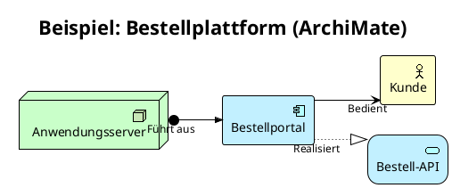

# PlantUML mit ArchiMate: Die kompakte deutsche Anleitung

Architekturdiagramme gehören ins Git-Repository, nicht in Zeichentools. Diese Anleitung fasst auf Deutsch zusammen, wie Sie mit PlantUML und der ArchiMate-Erweiterung Unternehmensarchitektur als Code erstellen. Die ausführlichen englischen Original-Guides sind unten verlinkt.

ÜBRIGENS:
**Platform Economies** — mein neues Buch — ist jetzt erhältlich.  
[**Bei Amazon.de kaufen**](https://www.amazon.de/dp/B0H3VVNPZ3) — Taschenbuch und Kindle-Ausgabe. Auch erhältlich bei [🇺🇸 Amazon.com](https://www.amazon.com/dp/B0H3VVNPZ3), [🇬🇧 UK](https://www.amazon.co.uk/dp/B0H3VVNPZ3), [🇯🇵 JP](https://www.amazon.co.jp/dp/B0H3VVNPZ3) und [🇨🇦 CA](https://www.amazon.ca/dp/B0H3VVNPZ3).  
Buchseite: **[mohammed-brueckner.com/platform-economies](https://mohammed-brueckner.com/platform-economies/)**.

---

## Inhaltsverzeichnis

- [Warum Diagramme als Code?](#warum-diagramme-als-code)
- [Installation und Schnellstart](#installation-und-schnellstart)
- [Ein erstes ArchiMate-Beispiel](#ein-erstes-archimate-beispiel)
- [Export und Qualität](#export-und-qualität)
- [Die häufigsten Fehler](#die-häufigsten-fehler)
- [Vorlagen und Vertiefung](#vorlagen-und-vertiefung)

---

## Warum Diagramme als Code?

Wir versionieren Infrastruktur in Terraform und APIs in OpenAPI — aber Architekturdiagramme liegen als Binärdateien auf persönlichen Laufwerken. Nicht diffbar, nicht reviewbar, nach dem Export sofort veraltet. PlantUML löst das: Diagramme entstehen aus Text, leben im Git, und Änderungen werden als Pull Request reviewt. Mit der ArchiMate-Erweiterung entstehen daraus standardkonforme Unternehmensarchitektur-Diagramme.

## Installation und Schnellstart

Der schnellste Weg ist die [VS-Code-Erweiterung „PlantUML"](https://marketplace.visualstudio.com/items?itemName=jebbs.plantuml) — Vorschau beim Tippen, ohne weitere Einrichtung. Für die Kommandozeile und CI:

1. Java installieren (aktuelles JRE genügt)
2. `plantuml.jar` von [plantuml.com/download](https://plantuml.com/download) laden
3. Rendern: `java -jar plantuml.jar diagramm.puml`

Die ArchiMate-Bibliothek ist im Jar **bereits enthalten** — kein separater Download nötig: `!include <archimate/Archimate>`. Für sehr große Diagramme oder als Online-Alternative: [Kroki.io](https://kroki.io/).

## Ein erstes ArchiMate-Beispiel

Drei Dinge machen dieses Grundgerüst stabil: `!theme plain` (kein Theme überschreibt die ArchiMate-Formen), `$ARCH_SPECIAL_SHAPES = %true()` (echte ArchiMate-Symbole statt generischer Kästen) und `skinparam linetype ortho` (rechtwinklige Linien statt „Spaghetti-Layout").

## Export und Qualität

- **PNG für Dokumente:** `skinparam dpi 300` vor dem Rendern — sonst wirken die Diagramme in Präsentationen unscharf.
- **SVG für Skalierung:** `java -jar plantuml.jar -tsvg diagramm.puml` — Vektorgrafik, beliebig zoombar.
- **CI-Integration:** `plantuml -pipe` im Build-Job — veraltete Diagramme werden so zum Build-Fehler statt zur peinlichen Entdeckung im Steering Board.

## Die häufigsten Fehler

1. **`!include <archimate/Archimate>` schlägt fehl** → PlantUML ist veraltet. Neues Jar laden, fertig. Es gibt keinen separaten Bibliotheks-Download.
2. **„Diagram too large" auf dem Online-Server** → lokal rendern oder Kroki nutzen. Oder das Diagramm teilen: eine Sicht pro Fragestellung.
3. **Layout kreuzt sich** → `left to right direction` und `skinparam linetype ortho`. Richtungshinweise wie `Rel_Flow_Right(a, b, "label")` sparsam einsetzen.
4. **Falsche Beziehungsrichtung** → Serving zeigt vom Anbieter zum Nutzer, Access vom zugreifenden Verhalten zum Datenobjekt. Rückwärts gezeichnete Pfeile sind das Erste, was ein ArchiMate-geschulter Reviewer bemerkt.
5. **skinparam ohne Wirkung** → Reihenfolge prüfen: eigene `skinparam`-Zeilen gehören **hinter** Includes und Themes.

Die vollständige Fehlersammlung (englisch): [PlantUML Troubleshooting](https://mohammed-brueckner.com/plantuml-how-to/troubleshooting/).

## Vorlagen und Vertiefung

- **[Komplette englische Anleitung](https://mohammed-brueckner.com/plantuml-how-to/)** — Installation, Export, Styling, Business Views, Praxisfall
- **[Vorlagen zum Kopieren](https://mohammed-brueckner.com/plantuml-how-to/templates/)** — Application Landscape, Technologie-Schicht, Business View, Migrations-Sicht
- **[C4-Diagramme mit PlantUML](https://mohammed-brueckner.com/plantuml-how-to/c4-diagrams/)** — die Alternative für Entwickler-Teams
- **[PlantUML vs. Mermaid](https://mohammed-brueckner.com/plantuml-how-to/plantuml-vs-mermaid/)** — ein ehrlicher Vergleich
- **[jArchi für Archi aus dem Quellcode bauen](https://mohammed-brueckner.com/jArchi-Build/)** — Scripting direkt in Archi
- **[Architecture as Code (englisch)](https://mohammed-brueckner.com/archimate/)** — warum Zeichentools verloren haben

---

**Zuletzt aktualisiert:** August 2026
