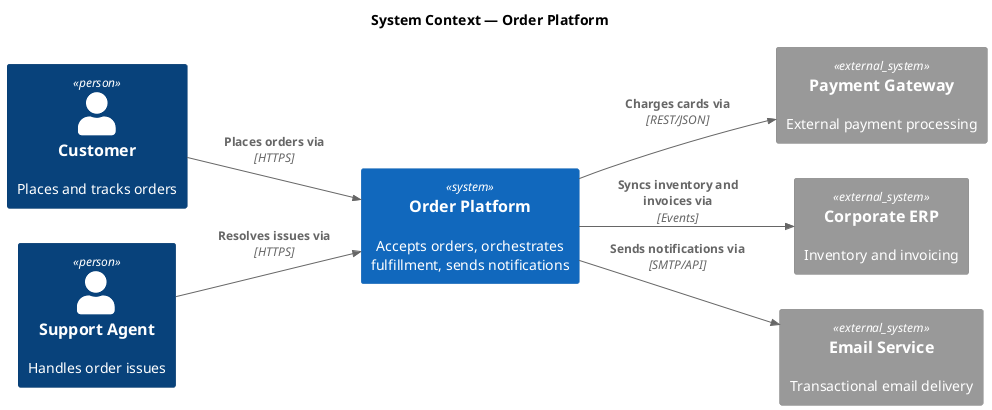
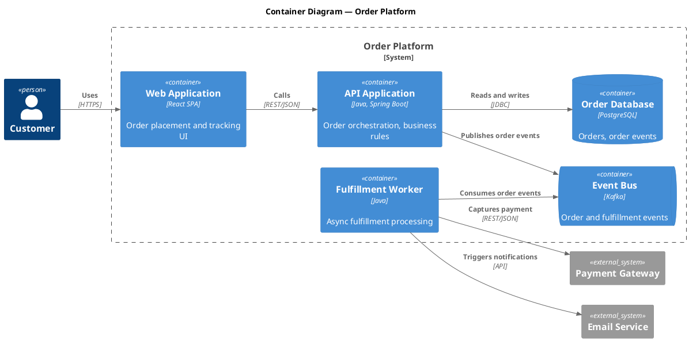
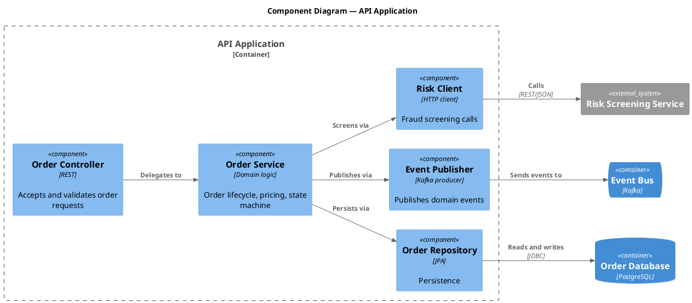

# PlantUML C4 Diagrams: The Practical Guide

The C4 model is the other notation that dominates architecture-as-code work — and the question I get after every ArchiMate session: "should we use C4 instead?" Short answer: they solve different problems, and PlantUML speaks both fluently. This guide covers the C4 side.

BY THE WAY:
**Platform Economies** — out now.  
[**Buy on Amazon**](https://www.amazon.com/dp/B0H3VVNPZ3) — Kindle and paperback. Also available in [🇬🇧 UK](https://www.amazon.co.uk/dp/B0H3VVNPZ3), [🇩🇪 DE](https://www.amazon.de/dp/B0H3VVNPZ3), [🇯🇵 JP](https://www.amazon.co.jp/dp/B0H3VVNPZ3), and [🇨🇦 CA](https://www.amazon.ca/dp/B0H3VVNPZ3).  
Book page: **[mohammed-brueckner.com/platform-economies](https://mohammed-brueckner.com/platform-economies/)**.

> 📚 Companion pages: [PlantUML with ArchiMate Guide](../) · [ArchiMate Templates](../templates/) · [Troubleshooting](../troubleshooting/) · [PlantUML vs. Mermaid](../plantuml-vs-mermaid/)

---

## Table of Contents

- [C4 vs. ArchiMate: Pick by Audience](#c4-vs-archimate-pick-by-audience)
- [Setup: The C4-PlantUML Library](#setup-the-c4-plantuml-library)
- [Level 1: System Context Diagram](#level-1-system-context-diagram)
- [Level 2: Container Diagram](#level-2-container-diagram)
- [Level 3: Component Diagram](#level-3-component-diagram)
- [Layout and Styling Notes](#layout-and-styling-notes)
- [Common Traps](#common-traps)

---

## C4 vs. ArchiMate: Pick by Audience

C4 is developer-first: systems, containers, components, code. Four zoom levels, minimal ceremony, readable by any engineer in five minutes. ArchiMate is enterprise-first: business capabilities, application services, motivation layers, governance semantics. Readable by your enterprise architecture board — and by few others without training.

The rule I use: **if the reader writes code, use C4. If the reader approves budgets, use ArchiMate.** Many organizations run both — C4 inside engineering documentation, ArchiMate in the architecture repository — and that is a division of labor, not indecision.

One honest asymmetry: C4 has no business layer. The moment someone asks "which capability does this system support?", you are in ArchiMate territory.

## Setup: The C4-PlantUML Library

C4 diagrams use the C4-PlantUML library, which lives in the PlantUML standard library — same deal as ArchiMate, bundled with any current PlantUML:

```plantuml
!include <C4/C4_Container>
```

Three includes cover the levels: `C4/C4_Context`, `C4/C4_Container`, `C4/C4_Component`. Include the one matching your deepest level; the deeper includes pull in the shallower ones.

If the include fails, your PlantUML is old. Update the jar — the library needs no separate download. (Full include-error catalog: [Troubleshooting](../troubleshooting/).)

## Level 1: System Context Diagram

The whole system as one box, its users, and its neighbors. This is the diagram for the first slide of any review.



## Level 2: Container Diagram

Zoom into the system boundary: the deployable units — applications, databases, queues — and the protocols between them. This is the workhorse diagram of engineering documentation.



## Level 3: Component Diagram

Zoom into one container: its internal components and their responsibilities. Use it where the container is complex enough to need a map — not as a ritual for every container.



## Layout and Styling Notes

- `left to right direction` plus the `Rel_*` direction hints (`Rel_U`, `Rel_D`, `Rel_L`, `Rel_R`) steer the layout — note that C4-PlantUML uses these short forms, **unlike** the ArchiMate macros which use `_Up/_Down/_Left/_Right`. Mixing the two conventions in one file is the most common C4-PlantUML mistake.
- `Lay_*` macros (e.g. `Lay_Distance(a, b, 2)`) nudge elements apart without drawing anything. Use sparingly; see the [layout section of the troubleshooting guide](../troubleshooting/) for the "more than four hints means two diagrams" rule.
- `LAYOUT_WITH_LEGEND()` adds a type legend — worth it on context and container diagrams that leave your team.
- `skinparam linetype ortho` works here too and untangles most container diagrams.

## Common Traps

**Every element needs a description.** `System(x, "Name")` without the third argument renders but produces empty-looking legend entries. Always `System(x, "Name", "Description")`.

**C4 has no arrows police — you do.** C4-PlantUML will happily connect anything to anything. The discipline (containers talk to containers, not to someone else's components across boundaries) is on you.

**Do not force level 4.** Code-level diagrams in PlantUML age like milk. If the code structure matters, read the code. Levels 1–3 in text, level 4 in the IDE.

**Zoom consistency.** The container diagram's systems must match the context diagram's. When they drift, the usual cause is that nobody owns the set. One repo, one owner per diagram, pull requests for changes — the same discipline as the [ArchiMate workflow](../#a-real-world-enterprise-case).

---

## Further Reading

- [PlantUML with ArchiMate: Complete Guide](../) — the enterprise-notation sibling of this page
- [Architecture as Code: Why Your Diagrams Deserve Better](https://mohammed-brueckner.com/archimate/) — the case for all of this
- [PlantUML Troubleshooting](../troubleshooting/) — when a diagram fights back
- [C4 model official site](https://c4model.com/) — Simon Brown's canonical reference
- [C4-PlantUML on GitHub](https://github.com/plantuml-stdlib/C4-PlantUML) — the library source and full macro list

---

**Last Updated:** August 2026
