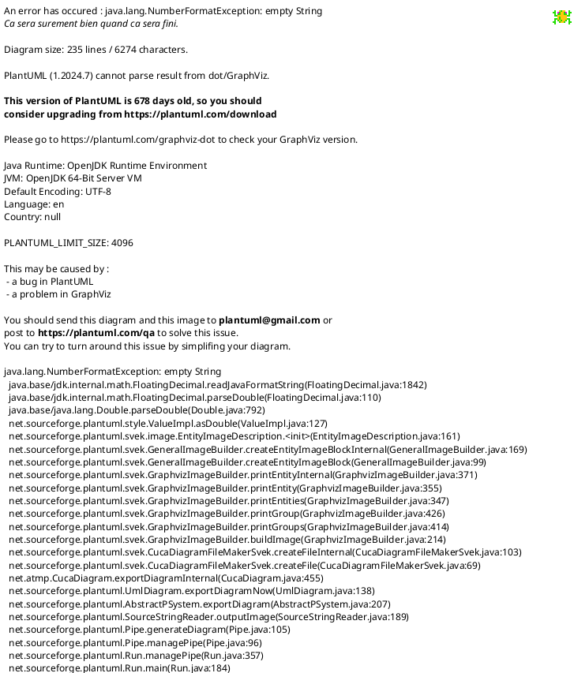

# PlantUML with ArchiMate: Complete Guide

A comprehensive guide for using PlantUML with ArchiMate extensions for enterprise architecture modeling.

---

## Table of Contents

- [Introduction](#introduction)
- [Quick Start Examples](#quick-start-examples)
- [Local Setup Guide](#local-setup-guide)
- [Usage and Export](#usage-and-export)
- [Advanced Features](#advanced-features)
- [Online Alternatives](#online-alternatives)
- [Integration with Archi](#integration-with-archi)
- [Styling and Customization](#styling-and-customization)
- [Business Domain Views](#business-domain-views)

---

## Introduction

PlantUML is a powerful tool for creating diagrams from plain text descriptions. When combined with ArchiMate extensions, it becomes an effective solution for enterprise architecture modeling. This guide covers both local and online usage scenarios.

---

## Quick Start Examples

### Simple Example


### Complex Example with Annotations

**Note:** This example requires local PlantUML installation or [Kroki.io](https://kroki.io/) as it exceeds online service limits.


---

## Local Setup Guide

### Prerequisites

#### 1. Install Java (JRE) ☕

PlantUML requires Java Runtime Environment to function.

**Windows:**
- Download from [adoptium.net](https://adoptium.net) or [oracle.com](https://www.oracle.com/java/technologies/downloads/)

**Mac:**
```bash
brew install openjdk
```

**Linux:**
```bash
sudo apt install default-jre
```

**Verify Installation:**
```bash
java -version
```

#### 2. Download PlantUML JAR 📦

1. Visit [plantuml.com/download](https://plantuml.com/download)
2. Download the latest `.jar` file
3. Store in a permanent location with a short path (no spaces)

**Example Location:** `C:\plant\plantuml-1.2025.8.jar`

#### 3. Install Graphviz (Optional but Recommended) 📊

Required for certain diagram types (Class, State, Component diagrams).

- Download from [graphviz.org](https://graphviz.org)
- Verify: `dot -version`

---

## Visual Studio Code Setup

### Install Extension 🖥️

1. Open VS Code
2. Go to Extensions (`Ctrl+Shift+X` or `Cmd+Shift+X`)
3. Search for "PlantUML" by jebbs
4. Install the extension

### Configure Settings ⚡

Open Command Palette (`Ctrl+Shift+P`) → **Preferences: Open Settings (JSON)**

Add the following configuration:

```json
{
    "security.workspace.trust.untrustedFiles": "open",
    "workbench.colorTheme": "Monokai Dimmed",
    "workbench.editor.empty.hint": "hidden",

    "plantuml.jarPath": "C:\\plant\\plantuml-1.2025.8.jar",
    "plantuml.includepaths": "C:\\plant",
    "plantuml.render": "Local",
    "plantuml.exportFormat": "png",
    "plantuml.exportOutDir": "exports",
    "plantuml.commandArgs": [
        "-charset", "UTF-8",
        "-DPLANTUML_LIMIT_SIZE=32768"
    ]
}
```

**Note:** Update paths to match your local setup.

### Environment Variables ⚙️

For large diagrams, set these environment variables:

```bash
PLANTUML_LIMIT_SIZE=32768
PLANTUML_SECURITY_PROFILE=DEFAULT
```

---

## Usage and Export

### Quick Test ✅

1. Create `test.puml`:


2. Export the diagram
3. Verify PNG appears in `exports` directory

### Exporting Diagrams 📤

1. Open `.puml` file in VS Code
2. Preview with `Alt+D` (optional)
3. Command Palette (`Ctrl+Shift+P`)
4. Run: **PlantUML: Export Current Diagram**
5. Output saved to configured `exportOutDir`

### Auto-Export 🔄

VS Code extension doesn't auto-export on save. Options:

**VS Code Task:** Create custom task to run export command

**External File-Watcher:** Use file-watcher to execute:
```bash
java -jar plantuml.jar file.puml
```

---

## Advanced Features

### ArchiMate Library 🏛️

**Preferred Method (Built-in stdlib):**
```plantuml
!include <archimate/Archimate>
!theme archimate-standard from <archimate/themes>
```

**If Built-in Fails:**

1. Extract stdlib:
```bash
java -jar plantuml.jar -extractstdlib
```

2. Manual inclusion:
```plantuml
!include path/to/Archimate.puml
!theme archimate-standard from path/to/themes
```

### Syntax Rules ✍️

**Quotes:** Always use straight ASCII quotes (`"Customer"`), not curly quotes (`"Customer"`)

**Macros (CamelCase):**
```plantuml
Business_Actor(alias, "Label")
Application_Component(alias, "Label")
Technology_Interface(alias, "Label")
```

**Relationships:**
```plantuml
' Full Macro
Rel_Serving(a, b, "label")

' Shorthand
a -[serving]-> b : label
```

### Diagram Layout & Styling 🎨

**Line Routing:**
```plantuml
skinparam linetype ortho
skinparam linetype polyline
```

**Direction:**
```plantuml
left to right direction
```

**Themes:**
```plantuml
!theme archimate-standard
!theme archimate-saturated
!theme archimate-lowsaturation
```

**Scaling:**
```plantuml
scale max 2000x1200
```

**Image Resolution:**
```plantuml
skinparam dpi 300
```

### Debugging 🔍

**Verbose Mode:**
```bash
java -jar plantuml.jar -v file.puml
```

**Preprocessor Output:**
```bash
java -jar plantuml.jar -preproc file.puml > file.preproc
```

**Check Stdlib:**
```bash
jar tf plantuml.jar | findstr archimate
```

### Common Pitfalls ⚠️

- ✅ Normalize all quotes to straight ASCII
- ✅ Use local includes if built-in stdlib missing
- ✅ Remote includes may be blocked by security profiles
- ⚠️ If macros fail, PlantUML defaults to basic sequence diagram

---

## Online Alternatives

### Kroki.io

[Kroki.io](https://kroki.io/) is more reliable than PlantUML's online service, especially for complex diagrams.

**Basic Example:**


**Complex Example:**


**Note:** For large diagrams, local installation recommended as online services have size limits.

---

## Integration with Archi

### Archi vs. Enterprise Tools

**Archi:**
- ✅ Free, open-source
- ✅ Lightweight
- ✅ Ideal for personal/small-scale modeling
- ❌ Limited collaboration features
- ❌ No enterprise integrations

**Sparx EA (Commercial):**
- ✅ Scalable, feature-rich
- ✅ Repositories, versioning, team support
- ✅ Built for enterprise use
- ❌ Requires paid licenses

**Interoperability:**
- Models exchangeable via `.archimate` files
- Complex elements may not transfer perfectly
- Manual cleanup often needed

**Use Case:**
- **Archi:** Learning, pilots, individual work
- **Sparx EA/BiZZdesign/LeanIX:** Professional, large-scale architecture

### From PlantUML to Archi Model

#### Prerequisites

- Archi desktop tool (v4.9+)
- [jArchi Scripting Plugin](https://github.com/archimatetool/archi-scripting-plugin)
- PlantUML diagram with ArchiMate syntax

#### Step 1: Sample PlantUML Diagram


#### Step 2: Converted JSON Structure

```json
{
  "elements": [
    {
      "type": "TechnologyDevice",
      "id": "firewall",
      "name": "Firewall"
    },
    {
      "type": "TechnologyNode",
      "id": "loadBalancer",
      "name": "Load Balancer"
    },
    {
      "type": "TechnologyNode",
      "id": "webServer",
      "name": "Web Server"
    }
  ],
  "relationships": [
    {
      "type": "AssignmentRelationship",
      "source": "loadBalancer",
      "target": "webServer",
      "label": "Balances"
    },
    {
      "type": "TriggeringRelationship",
      "source": "firewall",
      "target": "loadBalancer",
      "label": "Protects"
    }
  ]
}
```

#### Step 3: jArchi Script

Paste this into Archi's scripting console:

```javascript
// Setup
var model = repository.getModels()[0];
var view = model.createView("archimate-diagram", "Imported View");

// JSON Data
var data = {
  "elements": [
    { "type": "TechnologyDevice", "id": "firewall", "name": "Firewall" },
    { "type": "TechnologyNode", "id": "loadBalancer", "name": "Load Balancer" },
    { "type": "TechnologyNode", "id": "webServer", "name": "Web Server" }
  ],
  "relationships": [
    { "type": "AssignmentRelationship", "source": "loadBalancer", 
      "target": "webServer", "label": "Balances" },
    { "type": "TriggeringRelationship", "source": "firewall", 
      "target": "loadBalancer", "label": "Protects" }
  ]
};

// Create Elements
var elementsById = {};
data.elements.forEach(function(e, i) {
  var element = model.createElement(e.type, e.name);
  elementsById[e.id] = element;
  view.add(element, 100 + i * 200, 100);
});

// Create Relationships
data.relationships.forEach(function(r) {
  var source = elementsById[r.source];
  var target = elementsById[r.target];
  if (source && target) {
    var rel = model.createRelationship(r.type, source, target, r.label || "");
    view.add(rel);
  }
});

console.log("Model created from PlantUML JSON.");
```

**Result:** Fully editable ArchiMate view in Archi with real elements and relationships.

---

## Miro Plugin

The Miro PlantUML plugin renders diagrams as images (not editable models).

### Installation

1. Go to Miro Marketplace
2. Search "PlantUML"
3. Install and authorize

### Usage

1. Open Miro board
2. Access "More apps" (+ icon)
3. Select PlantUML app
4. Enter code in editor
5. Preview updates in real-time
6. Click "Add to board"

**Note:** Creates static images, not interactive Miro objects.

---

## Styling and Customization

### Modern Style Sheets

**Note:** Requires latest PlantUML version (Nov 2025+). Older versions use deprecated `skinparam`.



---

## Business Domain Views

When standard ArchiMate business components aren't available, use stereotype rectangles:


---

## Resources

- [PlantUML Official Site](https://plantuml.com)
- [PlantUML Download](https://plantuml.com/download)
- [Graphviz](https://graphviz.org)
- [Kroki.io](https://kroki.io/)
- [Archi Tool](https://www.archimatetool.com/)
- [jArchi Plugin](https://github.com/archimatetool/archi-scripting-plugin)
- [VS Code PlantUML Extension](https://marketplace.visualstudio.com/items?itemName=jebbs.plantuml)

---

**Last Updated:** November 2025
