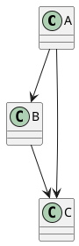
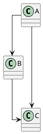
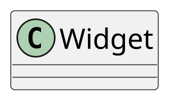
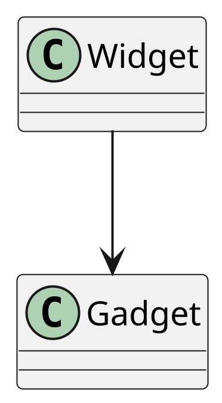

<script type="application/ld+json">
{
  "@context": "https://schema.org",
  "@type": "TechArticle",
  "headline": "PlantUML skinparam linetype ortho: why it does nothing, and how to fix it",
  "description": "skinparam linetype ortho, polyline and default compared, why ortho is silently ignored without Graphviz, the skinparam rectangle block, dpi and font size.",
  "url": "https://mohammed-brueckner.com/plantuml-how-to/skinparam/",
  "inLanguage": "en",
  "proficiencyLevel": "Intermediate",
  "dependencies": "PlantUML 1.2026.x, Java runtime, Graphviz (required for linetype)",
  "author": { "@id": "https://mohammed-brueckner.com/#person" },
  "isPartOf": { "@type": "WebPage", "@id": "https://mohammed-brueckner.com/plantuml-how-to/" },
  "mainEntityOfPage": { "@type": "WebPage", "@id": "https://mohammed-brueckner.com/plantuml-how-to/skinparam/" }
}
</script>

<script type="application/ld+json">
{
  "@context": "https://schema.org",
  "@type": "BreadcrumbList",
  "itemListElement": [
    { "@type": "ListItem", "position": 1, "name": "Home", "item": "https://mohammed-brueckner.com/" },
    { "@type": "ListItem", "position": 2, "name": "PlantUML with ArchiMate", "item": "https://mohammed-brueckner.com/plantuml-how-to/" },
    { "@type": "ListItem", "position": 3, "name": "skinparam and layout", "item": "https://mohammed-brueckner.com/plantuml-how-to/skinparam/" }
  ]
}
</script>

# PlantUML skinparam: linetype, rectangle, dpi

**The short answer, because it is the reason most people arrive here: `skinparam linetype ortho` does nothing unless Graphviz is installed.** It does not warn you. It does not error. It renders your diagram with curved edges exactly as if you had never written the line, and you conclude the directive is broken. It is not broken. Your PlantUML is running on the bundled Smetana layout engine, which ignores `linetype` entirely.

Everything below was rendered and checked against **PlantUML 1.2026.8** with and without **Graphviz 2.43.0**.

---

## Table of contents

- [linetype: the three values](#linetype-the-three-values)
- [Why ortho is silently ignored](#why-ortho-is-silently-ignored)
- [Which diagram types linetype actually affects](#which-diagram-types-linetype-actually-affects)
- [The skinparam rectangle block](#the-skinparam-rectangle-block)
- [dpi, scale and font size](#dpi-scale-and-font-size)
- [skinparam is legacy: the style block](#skinparam-is-legacy-the-style-block)
- [Layout debugging checklist](#layout-debugging-checklist)

---

## linetype: the three values

`skinparam linetype` takes three states. Put it once, near the top, before any element.

**Default (omit the directive).** Graphviz routes splines. Edges curve, and long edges cut diagonally across the diagram.



**`polyline`.** Straight segments with corners, no curves. Corners land wherever the router puts them, so angles are arbitrary rather than square.


**`ortho`.** Every edge is routed in horizontal and vertical segments only. Right angles, no diagonals. This is what makes a large landscape diagram readable, and it is the single highest-value styling directive in PlantUML.



With Graphviz present, that last example routes the `A --> C` edge down the side of the diagram in two straight segments meeting at a right angle, instead of slicing diagonally past `B`. On a diagram with forty elements that difference is the difference between a picture and a diagram.

## Why ortho is silently ignored

`linetype` is implemented by Graphviz, not by PlantUML. PlantUML ships a pure-Java fallback layout engine called **Smetana**, which is used automatically when Graphviz is not installed, and explicitly when you write `!pragma layout smetana`. Smetana does not implement edge routing modes. It accepts the `skinparam linetype ortho` line, ignores it, and renders splines.

I verified this directly: the same three-class source above, rendered under Smetana, produced curved edges; rendered with Graphviz 2.43.0, it produced right-angle routing. No warning either way.

So if `ortho` appears to do nothing, check in this order:

```bash
# 1. Is Graphviz on the machine at all?
dot -V
# graphviz version 2.43.0 (0)   <- good
# dot: command not found        <- this is your problem

# 2. Does PlantUML see it?
java -jar plantuml.jar -testdot

# 3. Are you forcing Smetana somewhere?
grep -rn "smetana" .
```

Install it and the directive starts working with no change to your source:

```bash
sudo apt-get install -y graphviz    # Debian, Ubuntu
brew install graphviz               # macOS
choco install graphviz              # Windows
```

**The CI corollary.** A slim container image will not have Graphviz. Diagrams that look correct on your laptop and wrong in the pipeline are almost always this, and the fix belongs in the image rather than in the diagram. If you deliberately run Smetana to avoid the native dependency, accept that `linetype` is unavailable and stop trying to style around it.

## Which diagram types linetype actually affects

`linetype` reaches only the diagram types Graphviz lays out:

| Diagram type | Laid out by | `linetype` has an effect |
|---|---|---|
| Class, object | Graphviz | Yes |
| Component, deployment | Graphviz | Yes |
| Use case, state | Graphviz | Yes |
| ArchiMate (via the stdlib) | Graphviz | Yes |
| **Sequence** | own engine | **No** |
| **Activity (beta)** | own engine | **No** |

Sequence diagrams draw straight horizontal arrows between lifelines by construction; there is no routing decision for `linetype` to influence. Activity diagrams are the more confusing case, because people add `skinparam linetype ortho` to one, see square corners, and conclude it worked. It did not. **Activity diagrams already route orthogonally by default** — adding the directive changes nothing, and removing it changes nothing.

## The skinparam rectangle block

Several styling parameters share a prefix, and PlantUML accepts a block form so you do not have to repeat it. Both of these are equivalent:

```plantuml
@startuml
skinparam rectangleBackgroundColor #FFE66D
skinparam rectangleBorderColor #FF6B6B
skinparam rectangleBorderThickness 2
rectangle "Order Service" as O
rectangle "Payment Service" as P
O --> P
@enduml
```

```plantuml
@startuml
skinparam rectangle {
  BackgroundColor #FFE66D
  BorderColor #FF6B6B
  BorderThickness 2
  FontColor #1d1d1f
  Shadowing false
}
rectangle "Order Service" as O
rectangle "Payment Service" as P
O --> P
@enduml
```





Three things trip people up in the block form:

1. **Drop the prefix inside the braces.** It is `BackgroundColor`, not `rectangleBackgroundColor`. Writing the full name inside the block silently does nothing.
2. **No colons, no commas.** Parameter, space, value, newline. That is the whole syntax.
3. **`Shadowing false` is per-element-type.** `skinparam shadowing false` turns shadows off globally and is usually what you actually want.

The same block form works for `class`, `component`, `node`, `database`, `queue`, `actor`, `usecase`, `state`, `activity`, `sequence` and the rest. `skinparam sequence { ... }` is the one worth knowing after `rectangle`.

## dpi, scale and font size



`skinparam dpi 300` multiplies the raster output resolution. It is the right control when a diagram is going into print or a high-resolution slide, and it is the wrong control for making a diagram fit a page — that is `scale`:



For anything that will be zoomed, resized or printed, skip the argument and render SVG instead:

```bash
java -jar plantuml.jar -tsvg diagram.puml
```

Font size has a global default and per-element overrides. `skinparam defaultFontSize` sets the baseline; `skinparam classFontSize`, `skinparam titleFontSize` and friends override it for one element type. If text is clipping rather than shrinking, the problem is usually a fixed width somewhere upstream, not the font size.

## skinparam is legacy: the style block

```plantuml
@startuml
<style>
  root {
    HyperLinkColor blue
  }
  classDiagram {
    class {
      BackGroundColor #FFE66D
      LineColor #FF6B6B
      LineThickness 2
    }
    arrow {
      LineColor #4ECDC4
      LineThickness 2
    }
  }
</style>
class A
class B
A --> B
@enduml
```

PlantUML now has a CSS-like `<style>` syntax, and it is where new styling work is going. `skinparam` is not deprecated and is not going away, but the style block composes better and handles nesting properly:



Two caveats worth knowing before you migrate a large template. `linetype` has no style-block equivalent — it stays a `skinparam`. And mixing the two in one file works, but when both set the same property the resolution order is not obvious. Pick one per file.

## Layout debugging checklist

When a diagram lays out badly, work down this list before styling anything:

1. **`dot -V`.** No Graphviz means no `linetype`, and it means a different layout engine than the one your colleague is using.
2. **`skinparam linetype ortho`** near the top, before the first element.
3. **Direction.** `left to right direction` fixes more bad layouts than any styling parameter. Diagrams that are tall and thin usually want it.
4. **`together { }`** to force related elements into the same rank instead of fighting the router.
5. **Hidden edges** to pin ordering: `A -[hidden]-> B` constrains layout without drawing anything.
6. **Cut the diagram.** Above roughly forty elements no routing mode saves it. Two diagrams that each answer one question beat one that answers none.
7. **`skinparam nodesep` and `ranksep`** for spacing, last, once the structure is right.

---

## Related

- [PlantUML with ArchiMate: Complete Guide](../) — setup, export, business domain views and the full ArchiMate examples
- [PlantUML Troubleshooting](../troubleshooting/) — the error catalog, including the Graphviz failures this page assumes you have already hit
- [PlantUML ArchiMate Templates](../templates/) — copy-paste starting points that already carry sensible layout settings
- [PlantUML vs. Mermaid](../plantuml-vs-mermaid/) — an honest comparison for architecture work

---

**Verified against PlantUML 1.2026.8 and Graphviz 2.43.0, September 2026.**
