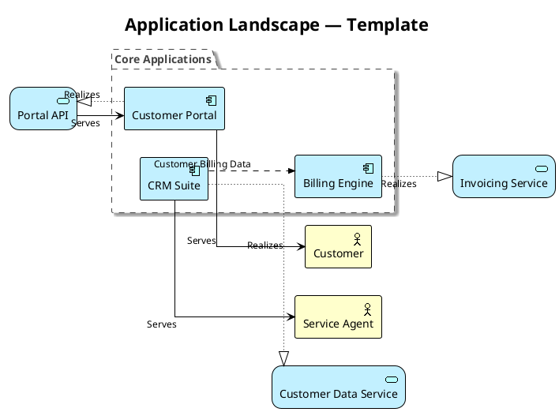
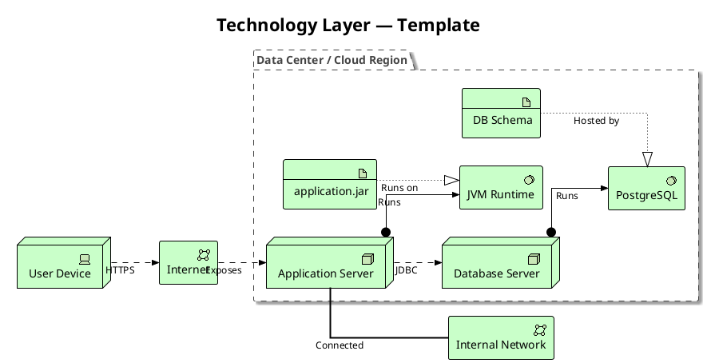
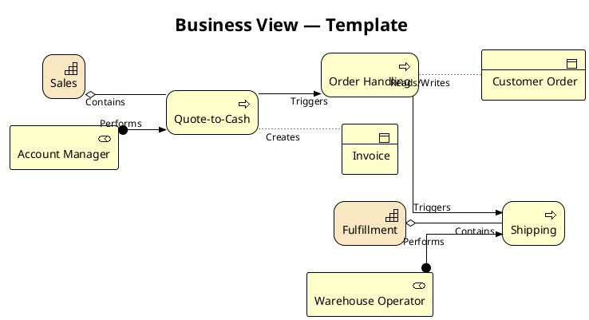
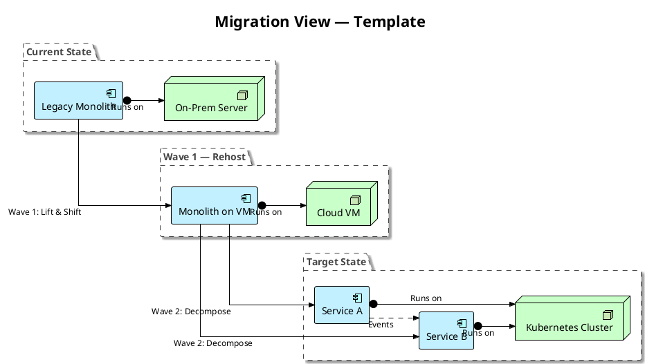
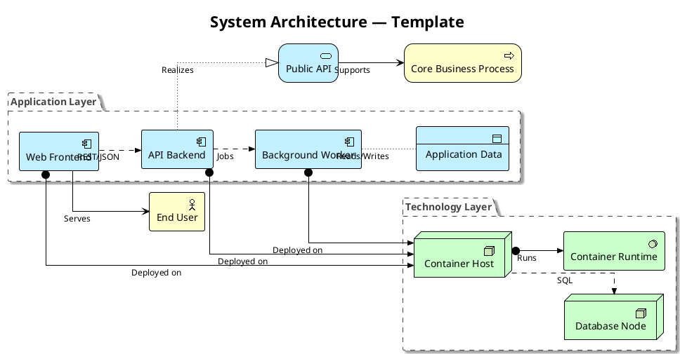

# PlantUML ArchiMate Templates: Copy-Paste Starting Points

Five templates covering the views I build most often. Every one renders with a current PlantUML out of the box — the ArchiMate standard library is bundled, no downloads needed. Adapt the element names, delete what you do not need, and keep the skeleton.

BY THE WAY:
**Platform Economies** — out now.  
[**Buy on Amazon**](https://www.amazon.com/dp/B0H3VVNPZ3) — Kindle and paperback. Also available in [🇬🇧 UK](https://www.amazon.co.uk/dp/B0H3VVNPZ3), [🇩🇪 DE](https://www.amazon.de/dp/B0H3VVNPZ3), [🇯🇵 JP](https://www.amazon.co.jp/dp/B0H3VVNPZ3), and [🇨🇦 CA](https://www.amazon.ca/dp/B0H3VVNPZ3).  
Book page: **[mohammed-brueckner.com/platform-economies](https://mohammed-brueckner.com/platform-economies/)**.

> 📚 New here? Start with the [PlantUML with ArchiMate Complete Guide](https://mohammed-brueckner.com/plantuml-how-to/) — setup, export, styling, and full annotated examples.

---

## Table of Contents

- [Template 1: Application Landscape](#template-1-application-landscape)
- [Template 2: Technology Layer](#template-2-technology-layer)
- [Template 3: Business View](#template-3-business-view)
- [Template 4: Migration View (Current → Target)](#template-4-migration-view-current--target)
- [Template 5: System Architecture Diagram](#template-5-system-architecture-diagram)
- [Usage Notes](#usage-notes)

---

## Template 1: Application Landscape

The classic "what applications do we have and who uses them" view. Application components, their services, and the business actors they serve.

---

## Template 2: Technology Layer

Infrastructure reality: nodes, system software, networks. The view that reveals end-of-life databases.

---

## Template 3: Business View

The slide leadership reads: capabilities, processes, and the roles that own them.

---

## Template 4: Migration View (Current → Target)

One view per migration wave. Triggering and Flow relationships between plateaus make the program plan visible.

---

## Template 5: System Architecture Diagram

For the "plantuml system architecture diagram" searches: a single-system view showing how one application decomposes across layers — business context, application internals, and the technology it runs on.

---

## Usage Notes

**Start ugly, refine later.** Replace my element names with yours and render. A wrong diagram on screen beats a perfect diagram in your head.

**One view, one question.** If a template starts answering two questions at once, split it. Five small views age better than one cathedral.

**Keep the header block identical everywhere.** The `!theme plain` + `$ARCH_SPECIAL_SHAPES` + `linetype ortho` combination is the baseline that survives PlantUML updates. Style per-view below it, never inside the includes.

**Direction variants are your layout steering wheel.** Every relationship macro accepts `_Up`, `_Down`, `_Left`, `_Right` suffixes (e.g. `Rel_Flow_Right(a, b, "label")`). Use them when the automatic layout crosses lines — but if you need more than three or four, the diagram wants to be two diagrams.

---

## Further Reading

- [PlantUML with ArchiMate: Complete Guide](https://mohammed-brueckner.com/plantuml-how-to/) — the full guide these templates come from
- [PlantUML Troubleshooting](../troubleshooting/) — when a template refuses to render
- [PlantUML vs. Mermaid](../plantuml-vs-mermaid/) — if you are still choosing your tool
- [Architecture as Code: Why Your Diagrams Deserve Better](https://mohammed-brueckner.com/archimate/) — the case for all of this

---

**Last Updated:** August 2026
