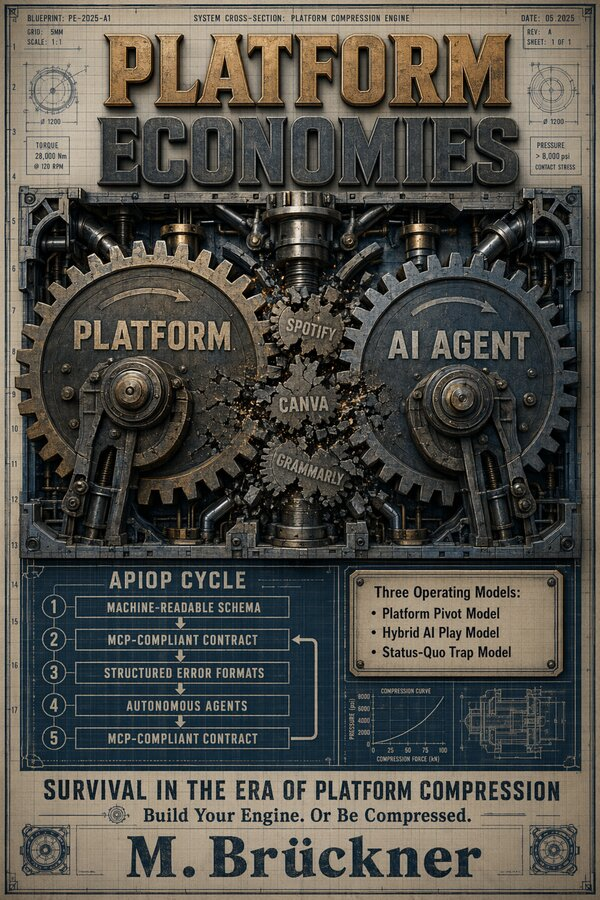

# Platform Economies

## How AI Is Rewriting the Rules of Platforms, APIs, and Partnerships

  

---

### Coming September 2026

A book seven years in the making. Four LinkedIn articles. Two thousand readers. Every prediction came true. Every prediction was insufficient.

**Platform Economies** tracks what happens when AI stops being a productivity tool and starts being a structural force. The middle ground between infrastructure owners, platform owners, and feature owners is vanishing. The question is no longer whether compression will arrive. The question is whether you are the platform, the infrastructure beneath it, or the feature inside it.

Most executives believe they are building a platform. They are not. They are building a product with an API. The difference is structural. And the difference determines who survives the next five years.

This book is the forensic autopsy of what I got wrong, what I got right, and what I now know about the rules that platforms make. And break.

---

### Where to Buy

**Amazon Marketplaces**

- **[US](https://www.amazon.com/dp/B0GXN4PRB5)** — https://www.amazon.com/dp/B0GXN4PRB5  
- **[Germany](https://www.amazon.de/dp/B0GXN4PRB5)** — https://www.amazon.de/dp/B0GXN4PRB5  
- **[UK](https://www.amazon.co.uk/dp/B0GXN4PRB5)** — https://www.amazon.co.uk/dp/B0GXN4PRB5  
- **[Japan](https://www.amazon.co.jp/dp/B0GXN4PRB5)** — https://www.amazon.co.jp/dp/B0GXN4PRB5  
- **[Canada](https://www.amazon.ca/dp/B0GXN4PRB5)** — https://www.amazon.ca/dp/B0GXN4PRB5 

---

### What Is Inside

Six parts. Twenty-three chapters. Two hundred and forty-one pages of no gradualism, no journeys, and no consultant language.

**Foundations.** What I believed in 2018. Why the optimism was not wrong. Why it was early. And why early, in platform economics, is the same as wrong.

**The New Rules.** Microsoft cut nine thousand people and grew operating income twenty-four percent. Cloudflare turned free scraping into a paid marketplace. Grammarly abandoned its own name. Three companies. One pressure. One story.

**Strategic Choice.** Three models for responding to compression. The Platform Pivot. The Hybrid AI Play. The Status Quo Trap. And the hard question of whether a fourth option exists.

**The Operating Engine.** From CI/CD to APIOps. Maturity and measurement. And where agentic AI fits into the cycle that now governs every software pipeline.

**The Hyperscaler Lens.** Microsoft. Cloudflare. Grammarly. Spotify. SAP. What their decisions reveal about the rules that now govern every industry that touches software. Which means every industry.

**Building Your Platform Economy.** Reading the signals. The Platform Compression Scorecard. The workforce signals, the pricing signals, the feature absorption signals. And what to do when you see them.

---

### The Details

| | |
|---|---|
| **Title** | Platform Economies |
| **Subtitle** | How AI Is Rewriting the Rules of Platforms, APIs, and Partnerships |
| **Author** | M. Brückner |
| **ISBN** | 979-8-1954-5157-8 |
| **Pages** | 241 |
| **Format** | 6″ × 9″ paperback, matte finish, black & white interior |
| **Also available** | Kindle ebook |
| **Publication** | September 2026 |

---

### About the Author

M. Brückner is a Senior Enterprise Architect and Digital Transformation Strategist based in Munich, working across large-scale European and international organisations. He has spent years inside the rooms where platform decisions get made, the budgets get allocated, and the layoff memos get written. This book is what he wishes he had read before he walked into those rooms.

---

**Interactive:** [The Platform Compression Scorecard](https://mohammed-brueckner.com/scorecard/) — score your organization on the five signals from Part Six. New to the topic? Start with [What Is a Platform Economy?](https://mohammed-brueckner.com/platform-economy/)

### Further Reading on This Site

The ideas in the book connect to work already published here:

- **[Internal Developer Platforms: From Tools to Products in 2026](https://mohammed-brueckner.com/developer-platforms/)** — why 80% of IDPs fail, and the product mindset that separates survivors from statistics.
- **[From Discovery to Deployment with AI, a reality check as of 2026](https://mohammed-brueckner.com/how-to-ai/)** — the capex numbers, the adoption gap, and the model overhang problem behind the headlines.
- **[Change Management never really changes... Now wait.](https://mohammed-brueckner.com/changemanagement/)** — platform compression is a change program; the Double Trinity Pyramid explains why most fail.
- **[Architecture as Code: Why Your Diagrams Deserve Better](https://mohammed-brueckner.com/archimate/)** and the **[PlantUML with ArchiMate guide](https://mohammed-brueckner.com/plantuml-how-to/)** — the APIOps and documentation-as-code discipline from Part Four, applied.

---

### Stay in the Loop

The book drops September 2026. In the meantime, the only links you need are the Amazon marketplaces above.

---

*Platform Economies. September 2026. The rules have already changed.*
