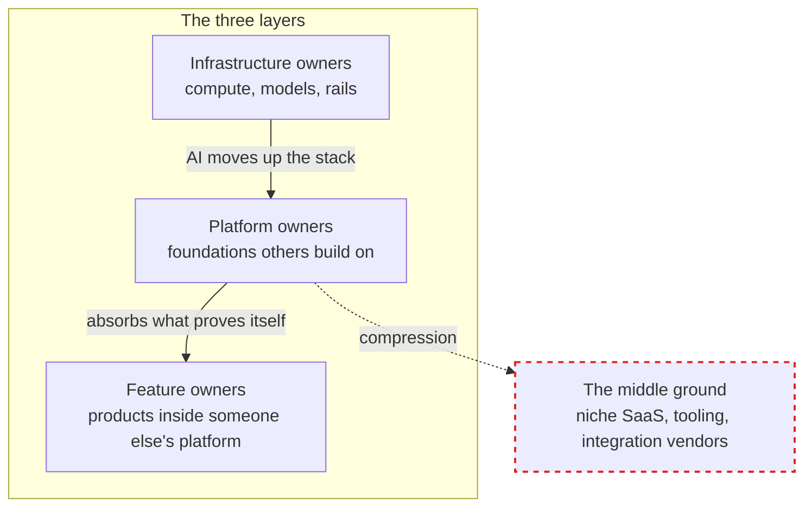

# What Is a Platform Economy?

**A platform economy is a market where value is created and captured through platforms — digital foundations that others build on — rather than through standalone products.** Amazon Web Services is a platform. So is Stripe, Shopify, the iPhone. The defining trait: the platform owner earns from other people's business models, not just from its own.

That is the definition you will find anywhere. The more useful question for 2026 is what AI is doing to it.

BY THE WAY:
**Platform Economies** — the book behind this page — is out now.  
[**Buy on Amazon**](https://www.amazon.com/dp/B0GXN4PRB5) — Kindle and paperback. Also available in [🇬🇧 UK](https://www.amazon.co.uk/dp/B0GXN4PRB5), [🇩🇪 DE](https://www.amazon.de/dp/B0GXN4PRB5), [🇯🇵 JP](https://www.amazon.co.jp/dp/B0GXN4PRB5), and [🇨🇦 CA](https://www.amazon.ca/dp/B0GXN4PRB5).  
Book page: **[mohammed-brueckner.com/platform-economies](https://mohammed-brueckner.com/platform-economies/)**.

---

## The Three Layers

Every digital business sits in one of three layers:

- **Infrastructure owners** provide the compute, the models, the rails. Microsoft, Amazon, the hyperscalers. Capital-intensive, winner-take-most.
- **Platform owners** provide the foundation others build on. They take a cut of ecosystems rather than selling only their own output.
- **Feature owners** build products that live inside someone else's platform. A grammar checker. A calendar scheduler. A password manager.

For two decades there was a comfortable middle ground between these layers: companies that were not quite platforms but more than features. Niche SaaS, integration vendors, tooling companies. That middle ground is where most of the software industry lived.

## What Is Platform Compression?

**Platform compression is the collapse of that middle ground.** AI gives infrastructure owners the ability to move up the stack and absorb features directly. It gives platform owners the ability to replicate any feature that proves itself. And it gives feature owners no defensible ground to retreat to — because the feature was never the moat. The user relationship was. And the platform owns that.

The middle ground did not erode slowly. It disappeared in a single investment cycle. Grammarly abandoned its own name. Microsoft cut nine thousand people and grew operating income twenty-four percent. Cloudflare turned free scraping into a paid marketplace. Three companies, one pressure, one story: when AI stops being a productivity tool and starts being a structural force, the question is no longer whether compression arrives. The question is whether you are the platform, the infrastructure beneath it, or the feature inside it.

## Three Rule Shifts

The compression follows three rule shifts. Their names are simple. Their consequences are not:

1. **Efficiency over headcount.**
2. **Value over volume.**
3. **Platforms over features.**

What they mean in practice — who already lives by them, what they did to the companies that did not, and which of the three your organization is violating right now — is the core of the book. One hint: most executives who nod at the third shift are building a product with an API, and the difference is structural.

## Frequently Asked Questions

### Is my company a platform if it has an API?

No. Most executives believe they are building a platform. They are building a product with an API. A platform is defined by what others build on it and what the owner earns from that — not by having endpoints. The test: would developers pay if you charged? Would partners build businesses on top of you? If the answer is no, you have a product. That is fine — but it is a different strategic position with different rules. The book has a full chapter on telling the two apart before the market does it for you.

### What is the Status-Quo Trap?

The Status-Quo Trap is responding to compression by optimizing the current model instead of changing it. Seventy-two percent of organizations adopted AI in at least one business function; only twenty-one percent report measurable bottom-line impact. The fifty-one-point gap is the trap in action: AI deployed as a productivity tool for the old model instead of a transformation engine for a new one. Why smart organizations fall into it anyway — and the two response models that avoid it — is where the book goes next.

### Can a company escape being a feature?

Yes, but the paths are narrower than the keynote slides suggest. There are three response models — one that works for almost nobody, one that works for more organizations than you'd think, and one that is less a strategy than an epitaph. Which is which, and how to choose between them, is the strategic heart of the book. The first step is diagnostic: read the signals before the market reads them for you. The [Platform Compression Scorecard](https://mohammed-brueckner.com/scorecard/) is the five-minute version.

### Is platform compression only a tech-industry problem?

No. It arrives first where software is the product, but the mechanism — infrastructure absorbing features, platforms taxing ecosystems — works in any industry that touches software. Which means every industry. Professional services feel it when AI absorbs the junior tier. Manufacturing feels it when the equipment vendor's platform absorbs the analytics vendor.

---

## Where to Go Deeper

- **[Platform Economies — the book](https://mohammed-brueckner.com/platform-economies/)** — six parts, twenty-three chapters, the forensic autopsy of what the last seven years got right and wrong
- **[The Platform Compression Scorecard](https://mohammed-brueckner.com/scorecard/)** — score your organization on the five signals
- **[Internal Developer Platforms: From Tools to Products](https://mohammed-brueckner.com/developer-platforms/)** — the platform-engineering angle for technical teams
- **[From Discovery to Deployment with AI](https://mohammed-brueckner.com/how-to-ai/)** — the adoption data behind the rule shifts

---

*This page is the short answer. The long answer is 241 pages, out now.*

